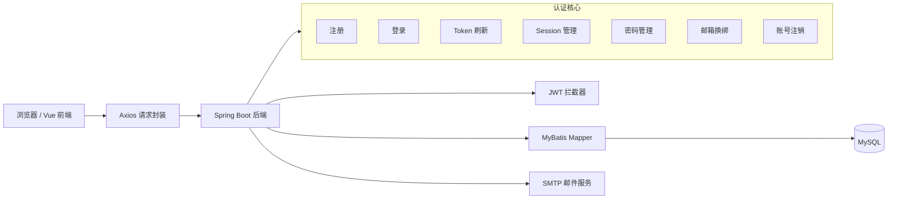

# Auth Template 登录注册认证模板完整开发文档

> 版本：2026-05-08 合并版  
> 适用项目：`auth-template-updated.zip` 当前源码  
> 开发环境：IntelliJ IDEA 开发后端，VS Code 开发前端  
> 项目定位：通用登录注册认证模板，不做博客业务，不做手机号功能。

---

## 0. 这份文档解决什么问题

这份文档把你现有的几份开发文档、账号注销补充文档、实施顺序文档，以及我之前给你的更新版源码包合并成一份完整手册。

按照这份文档，你应该可以从空目录开始，在 IDEA 和 VS Code 里搭建出当前这个项目，并理解每个核心文件应该写什么、为什么这么写、如何启动、如何测试、如何继续二次开发。

本文档不会引入博客文章、评论、点赞、分类、标签等业务功能。这个项目的目标是做一个可复用的认证模板。

---

## 1. 项目最终定位

这个项目建议命名为：

```text
auth-template
```

当前包名和部分目录仍保留 `smartblog`，这是因为原项目来源叫 SmartBlog。你可以继续保留，也可以后续统一重命名为 `com.authtemplate`。

项目只解决这些问题：

```text
1. 用户注册
2. 用户名/邮箱 + 密码登录
3. 邮箱验证码登录
4. access token + refresh token
5. refresh token 轮换
6. 服务端 session 管理
7. 退出当前设备
8. 退出全部设备
9. 设备列表与踢下线
10. 修改密码
11. 忘记密码
12. 修改密码/重置密码后撤销全部会话
13. 用户基础资料修改：昵称、头像 URL
14. 邮箱换绑
15. 账号注销、取消注销、最终注销
16. 注销后标识匿名化，释放用户名和邮箱
17. 邮箱验证码限流、错误次数限制、过期清理
18. 过期 session 清理
19. 安全事件日志
20. 后端集成测试
```

明确不做：

```text
1. 手机号注册
2. 手机号登录
3. 短信验证码
4. 博客文章业务
5. 评论、点赞、收藏
6. 内容审核
7. 复杂后台管理
8. 过早接入 OAuth2 / SSO / MFA
```

---

## 2. 人话解释：这个模板以后怎么复用

你以后做任何新项目，比如商城、论坛、预约系统、企业内部系统，都可以先复制这个认证模板。

复制后，你不用再从零写注册、登录、密码加密、JWT、刷新 token、邮箱验证码、会话踢下线、忘记密码、注销这些东西。

你只需要在这个模板后面继续加业务模块，例如：

```text
商城项目：商品、订单、支付
论坛项目：帖子、评论、举报
企业项目：审批、客户、报表
```

认证模板负责“你是谁、你是否登录、你的登录状态是否有效”。业务系统负责“你登录后能做什么业务”。

---

## 3. 技术栈

### 后端

```text
Java 17
Spring Boot 3.3.5
Spring MVC
Bean Validation
MyBatis 注解 Mapper
MySQL 8.x
BCrypt 密码哈希
JJWT
Spring Mail
Testcontainers + MockMvc
```

### 前端

```text
Vue 3
Vue Router
Axios
Vite
原生 CSS
```

### 数据库

```text
MySQL 数据库名：smartblog_auth
```

---

## 4. 整体架构



### 登录态逻辑

```text
登录成功
  ↓
后端生成 session_id
  ↓
生成短期 access token
  ↓
生成长期 refresh token secret
  ↓
数据库保存 refresh token hash 和当前 access token jti
  ↓
前端保存 accessToken / refreshToken
  ↓
访问受保护接口时携带 Authorization: Bearer accessToken
  ↓
accessToken 过期后，前端自动用 refreshToken 换新 token
  ↓
刷新成功后，refreshToken 也会轮换，旧 refreshToken 失效
```

---

## 5. 数据表设计说明

| 表名 | 作用 |
|---|---|
| `users` | 用户主体表，只放用户状态、昵称、头像等基础资料 |
| `user_identities` | 用户登录标识表，保存 USERNAME 和 EMAIL |
| `user_credentials` | 用户认证凭据表，保存 BCrypt 密码哈希 |
| `auth_sessions` | 登录会话表，保存 session、refresh token hash、设备信息 |
| `verification_challenges` | 邮箱验证码挑战表，保存验证码 hash、场景、过期时间、尝试次数 |
| `security_events` | 安全事件日志表 |
| `account_deletion_requests` | 账号注销申请表，支持冷静期、取消注销、最终注销 |

这里没有手机号字段。`identity_type` 只支持 `USERNAME` 和 `EMAIL`。

---

## 6. 当前项目文件结构

```text
.gitignore
README.md
backend/.env.example
backend/.mvn/wrapper/maven-wrapper.properties
backend/mvnw
backend/mvnw.cmd
backend/pom.xml
backend/src/main/java/com/smartblog/SmartblogBackendApplication.java
backend/src/main/java/com/smartblog/common/ApiResponse.java
backend/src/main/java/com/smartblog/config/CorsConfig.java
backend/src/main/java/com/smartblog/config/PasswordConfig.java
backend/src/main/java/com/smartblog/config/WebMvcConfig.java
backend/src/main/java/com/smartblog/controller/AccountController.java
backend/src/main/java/com/smartblog/controller/AuthController.java
backend/src/main/java/com/smartblog/controller/UserController.java
backend/src/main/java/com/smartblog/dto/request/AccountDeleteCancelRequest.java
backend/src/main/java/com/smartblog/dto/request/AccountDeleteRequest.java
backend/src/main/java/com/smartblog/dto/request/EmailChangeCodeRequest.java
backend/src/main/java/com/smartblog/dto/request/EmailChangeConfirmRequest.java
backend/src/main/java/com/smartblog/dto/request/EmailCodeLoginRequest.java
backend/src/main/java/com/smartblog/dto/request/EmailRequest.java
backend/src/main/java/com/smartblog/dto/request/LoginRequest.java
backend/src/main/java/com/smartblog/dto/request/PasswordChangeRequest.java
backend/src/main/java/com/smartblog/dto/request/PasswordResetConfirmRequest.java
backend/src/main/java/com/smartblog/dto/request/PasswordResetRequest.java
backend/src/main/java/com/smartblog/dto/request/RefreshTokenRequest.java
backend/src/main/java/com/smartblog/dto/request/RegisterRequest.java
backend/src/main/java/com/smartblog/dto/request/UpdateProfileRequest.java
backend/src/main/java/com/smartblog/dto/response/EmailCodeResponse.java
backend/src/main/java/com/smartblog/dto/response/LoginResponse.java
backend/src/main/java/com/smartblog/dto/response/SessionResponse.java
backend/src/main/java/com/smartblog/dto/response/UserInfoResponse.java
backend/src/main/java/com/smartblog/entity/AccountDeletionRequest.java
backend/src/main/java/com/smartblog/entity/AuthSession.java
backend/src/main/java/com/smartblog/entity/SecurityEvent.java
backend/src/main/java/com/smartblog/entity/User.java
backend/src/main/java/com/smartblog/entity/UserCredential.java
backend/src/main/java/com/smartblog/entity/UserIdentity.java
backend/src/main/java/com/smartblog/entity/VerificationChallenge.java
backend/src/main/java/com/smartblog/exception/BusinessException.java
backend/src/main/java/com/smartblog/exception/GlobalExceptionHandler.java
backend/src/main/java/com/smartblog/interceptor/JwtAuthInterceptor.java
backend/src/main/java/com/smartblog/mapper/AccountDeletionRequestMapper.java
backend/src/main/java/com/smartblog/mapper/AuthSessionMapper.java
backend/src/main/java/com/smartblog/mapper/SecurityEventMapper.java
backend/src/main/java/com/smartblog/mapper/UserCredentialMapper.java
backend/src/main/java/com/smartblog/mapper/UserIdentityMapper.java
backend/src/main/java/com/smartblog/mapper/UserMapper.java
backend/src/main/java/com/smartblog/mapper/VerificationChallengeMapper.java
backend/src/main/java/com/smartblog/service/AccountService.java
backend/src/main/java/com/smartblog/service/AuthService.java
backend/src/main/java/com/smartblog/service/EmailCodeService.java
backend/src/main/java/com/smartblog/service/MailService.java
backend/src/main/java/com/smartblog/service/PasswordService.java
backend/src/main/java/com/smartblog/service/SecurityEventService.java
backend/src/main/java/com/smartblog/service/SessionService.java
backend/src/main/java/com/smartblog/service/UserService.java
backend/src/main/java/com/smartblog/service/impl/AccountServiceImpl.java
backend/src/main/java/com/smartblog/service/impl/AuthServiceImpl.java
backend/src/main/java/com/smartblog/service/impl/EmailCodeServiceImpl.java
backend/src/main/java/com/smartblog/service/impl/MailServiceImpl.java
backend/src/main/java/com/smartblog/service/impl/PasswordServiceImpl.java
backend/src/main/java/com/smartblog/service/impl/SecurityEventServiceImpl.java
backend/src/main/java/com/smartblog/service/impl/SessionServiceImpl.java
backend/src/main/java/com/smartblog/service/impl/UserServiceImpl.java
backend/src/main/java/com/smartblog/task/AccountDeletionFinalizeTask.java
backend/src/main/java/com/smartblog/task/AuthDataCleanupTask.java
backend/src/main/java/com/smartblog/util/AuthConstants.java
backend/src/main/java/com/smartblog/util/JwtUtil.java
backend/src/main/java/com/smartblog/util/NormalizeUtil.java
backend/src/main/java/com/smartblog/util/RequestUtil.java
backend/src/main/java/com/smartblog/util/UserContext.java
backend/src/main/java/com/smartblog/vo/CurrentUser.java
backend/src/main/resources/application.yml
backend/src/main/resources/mapper/UserMapper.xml
backend/src/main/resources/sql/schema.sql
backend/src/test/java/com/smartblog/AuthTemplateIntegrationTest.java
frontend/.env.example
frontend/index.html
frontend/package-lock.json
frontend/package.json
frontend/src/App.vue
frontend/src/api/auth.js
frontend/src/assets/styles/common.css
frontend/src/assets/styles/reset.css
frontend/src/main.js
frontend/src/router/index.js
frontend/src/utils/auth.js
frontend/src/utils/request.js
frontend/src/utils/useCountdown.js
frontend/src/utils/validators.js
frontend/src/views/CancelDelete.vue
frontend/src/views/DeleteAccount.vue
frontend/src/views/DeviceManage.vue
frontend/src/views/ForgotPassword.vue
frontend/src/views/Home.vue
frontend/src/views/Login.vue
frontend/src/views/Profile.vue
frontend/src/views/Register.vue
frontend/vite.config.js
```

---

## 7. 从零创建项目

### 7.1 创建根目录

```bash
mkdir auth-template
cd auth-template
mkdir backend frontend
```

如果你使用源码压缩包，可以直接：

```bash
unzip auth-template-updated.zip -d auth-template
cd auth-template
```

---

## 8. 后端：在 IntelliJ IDEA 中开发

### 8.1 创建后端工程

打开 IntelliJ IDEA：

```text
New Project -> Spring Initializr
```

建议填写：

```text
Group: com.smartblog
Artifact: smartblog-backend
Name: smartblog-backend
Package name: com.smartblog
JDK: 17
Java: 17
```

选择依赖：

```text
Spring Web
Validation
MySQL Driver
MyBatis Framework
Java Mail Sender
```

然后按照本文档附录中的 `backend/pom.xml` 替换完整 pom。

### 8.2 IDEA 导入已有后端

如果你使用压缩包源码：

```text
File -> Open -> 选择 auth-template/backend
```

IDEA 会识别 Maven 项目。右侧 Maven 面板点击 Reload。

### 8.3 IDEA 必要设置

```text
File -> Project Structure -> Project SDK -> 选择 JDK 17
File -> Settings -> Build Tools -> Maven -> JDK for importer -> 选择 JDK 17
```

如果 Maven 依赖下载慢，配置国内镜像。

---

## 9. 后端环境变量配置

后端的敏感配置不要写死在 Git 里。当前 `application.yml` 使用环境变量。

Linux / macOS：

```bash
export DB_URL='jdbc:mysql://localhost:3306/smartblog_auth?useSSL=false&serverTimezone=Asia/Shanghai&characterEncoding=utf8&allowPublicKeyRetrieval=true'
export DB_USERNAME='root'
export DB_PASSWORD='你的数据库密码'
export JWT_SECRET='至少32字节随机密钥，例如 12345678901234567890123456789012'
export MAIL_HOST='smtp.163.com'
export MAIL_PORT='465'
export MAIL_USERNAME='你的163邮箱@163.com'
export MAIL_AUTH_CODE='你的163邮箱授权码，不是邮箱登录密码'
export MAIL_SMTP_SSL_ENABLE='true'
export MAIL_SMTP_STARTTLS_ENABLE='false'
```

Windows PowerShell：

```powershell
$env:DB_URL="jdbc:mysql://localhost:3306/smartblog_auth?useSSL=false&serverTimezone=Asia/Shanghai&characterEncoding=utf8&allowPublicKeyRetrieval=true"
$env:DB_USERNAME="root"
$env:DB_PASSWORD="你的数据库密码"
$env:JWT_SECRET="至少32字节随机密钥，例如 12345678901234567890123456789012"
$env:MAIL_HOST="smtp.163.com"
$env:MAIL_PORT="465"
$env:MAIL_USERNAME="你的163邮箱@163.com"
$env:MAIL_AUTH_CODE="你的163邮箱授权码，不是邮箱登录密码"
$env:MAIL_SMTP_SSL_ENABLE="true"
$env:MAIL_SMTP_STARTTLS_ENABLE="false"
```

IDEA 运行配置：

```text
Run -> Edit Configurations -> SmartblogBackendApplication -> Environment variables
```

把上面的变量填进去。

### 9.1 163 邮箱说明

如果使用 163 邮箱，程序里的 `MAIL_AUTH_CODE` 是“授权码”，不是网页登录密码。

需要在 163 邮箱设置里开启 SMTP/POP3/IMAP，然后生成授权码。

---

## 10. 数据库初始化

### 10.1 创建并初始化数据库

在 MySQL 客户端执行：

```bash
mysql -u root -p < backend/src/main/resources/sql/schema.sql
```

如果你已经进入 MySQL：

```sql
SOURCE backend/src/main/resources/sql/schema.sql;
```

该脚本会先删除旧表，再重建表。开发阶段很方便，但生产环境不要直接执行这种重建脚本。

### 10.2 检查表是否创建成功

```sql
USE smartblog_auth;
SHOW TABLES;
```

应该看到：

```text
users
user_identities
user_credentials
auth_sessions
verification_challenges
security_events
account_deletion_requests
```

---

## 11. 后端启动、构建、测试

### 11.1 IDEA 启动

打开：

```text
backend/src/main/java/com/smartblog/SmartblogBackendApplication.java
```

点击绿色运行按钮。启动成功后，控制台应显示监听端口 `7070`。

### 11.2 命令行启动

Linux / macOS：

```bash
cd backend
chmod +x mvnw
./mvnw spring-boot:run
```

Windows：

```powershell
cd backend
.\mvnw.cmd spring-boot:run
```

### 11.3 打包

```bash
cd backend
./mvnw clean package
```

### 11.4 执行后端测试

```bash
cd backend
./mvnw test
```

后端测试使用 Testcontainers，需要本机安装并启动 Docker。如果没有 Docker，测试类上有 `@Testcontainers(disabledWithoutDocker = true)`，没有 Docker 时会跳过容器测试。

---

## 12. 前端：在 VS Code 中开发

### 12.1 创建 Vue 工程

如果从零创建：

```bash
npm create vite@latest frontend -- --template vue
cd frontend
npm install
npm install axios vue-router
```

然后按照本文档附录中的前端文件替换。

如果你使用源码压缩包，直接打开：

```text
auth-template/frontend
```

### 12.2 VS Code 推荐插件

```text
Vue - Official
ESLint
Prettier
JavaScript and TypeScript Nightly，可选
```

### 12.3 安装依赖

```bash
cd frontend
npm install
```

不要直接复用别人电脑上的 `node_modules`。不同系统的 Vite/Rolldown 原生依赖可能不同。

### 12.4 启动前端

```bash
cd frontend
npm run dev
```

浏览器访问：

```text
http://localhost:5173
```

### 12.5 构建前端

```bash
cd frontend
npm run build
```

构建产物在：

```text
frontend/dist
```

---

## 13. 前后端联调

前端 Vite 已经配置代理：

```text
/api -> http://localhost:7070
```

因此前端 Axios 里的基础地址是 `/api`，接口写法是：

```text
/auth/register
/auth/login/password
/user/me
/account/delete/request
```

实际会转发为：

```text
http://localhost:7070/api/auth/register
http://localhost:7070/api/auth/login/password
http://localhost:7070/api/user/me
http://localhost:7070/api/account/delete/request
```

---

## 14. 核心接口清单

### 14.1 公开接口

| 功能 | 方法 | 路径 | 请求字段 |
|---|---|---|---|
| 发送注册验证码 | POST | `/api/auth/email-code/send` | `email` |
| 注册 | POST | `/api/auth/register` | `username`, `password`, `email`, `emailCode`, `nickname` |
| 密码登录 | POST | `/api/auth/login/password` | `account`, `password`, `deviceName` |
| 发送邮箱登录验证码 | POST | `/api/auth/login/email-code/send` | `email` |
| 邮箱验证码登录 | POST | `/api/auth/login/email-code/verify` | `email`, `code`, `deviceName` |
| 刷新 token | POST | `/api/auth/token/refresh` | `refreshToken` |
| 忘记密码发送验证码 | POST | `/api/auth/password/reset/request` | `email` |
| 忘记密码确认重置 | POST | `/api/auth/password/reset/confirm` | `email`, `code`, `newPassword` |
| 发送取消注销验证码 | POST | `/api/account/delete/cancel/code/send` | `email` |
| 确认取消注销 | POST | `/api/account/delete/cancel/confirm` | `email`, `emailCode` |

### 14.2 需要登录的接口

| 功能 | 方法 | 路径 | 请求字段 |
|---|---|---|---|
| 当前用户信息 | GET | `/api/user/me` | 无 |
| 修改资料 | PUT | `/api/user/profile` | `nickname`, `avatarUrl` |
| 发送换绑邮箱验证码 | POST | `/api/user/email/change/code/send` | `newEmail` |
| 确认换绑邮箱 | POST | `/api/user/email/change/confirm` | `newEmail`, `emailCode`, `currentPassword` |
| 修改密码 | POST | `/api/auth/password/change` | `oldPassword`, `newPassword` |
| 查看设备列表 | GET | `/api/auth/sessions` | 无 |
| 踢下线指定设备 | DELETE | `/api/auth/sessions/{sessionId}` | path 参数 |
| 退出当前设备 | POST | `/api/auth/logout` | 无 |
| 退出全部设备 | POST | `/api/auth/logout-all` | 无 |
| 发送注销验证码 | POST | `/api/account/delete/code/send` | 无 |
| 提交注销申请 | POST | `/api/account/delete/request` | `emailCode`, `reason` |

---

## 15. 关键业务流程

### 15.1 注册流程

```text
用户输入邮箱
  ↓
POST /api/auth/email-code/send
  ↓
后端生成 6 位验证码
  ↓
验证码 BCrypt 哈希后写入 verification_challenges
  ↓
邮件发送验证码
  ↓
用户输入 username/email/password/emailCode
  ↓
POST /api/auth/register
  ↓
后端校验验证码
  ↓
创建 users
  ↓
创建 USERNAME 和 EMAIL identity
  ↓
创建 PASSWORD credential
  ↓
写安全日志
```

### 15.2 登录流程

```text
用户输入用户名或邮箱 + 密码
  ↓
POST /api/auth/login/password
  ↓
查 identity
  ↓
查 user 状态，必须是 ACTIVE
  ↓
BCrypt 校验密码
  ↓
创建 session
  ↓
返回 accessToken + refreshToken
```

### 15.3 Refresh token 轮换

```text
前端 accessToken 过期
  ↓
自动 POST /api/auth/token/refresh
  ↓
后端校验 refreshToken
  ↓
校验通过后生成新的 accessToken 和 refreshToken
  ↓
数据库替换 refresh_token_hash
  ↓
旧 refreshToken 再次使用会失败
```

### 15.4 修改密码

```text
用户登录
  ↓
提交 oldPassword + newPassword
  ↓
后端验证旧密码
  ↓
更新 BCrypt 密码哈希
  ↓
撤销该用户所有 session
  ↓
前端清除 token，跳转登录页
```

### 15.5 邮箱换绑

```text
用户登录
  ↓
输入新邮箱
  ↓
发送新邮箱验证码
  ↓
提交新邮箱 + 验证码 + 当前密码
  ↓
后端验证当前密码
  ↓
后端验证新邮箱验证码
  ↓
更新 EMAIL identity
  ↓
撤销全部 session
  ↓
用户重新登录
```

### 15.6 注销与取消注销

```text
用户登录并发送注销验证码
  ↓
提交注销申请
  ↓
users.status = 2 待注销
account_deletion_requests.status = 1 待注销
  ↓
撤销全部 session
  ↓
冷静期内不能登录，不能找回密码
  ↓
用户可通过邮箱验证码取消注销
  ↓
取消成功后 users.status = 1
```

最终注销：

```text
冷静期结束
  ↓
定时任务扫描到期注销申请
  ↓
user_identities 匿名化
  ↓
users.status = 3 已注销
  ↓
account_deletion_requests.status = 3 已完成
  ↓
原用户名和邮箱释放，可重新注册
```

---

## 16. 手动测试流程

### 16.1 注册

```http
POST http://localhost:7070/api/auth/email-code/send
Content-Type: application/json

{
  "email": "testuser@example.com"
}
```

收到邮箱验证码后：

```http
POST http://localhost:7070/api/auth/register
Content-Type: application/json

{
  "username": "test_user",
  "email": "testuser@example.com",
  "emailCode": "123456",
  "password": "Test123456",
  "nickname": "测试用户"
}
```

### 16.2 密码登录

```http
POST http://localhost:7070/api/auth/login/password
Content-Type: application/json

{
  "account": "test_user",
  "password": "Test123456",
  "deviceName": "Postman"
}
```

保存响应里的 `accessToken` 和 `refreshToken`。

### 16.3 访问当前用户

```http
GET http://localhost:7070/api/user/me
Authorization: Bearer <accessToken>
```

### 16.4 刷新 token

```http
POST http://localhost:7070/api/auth/token/refresh
Content-Type: application/json

{
  "refreshToken": "<refreshToken>"
}
```

刷新成功后要保存新的 `accessToken` 和新的 `refreshToken`。

### 16.5 修改资料

```http
PUT http://localhost:7070/api/user/profile
Authorization: Bearer <accessToken>
Content-Type: application/json

{
  "nickname": "新昵称",
  "avatarUrl": "https://example.com/avatar.png"
}
```

### 16.6 修改密码

```http
POST http://localhost:7070/api/auth/password/change
Authorization: Bearer <accessToken>
Content-Type: application/json

{
  "oldPassword": "Test123456",
  "newPassword": "Test654321"
}
```

预期：所有旧 session 失效，必须重新登录。

### 16.7 忘记密码

```http
POST http://localhost:7070/api/auth/password/reset/request
Content-Type: application/json

{
  "email": "testuser@example.com"
}
```

收到验证码后：

```http
POST http://localhost:7070/api/auth/password/reset/confirm
Content-Type: application/json

{
  "email": "testuser@example.com",
  "code": "123456",
  "newPassword": "Test999999"
}
```

### 16.8 邮箱换绑

```http
POST http://localhost:7070/api/user/email/change/code/send
Authorization: Bearer <accessToken>
Content-Type: application/json

{
  "newEmail": "newuser@example.com"
}
```

收到验证码后：

```http
POST http://localhost:7070/api/user/email/change/confirm
Authorization: Bearer <accessToken>
Content-Type: application/json

{
  "newEmail": "newuser@example.com",
  "emailCode": "123456",
  "currentPassword": "Test999999"
}
```

预期：换绑成功后全部 session 失效。

### 16.9 注销和取消注销

发送注销验证码：

```http
POST http://localhost:7070/api/account/delete/code/send
Authorization: Bearer <accessToken>
```

提交注销：

```http
POST http://localhost:7070/api/account/delete/request
Authorization: Bearer <accessToken>
Content-Type: application/json

{
  "emailCode": "123456",
  "reason": "不再使用"
}
```

取消注销发送验证码：

```http
POST http://localhost:7070/api/account/delete/cancel/code/send
Content-Type: application/json

{
  "email": "newuser@example.com"
}
```

确认取消注销：

```http
POST http://localhost:7070/api/account/delete/cancel/confirm
Content-Type: application/json

{
  "email": "newuser@example.com",
  "emailCode": "123456"
}
```

---

## 17. Postman / Apifox 测试集合

之前已经生成了：

```text
auth-template-postman-collection.json
auth-template-apifox-collection.json
auth-template-apifox-openapi.json
```

导入后设置或确认变量：

```text
baseUrl = http://localhost:7070
email = testuser@example.com
username = test_user
password = Test123456
```

登录、刷新 token 等请求已经带有自动脚本，会自动保存：

```text
accessToken
refreshToken
```

验证码需要你从邮箱读取后手动填入对应变量。

---

## 18. 最后检查清单

后端检查：

```bash
cd backend
grep -R "debugCode" -n src/main/java src/test || true
grep -R "PHONE" -n src/main/java src/main/resources || true
grep -R "手机号" -n src/main/java src/main/resources || true
grep -R "password: 1234" -n . || true
```

前端检查：

```bash
cd frontend
grep -R "debugCode" -n src || true
grep -R "测试验证码" -n src || true
grep -R "手机号" -n src || true
```

预期都没有结果。

---

## 19. 常见问题

### 19.1 后端启动失败：找不到 DB_PASSWORD / JWT_SECRET / MAIL_USERNAME

这是正常的，因为这些是敏感变量，没有默认值。请在 IDEA Run Configuration 或系统环境变量里配置。

### 19.2 邮件发送失败

检查：

```text
1. MAIL_USERNAME 是否为完整邮箱
2. MAIL_AUTH_CODE 是否是授权码，不是邮箱密码
3. 163 邮箱是否开启 SMTP
4. MAIL_PORT=465 时 SSL 是否开启
5. 本机网络是否能连接 smtp.163.com
```

### 19.3 前端 npm run build 报 rolldown 依赖缺失

不要复用压缩包里的 `node_modules`。执行：

```bash
cd frontend
rm -rf node_modules package-lock.json
npm install
npm run build
```

如果你想保留 package-lock，也可以只删 `node_modules`：

```bash
rm -rf node_modules
npm install
```

### 19.4 取消注销接口返回 401

检查 `WebMvcConfig` 是否放行：

```text
/api/account/delete/cancel/code/send
/api/account/delete/cancel/confirm
```

### 19.5 忘记密码仍然给待注销账号发邮件

检查 `PasswordServiceImpl.requestReset()` 是否判断用户状态，只有 ACTIVE 用户才发送重置验证码。

### 19.6 换绑邮箱后还能用旧 token 访问

检查 `UserServiceImpl.confirmChangeEmail()` 是否调用：

```java
sessionMapper.revokeAllByUserId(userId);
```

---

## 20. 推荐 Git 提交顺序

```bash
git add backend/pom.xml backend/src/main/resources
git commit -m "chore: configure auth backend dependencies and resources"

git add backend/src/main/java
git commit -m "feat: implement reusable auth template backend"

git add frontend/src frontend/package.json frontend/vite.config.js
git commit -m "feat: implement auth template frontend"

git add backend/src/test
git commit -m "test: add auth template integration tests"

git add docs
git commit -m "docs: add complete auth template development guide"
```

---

## 21. 当前环境验证记录

我在当前沙箱环境中尝试过后端 Maven 构建：

```bash
cd backend
./mvnw -q -DskipTests package
```

失败原因是 Maven Wrapper 需要联网下载 Maven，而当前环境无法访问 Maven 仓库：

```text
wget: Failed to fetch https://repo.maven.apache.org/maven2/org/apache/maven/apache-maven/3.9.14/apache-maven-3.9.14-bin.zip
```

我也尝试过前端构建：

```bash
cd frontend
npm run build
```

失败原因是当前压缩包没有携带 `node_modules`，因此本地缺少 `vite` 命令。你在本地联网执行 `npm install` 后再构建即可。

---

## 22. 后端完整代码清单

下面是根据当前源码包整理的后端关键源码。按路径创建文件即可。

### `backend/pom.xml`

```xml
<project xmlns="http://maven.apache.org/POM/4.0.0"
         xmlns:xsi="http://www.w3.org/2001/XMLSchema-instance"
         xsi:schemaLocation="http://maven.apache.org/POM/4.0.0
         https://maven.apache.org/xsd/maven-4.0.0.xsd">
    <modelVersion>4.0.0</modelVersion>

    <parent>
        <groupId>org.springframework.boot</groupId>
        <artifactId>spring-boot-starter-parent</artifactId>
        <version>3.3.5</version>
        <relativePath/>
    </parent>

    <groupId>com.smartblog</groupId>
    <artifactId>smartblog-backend</artifactId>
    <version>0.0.1-SNAPSHOT</version>
    <name>smartblog-backend</name>
    <description>smartblog backend</description>

    <properties>
        <java.version>17</java.version>
        <mybatis.version>3.0.4</mybatis.version>
        <jjwt.version>0.11.5</jjwt.version>
    </properties>

    <dependencies>
        <!-- Web -->
        <dependency>
            <groupId>org.springframework.boot</groupId>
            <artifactId>spring-boot-starter-web</artifactId>
        </dependency>

        <!-- Validation -->
        <dependency>
            <groupId>org.springframework.boot</groupId>
            <artifactId>spring-boot-starter-validation</artifactId>
        </dependency>

        <!-- Mail -->
        <dependency>
            <groupId>org.springframework.boot</groupId>
            <artifactId>spring-boot-starter-mail</artifactId>
        </dependency>

        <!-- MyBatis -->
        <dependency>
            <groupId>org.mybatis.spring.boot</groupId>
            <artifactId>mybatis-spring-boot-starter</artifactId>
            <version>${mybatis.version}</version>
        </dependency>

        <!-- MySQL -->
        <dependency>
            <groupId>com.mysql</groupId>
            <artifactId>mysql-connector-j</artifactId>
            <scope>runtime</scope>
        </dependency>

        <!-- BCrypt -->
        <dependency>
            <groupId>org.springframework.security</groupId>
            <artifactId>spring-security-crypto</artifactId>
        </dependency>

        <!-- JWT -->
        <dependency>
            <groupId>io.jsonwebtoken</groupId>
            <artifactId>jjwt-api</artifactId>
            <version>${jjwt.version}</version>
        </dependency>
        <dependency>
            <groupId>io.jsonwebtoken</groupId>
            <artifactId>jjwt-impl</artifactId>
            <version>${jjwt.version}</version>
            <scope>runtime</scope>
        </dependency>
        <dependency>
            <groupId>io.jsonwebtoken</groupId>
            <artifactId>jjwt-jackson</artifactId>
            <version>${jjwt.version}</version>
            <scope>runtime</scope>
        </dependency>

        <!-- Test -->
        <dependency>
            <groupId>org.springframework.boot</groupId>
            <artifactId>spring-boot-starter-test</artifactId>
            <scope>test</scope>
        </dependency>

        <dependency>
            <groupId>org.testcontainers</groupId>
            <artifactId>junit-jupiter</artifactId>
            <scope>test</scope>
        </dependency>

        <dependency>
            <groupId>org.testcontainers</groupId>
            <artifactId>mysql</artifactId>
            <scope>test</scope>
        </dependency>
    </dependencies>

    <build>
        <plugins>
            <plugin>
                <groupId>org.springframework.boot</groupId>
                <artifactId>spring-boot-maven-plugin</artifactId>
            </plugin>
        </plugins>
    </build>
</project>
```
### `backend/.env.example`

```bash
DB_URL=jdbc:mysql://localhost:3306/smartblog_auth?useSSL=false&serverTimezone=Asia/Shanghai&characterEncoding=utf8&allowPublicKeyRetrieval=true
DB_USERNAME=root
DB_PASSWORD=your_mysql_password

JWT_SECRET=please_replace_with_a_random_secret_at_least_32_bytes_long

MAIL_HOST=smtp.163.com
MAIL_PORT=465
MAIL_USERNAME=your_163_email@163.com
MAIL_AUTH_CODE=your_163_authorization_code
MAIL_SMTP_SSL_ENABLE=true
MAIL_SMTP_STARTTLS_ENABLE=false

JWT_ACCESS_EXPIRATION=1800000
JWT_REFRESH_EXPIRATION_DAYS=7

EMAIL_CODE_EXPIRE_MINUTES=10
EMAIL_CODE_SEND_INTERVAL_SECONDS=60
EMAIL_CODE_MAX_SEND_PER_HOUR_TARGET=5
EMAIL_CODE_MAX_SEND_PER_HOUR_IP=20
EMAIL_CODE_MAX_ATTEMPTS=5
AUTH_CLEANUP_FIXED_DELAY_MS=600000
AUTH_VERIFICATION_RETENTION_DAYS=7
AUTH_SESSION_RETENTION_DAYS=30
```
### `backend/src/main/resources/application.yml`

```yaml
server:
  port: ${SERVER_PORT:7070}
  servlet:
    encoding:
      charset: UTF-8
      enabled: true
      force: true

spring:
  application:
    name: smartblog-auth-backend

  datasource:
    url: ${DB_URL:jdbc:mysql://localhost:3306/smartblog_auth?useSSL=false&serverTimezone=Asia/Shanghai&characterEncoding=utf8&allowPublicKeyRetrieval=true}
    username: ${DB_USERNAME:root}
    password: ${DB_PASSWORD}
    driver-class-name: com.mysql.cj.jdbc.Driver

  mail:
    host: ${MAIL_HOST:smtp.163.com}
    port: ${MAIL_PORT:465}
    username: ${MAIL_USERNAME}
    password: ${MAIL_AUTH_CODE}
    protocol: smtp
    default-encoding: UTF-8
    properties:
      mail:
        smtp:
          auth: true
          ssl:
            enable: ${MAIL_SMTP_SSL_ENABLE:true}
          starttls:
            enable: ${MAIL_SMTP_STARTTLS_ENABLE:false}
          connectiontimeout: 10000
          timeout: 10000
          writetimeout: 10000

mybatis:
  mapper-locations: classpath:mapper/*.xml
  type-aliases-package: com.smartblog.entity
  configuration:
    map-underscore-to-camel-case: true

jwt:
  secret: ${JWT_SECRET}
  access-expiration: ${JWT_ACCESS_EXPIRATION:1800000}
  refresh-expiration-days: ${JWT_REFRESH_EXPIRATION_DAYS:7}

security:
  login:
    max-failures: ${LOGIN_MAX_FAILURES:5}
    failure-window-minutes: ${LOGIN_FAILURE_WINDOW_MINUTES:15}
  email-code:
    expire-minutes: ${EMAIL_CODE_EXPIRE_MINUTES:10}
    send-interval-seconds: ${EMAIL_CODE_SEND_INTERVAL_SECONDS:60}
    max-send-per-hour-target: ${EMAIL_CODE_MAX_SEND_PER_HOUR_TARGET:5}
    max-send-per-hour-ip: ${EMAIL_CODE_MAX_SEND_PER_HOUR_IP:20}
    max-attempts: ${EMAIL_CODE_MAX_ATTEMPTS:5}

auth:
  cleanup:
    fixed-delay-ms: ${AUTH_CLEANUP_FIXED_DELAY_MS:600000}
    verification-retention-days: ${AUTH_VERIFICATION_RETENTION_DAYS:7}
    session-retention-days: ${AUTH_SESSION_RETENTION_DAYS:30}

account:
  delete:
    cooldown-days: ${ACCOUNT_DELETE_COOLDOWN_DAYS:7}
    finalize-batch-size: ${ACCOUNT_DELETE_FINALIZE_BATCH_SIZE:100}
    finalize-fixed-delay-ms: ${ACCOUNT_DELETE_FINALIZE_FIXED_DELAY_MS:600000}

logging:
  level:
    com.smartblog.mapper: debug
app:
  mail:
    from: ${MAIL_USERNAME}
```
### `backend/src/main/resources/sql/schema.sql`

```sql
CREATE DATABASE IF NOT EXISTS smartblog_auth
    DEFAULT CHARACTER SET utf8mb4
    DEFAULT COLLATE utf8mb4_unicode_ci;

USE smartblog_auth;

SET FOREIGN_KEY_CHECKS = 0;

DROP TABLE IF EXISTS account_deletion_requests;
DROP TABLE IF EXISTS security_events;
DROP TABLE IF EXISTS verification_challenges;
DROP TABLE IF EXISTS auth_sessions;
DROP TABLE IF EXISTS user_credentials;
DROP TABLE IF EXISTS user_identities;
DROP TABLE IF EXISTS users;

SET FOREIGN_KEY_CHECKS = 1;

CREATE TABLE users (
                       id BIGINT PRIMARY KEY AUTO_INCREMENT COMMENT '用户ID',
                       nickname VARCHAR(50) DEFAULT NULL COMMENT '昵称',
                       avatar_url VARCHAR(255) DEFAULT NULL COMMENT '头像',
                       status TINYINT NOT NULL DEFAULT 1 COMMENT '状态:1正常,0禁用,2待注销,3已注销',
                       create_time DATETIME NOT NULL DEFAULT CURRENT_TIMESTAMP COMMENT '创建时间',
                       update_time DATETIME NOT NULL DEFAULT CURRENT_TIMESTAMP ON UPDATE CURRENT_TIMESTAMP COMMENT '更新时间'
) ENGINE=InnoDB DEFAULT CHARSET=utf8mb4 COLLATE=utf8mb4_unicode_ci COMMENT='用户主体表';

CREATE TABLE user_identities (
                                 id BIGINT PRIMARY KEY AUTO_INCREMENT COMMENT '主键ID',
                                 user_id BIGINT NOT NULL COMMENT '用户ID',
                                 identity_type VARCHAR(20) NOT NULL COMMENT 'USERNAME/EMAIL',
                                 identity_value VARCHAR(100) NOT NULL COMMENT '原始标识值',
                                 normalized_value VARCHAR(100) NOT NULL COMMENT '规范化标识值',
                                 verified TINYINT NOT NULL DEFAULT 0 COMMENT '是否已验证:1是,0否',
                                 primary_identity TINYINT NOT NULL DEFAULT 0 COMMENT '是否主标识:1是,0否',
                                 create_time DATETIME NOT NULL DEFAULT CURRENT_TIMESTAMP COMMENT '创建时间',
                                 update_time DATETIME NOT NULL DEFAULT CURRENT_TIMESTAMP ON UPDATE CURRENT_TIMESTAMP COMMENT '更新时间',

                                 UNIQUE KEY uk_identity_type_value (identity_type, normalized_value),
                                 KEY idx_identity_user_id (user_id),

                                 CONSTRAINT fk_user_identities_user
                                     FOREIGN KEY (user_id) REFERENCES users(id)
                                         ON DELETE CASCADE
                                         ON UPDATE CASCADE
) ENGINE=InnoDB DEFAULT CHARSET=utf8mb4 COLLATE=utf8mb4_unicode_ci COMMENT='用户登录标识表';

CREATE TABLE user_credentials (
                                  id BIGINT PRIMARY KEY AUTO_INCREMENT COMMENT '主键ID',
                                  user_id BIGINT NOT NULL COMMENT '用户ID',
                                  credential_type VARCHAR(20) NOT NULL COMMENT 'PASSWORD/TOTP/PASSKEY',
                                  secret_hash VARCHAR(255) NOT NULL COMMENT '密码哈希或凭据密文',
                                  status TINYINT NOT NULL DEFAULT 1 COMMENT '状态:1有效,0失效',
                                  create_time DATETIME NOT NULL DEFAULT CURRENT_TIMESTAMP COMMENT '创建时间',
                                  update_time DATETIME NOT NULL DEFAULT CURRENT_TIMESTAMP ON UPDATE CURRENT_TIMESTAMP COMMENT '更新时间',

                                  KEY idx_credential_user_id (user_id),

                                  CONSTRAINT fk_user_credentials_user
                                      FOREIGN KEY (user_id) REFERENCES users(id)
                                          ON DELETE CASCADE
                                          ON UPDATE CASCADE
) ENGINE=InnoDB DEFAULT CHARSET=utf8mb4 COLLATE=utf8mb4_unicode_ci COMMENT='用户认证凭据表';

CREATE TABLE auth_sessions (
                               id BIGINT PRIMARY KEY AUTO_INCREMENT COMMENT '主键ID',
                               session_id VARCHAR(64) NOT NULL COMMENT '会话ID',
                               user_id BIGINT NOT NULL COMMENT '用户ID',
                               device_id VARCHAR(64) DEFAULT NULL COMMENT '设备ID',
                               access_token_jti VARCHAR(64) DEFAULT NULL COMMENT '当前有效access token jti',
                               refresh_token_hash VARCHAR(255) NOT NULL COMMENT 'refresh token哈希',
                               ip VARCHAR(64) DEFAULT NULL COMMENT '登录IP',
                               user_agent VARCHAR(500) DEFAULT NULL COMMENT 'User-Agent',
                               device_name VARCHAR(100) DEFAULT NULL COMMENT '设备名称',
                               status TINYINT NOT NULL DEFAULT 1 COMMENT '状态:1有效,0已退出,2已过期',
                               expire_time DATETIME NOT NULL COMMENT 'refresh token过期时间',
                               revoked_time DATETIME DEFAULT NULL COMMENT '撤销时间',
                               create_time DATETIME NOT NULL DEFAULT CURRENT_TIMESTAMP COMMENT '创建时间',
                               update_time DATETIME NOT NULL DEFAULT CURRENT_TIMESTAMP ON UPDATE CURRENT_TIMESTAMP COMMENT '更新时间',

                               UNIQUE KEY uk_session_id (session_id),
                               KEY idx_session_user_id (user_id),
                               KEY idx_session_status_expire (status, expire_time),

                               CONSTRAINT fk_auth_sessions_user
                                   FOREIGN KEY (user_id) REFERENCES users(id)
                                       ON DELETE CASCADE
                                       ON UPDATE CASCADE
) ENGINE=InnoDB DEFAULT CHARSET=utf8mb4 COLLATE=utf8mb4_unicode_ci COMMENT='登录会话表';

CREATE TABLE verification_challenges (
                                         id BIGINT PRIMARY KEY AUTO_INCREMENT COMMENT '主键ID',
                                         scene VARCHAR(40) NOT NULL COMMENT 'REGISTER_EMAIL/LOGIN_EMAIL/RESET_PASSWORD/DELETE_ACCOUNT/CANCEL_DELETE_ACCOUNT/CHANGE_EMAIL',
                                         target VARCHAR(100) NOT NULL COMMENT '邮箱',
                                         code_hash VARCHAR(255) NOT NULL COMMENT '验证码哈希',
                                         expire_time DATETIME NOT NULL COMMENT '过期时间',
                                         used_time DATETIME DEFAULT NULL COMMENT '使用时间',
                                         attempt_count INT NOT NULL DEFAULT 0 COMMENT '错误尝试次数',
                                         send_ip VARCHAR(64) DEFAULT NULL COMMENT '发送IP',
                                         status TINYINT NOT NULL DEFAULT 1 COMMENT '状态:1有效,0已使用,2已过期',
                                         create_time DATETIME NOT NULL DEFAULT CURRENT_TIMESTAMP COMMENT '创建时间',

                                         KEY idx_challenge_target_scene (target, scene),
                                         KEY idx_challenge_scene_ip_time (scene, send_ip, create_time),
                                         KEY idx_challenge_active_lookup (scene, target, status, used_time, expire_time, create_time),
                                         KEY idx_challenge_status_expire (status, expire_time)
) ENGINE=InnoDB DEFAULT CHARSET=utf8mb4 COLLATE=utf8mb4_unicode_ci COMMENT='验证码挑战表';

CREATE TABLE security_events (
                                 id BIGINT PRIMARY KEY AUTO_INCREMENT COMMENT '主键ID',
                                 user_id BIGINT DEFAULT NULL COMMENT '用户ID，可为空',
                                 event_type VARCHAR(50) NOT NULL COMMENT 'REGISTER/LOGIN_SUCCESS/LOGIN_FAIL/LOGOUT/PASSWORD_CHANGE/PASSWORD_RESET/EMAIL_CODE_SEND/EMAIL_CHANGE/PROFILE_UPDATE/DELETE_REQUEST',
                                 event_result VARCHAR(20) NOT NULL COMMENT 'SUCCESS/FAIL',
                                 ip VARCHAR(64) DEFAULT NULL COMMENT '来源IP',
                                 user_agent VARCHAR(500) DEFAULT NULL COMMENT 'User-Agent',
                                 detail VARCHAR(500) DEFAULT NULL COMMENT '事件详情',
                                 create_time DATETIME NOT NULL DEFAULT CURRENT_TIMESTAMP COMMENT '创建时间',

                                 KEY idx_event_user_id (user_id),
                                 KEY idx_event_type_time (event_type, create_time),
                                 KEY idx_event_ip_time (ip, create_time),

                                 CONSTRAINT fk_security_events_user
                                     FOREIGN KEY (user_id) REFERENCES users(id)
                                         ON DELETE SET NULL
                                         ON UPDATE CASCADE
) ENGINE=InnoDB DEFAULT CHARSET=utf8mb4 COLLATE=utf8mb4_unicode_ci COMMENT='安全事件日志表';

CREATE TABLE account_deletion_requests (
                                           id BIGINT PRIMARY KEY AUTO_INCREMENT COMMENT '主键ID',
                                           user_id BIGINT NOT NULL COMMENT '用户ID',
                                           status TINYINT NOT NULL DEFAULT 1 COMMENT '状态:1待注销,2已取消,3已完成',
                                           reason VARCHAR(255) DEFAULT NULL COMMENT '注销原因',
                                           request_time DATETIME NOT NULL DEFAULT CURRENT_TIMESTAMP COMMENT '申请时间',
                                           cooldown_until DATETIME DEFAULT NULL COMMENT '冷静期截止时间',
                                           finish_time DATETIME DEFAULT NULL COMMENT '完成时间',

                                           KEY idx_delete_user_id (user_id),

                                           CONSTRAINT fk_account_deletion_requests_user
                                               FOREIGN KEY (user_id) REFERENCES users(id)
                                                   ON DELETE CASCADE
                                                   ON UPDATE CASCADE
) ENGINE=InnoDB DEFAULT CHARSET=utf8mb4 COLLATE=utf8mb4_unicode_ci COMMENT='账号注销申请表';
```
### `backend/src/main/resources/mapper/UserMapper.xml`

```xml
<?xml version="1.0" encoding="UTF-8" ?>
<!DOCTYPE mapper PUBLIC "-//mybatis.org//DTD Mapper 3.0//EN" "https://mybatis.org/dtd/mybatis-3-mapper.dtd">
<mapper namespace="com.smartblog.mapper.UserMapper">
</mapper>
```
### `backend/src/main/java/com/smartblog/SmartblogBackendApplication.java`

```java
package com.smartblog;

import org.mybatis.spring.annotation.MapperScan;
import org.springframework.boot.SpringApplication;
import org.springframework.boot.autoconfigure.SpringBootApplication;
import org.springframework.scheduling.annotation.EnableScheduling;

@EnableScheduling
@MapperScan("com.smartblog.mapper")
@SpringBootApplication
public class SmartblogBackendApplication {

    public static void main(String[] args) {
        SpringApplication.run(SmartblogBackendApplication.class, args);
    }
}
```
### `backend/src/main/java/com/smartblog/common/ApiResponse.java`

```java
package com.smartblog.common;

public class ApiResponse<T> {

    private Integer code;
    private String message;
    private T data;

    public ApiResponse() {
    }

    public ApiResponse(Integer code, String message, T data) {
        this.code = code;
        this.message = message;
        this.data = data;
    }

    public static <T> ApiResponse<T> success(T data) {
        return new ApiResponse<>(200, "success", data);
    }

    public static <T> ApiResponse<T> success(String message, T data) {
        return new ApiResponse<>(200, message, data);
    }

    public static <T> ApiResponse<T> fail(Integer code, String message) {
        return new ApiResponse<>(code, message, null);
    }

    public Integer getCode() {
        return code;
    }

    public void setCode(Integer code) {
        this.code = code;
    }

    public String getMessage() {
        return message;
    }

    public void setMessage(String message) {
        this.message = message;
    }

    public T getData() {
        return data;
    }

    public void setData(T data) {
        this.data = data;
    }
}
```
### `backend/src/main/java/com/smartblog/config/CorsConfig.java`

```java
package com.smartblog.config;

import org.springframework.context.annotation.Configuration;
import org.springframework.web.servlet.config.annotation.CorsRegistry;
import org.springframework.web.servlet.config.annotation.WebMvcConfigurer;

@Configuration
public class CorsConfig implements WebMvcConfigurer {

    @Override
    public void addCorsMappings(CorsRegistry registry) {
        registry.addMapping("/api/**")
                .allowedOriginPatterns(
                        "http://localhost:5173",
                        "http://127.0.0.1:5173",
                        "http://localhost:8080",
                        "http://127.0.0.1:8080"
                )
                .allowedMethods("GET", "POST", "PUT", "DELETE", "OPTIONS")
                .allowedHeaders("*")
                .allowCredentials(false)
                .maxAge(3600);
    }
}
```
### `backend/src/main/java/com/smartblog/config/PasswordConfig.java`

```java
package com.smartblog.config;

import org.springframework.context.annotation.Bean;
import org.springframework.context.annotation.Configuration;
import org.springframework.security.crypto.bcrypt.BCryptPasswordEncoder;
import org.springframework.security.crypto.password.PasswordEncoder;

@Configuration
public class PasswordConfig {

    @Bean
    public PasswordEncoder passwordEncoder() {
        return new BCryptPasswordEncoder();
    }
}
```
### `backend/src/main/java/com/smartblog/config/WebMvcConfig.java`

```java
package com.smartblog.config;

import com.smartblog.interceptor.JwtAuthInterceptor;
import org.springframework.context.annotation.Configuration;
import org.springframework.web.servlet.config.annotation.*;

@Configuration
public class WebMvcConfig implements WebMvcConfigurer {

    private final JwtAuthInterceptor jwtAuthInterceptor;

    public WebMvcConfig(JwtAuthInterceptor jwtAuthInterceptor) {
        this.jwtAuthInterceptor = jwtAuthInterceptor;
    }

    @Override
    public void addInterceptors(InterceptorRegistry registry) {
        registry.addInterceptor(jwtAuthInterceptor)
                .addPathPatterns("/api/**")
                .excludePathPatterns(
                        "/api/auth/register",
                        "/api/auth/login",
                        "/api/auth/login/password",
                        "/api/auth/email-code/send",
                        "/api/auth/login/email-code/send",
                        "/api/auth/login/email-code/verify",
                        "/api/auth/token/refresh",
                        "/api/auth/password/reset/request",
                        "/api/auth/password/reset/confirm",
                        "/api/account/delete/cancel/code/send",
                        "/api/account/delete/cancel/confirm"
                );
    }
}
```
### `backend/src/main/java/com/smartblog/controller/AccountController.java`

```java
package com.smartblog.controller;

import com.smartblog.common.ApiResponse;
import com.smartblog.dto.request.AccountDeleteCancelRequest;
import com.smartblog.dto.request.AccountDeleteRequest;
import com.smartblog.dto.request.EmailRequest;
import com.smartblog.dto.response.EmailCodeResponse;
import com.smartblog.service.AccountService;
import com.smartblog.util.UserContext;
import com.smartblog.vo.CurrentUser;
import jakarta.servlet.http.HttpServletRequest;
import jakarta.validation.Valid;
import org.springframework.web.bind.annotation.*;

@RestController
@RequestMapping("/api/account")
public class AccountController {

    private final AccountService accountService;

    public AccountController(AccountService accountService) {
        this.accountService = accountService;
    }

    @PostMapping("/delete/code/send")
    public ApiResponse<EmailCodeResponse> sendDeleteCode(HttpServletRequest request) {
        CurrentUser cu = UserContext.get();
        return ApiResponse.success(accountService.sendDeleteCode(cu.userId(), request));
    }

    @PostMapping("/delete/request")
    public ApiResponse<Void> requestDelete(
            @Valid @RequestBody AccountDeleteRequest request,
            HttpServletRequest servletRequest
    ) {
        CurrentUser cu = UserContext.get();
        accountService.requestDelete(cu.userId(), request, servletRequest);
        return ApiResponse.success("账号已进入注销冷静期", null);
    }

    @PostMapping("/delete/cancel/code/send")
    public ApiResponse<EmailCodeResponse> sendCancelDeleteCode(
            @Valid @RequestBody EmailRequest request,
            HttpServletRequest servletRequest
    ) {
        return ApiResponse.success(accountService.sendCancelDeleteCode(request, servletRequest));
    }

    @PostMapping("/delete/cancel/confirm")
    public ApiResponse<Void> cancelDelete(
            @Valid @RequestBody AccountDeleteCancelRequest request,
            HttpServletRequest servletRequest
    ) {
        accountService.cancelDelete(request, servletRequest);
        return ApiResponse.success("账号注销已取消，请重新登录", null);
    }
}
```
### `backend/src/main/java/com/smartblog/controller/AuthController.java`

```java
package com.smartblog.controller;

import com.smartblog.common.ApiResponse;
import com.smartblog.dto.request.*;
import com.smartblog.dto.response.*;
import com.smartblog.service.*;
import com.smartblog.util.*;
import com.smartblog.vo.CurrentUser;
import jakarta.servlet.http.HttpServletRequest;
import jakarta.validation.Valid;
import org.springframework.web.bind.annotation.*;

import java.util.List;

@RestController
@RequestMapping("/api/auth")
public class AuthController {

    private final AuthService authService;
    private final EmailCodeService emailCodeService;
    private final SessionService sessionService;
    private final PasswordService passwordService;

    public AuthController(AuthService a, EmailCodeService e, SessionService s, PasswordService p) {
        authService = a;
        emailCodeService = e;
        sessionService = s;
        passwordService = p;
    }

    @PostMapping("/email-code/send")
    public ApiResponse<EmailCodeResponse> sendRegisterEmailCode(
            @Valid @RequestBody EmailRequest request,
            HttpServletRequest servletRequest
    ) {
        return ApiResponse.success(emailCodeService.sendCode(AuthConstants.SCENE_REGISTER, request.email(), servletRequest));
    }

    @PostMapping("/register")
    public ApiResponse<Void> register(
            @Valid @RequestBody RegisterRequest request,
            HttpServletRequest servletRequest
    ) {
        authService.register(request, servletRequest);
        return ApiResponse.success("注册成功", null);
    }

    @PostMapping({"/login", "/login/password"})
    public ApiResponse<LoginResponse> login(
            @Valid @RequestBody LoginRequest request,
            HttpServletRequest servletRequest
    ) {
        return ApiResponse.success(authService.loginByPassword(request, servletRequest));
    }

    @PostMapping("/login/email-code/send")
    public ApiResponse<EmailCodeResponse> sendEmailLoginCode(
            @Valid @RequestBody EmailRequest request,
            HttpServletRequest servletRequest
    ) {
        return ApiResponse.success(emailCodeService.sendCode(AuthConstants.SCENE_LOGIN, request.email(), servletRequest));
    }

    @PostMapping("/login/email-code/verify")
    public ApiResponse<LoginResponse> emailCodeLogin(
            @Valid @RequestBody EmailCodeLoginRequest request,
            HttpServletRequest servletRequest
    ) {
        return ApiResponse.success(authService.loginByEmailCode(request, servletRequest));
    }

    @PostMapping("/token/refresh")
    public ApiResponse<LoginResponse> refresh(
            @Valid @RequestBody RefreshTokenRequest request
    ) {
        return ApiResponse.success(sessionService.refresh(request));
    }

    @PostMapping("/logout")
    public ApiResponse<Void> logout(HttpServletRequest request) {
        sessionService.logoutCurrent(request);
        return ApiResponse.success("退出成功", null);
    }

    @PostMapping("/logout-all")
    public ApiResponse<Void> logoutAll(HttpServletRequest request) {
        CurrentUser cu = UserContext.get();
        sessionService.logoutAll(cu.userId(), request);
        return ApiResponse.success("已退出全部设备", null);
    }

    @PostMapping("/password/reset/request")
    public ApiResponse<EmailCodeResponse> resetRequest(
            @Valid @RequestBody PasswordResetRequest request,
            HttpServletRequest servletRequest
    ) {
        return ApiResponse.success(passwordService.requestReset(request, servletRequest));
    }

    @PostMapping("/password/reset/confirm")
    public ApiResponse<Void> resetConfirm(
            @Valid @RequestBody PasswordResetConfirmRequest request,
            HttpServletRequest servletRequest
    ) {
        passwordService.confirmReset(request, servletRequest);
        return ApiResponse.success("密码已重置，请重新登录", null);
    }

    @PostMapping("/password/change")
    public ApiResponse<Void> changePassword(
            @Valid @RequestBody PasswordChangeRequest request,
            HttpServletRequest servletRequest
    ) {
        CurrentUser cu = UserContext.get();
        passwordService.changePassword(cu.userId(), request, servletRequest);
        return ApiResponse.success("密码修改成功，请重新登录", null);
    }

    @GetMapping("/sessions")
    public ApiResponse<List<SessionResponse>> sessions() {
        CurrentUser cu = UserContext.get();
        return ApiResponse.success(sessionService.listSessions(cu.userId(), cu.sessionId()));
    }

    @DeleteMapping("/sessions/{sessionId}")
    public ApiResponse<Void> revokeSession(@PathVariable String sessionId) {
        CurrentUser cu = UserContext.get();
        sessionService.revokeSession(cu.userId(), sessionId);
        return ApiResponse.success("设备已下线", null);
    }
}
```
### `backend/src/main/java/com/smartblog/controller/UserController.java`

```java
package com.smartblog.controller;

import com.smartblog.common.ApiResponse;
import com.smartblog.dto.request.EmailChangeCodeRequest;
import com.smartblog.dto.request.EmailChangeConfirmRequest;
import com.smartblog.dto.request.UpdateProfileRequest;
import com.smartblog.dto.response.EmailCodeResponse;
import com.smartblog.dto.response.UserInfoResponse;
import com.smartblog.service.UserService;
import com.smartblog.util.UserContext;
import com.smartblog.vo.CurrentUser;
import jakarta.servlet.http.HttpServletRequest;
import jakarta.validation.Valid;
import org.springframework.web.bind.annotation.*;

@RestController
@RequestMapping("/api/user")
public class UserController {
    private final UserService userService;

    public UserController(UserService userService) {
        this.userService = userService;
    }

    @GetMapping("/me")
    public ApiResponse<UserInfoResponse> me() {
        CurrentUser cu = UserContext.get();
        if (cu == null) return ApiResponse.fail(401, "未登录，请先登录");
        return ApiResponse.success(userService.getCurrentUserInfo(cu.userId()));
    }

    @PutMapping("/profile")
    public ApiResponse<Void> updateProfile(@Valid @RequestBody UpdateProfileRequest request, HttpServletRequest servletRequest) {
        CurrentUser cu = UserContext.get();
        userService.updateProfile(cu.userId(), request, servletRequest);
        return ApiResponse.success("资料修改成功", null);
    }

    @PostMapping("/email/change/code/send")
    public ApiResponse<EmailCodeResponse> sendChangeEmailCode(@Valid @RequestBody EmailChangeCodeRequest request, HttpServletRequest servletRequest) {
        CurrentUser cu = UserContext.get();
        return ApiResponse.success(userService.sendChangeEmailCode(cu.userId(), request, servletRequest));
    }

    @PostMapping("/email/change/confirm")
    public ApiResponse<Void> confirmChangeEmail(@Valid @RequestBody EmailChangeConfirmRequest request, HttpServletRequest servletRequest) {
        CurrentUser cu = UserContext.get();
        userService.confirmChangeEmail(cu.userId(), request, servletRequest);
        return ApiResponse.success("邮箱换绑成功，请重新登录", null);
    }
}
```
### `backend/src/main/java/com/smartblog/dto/request/AccountDeleteCancelRequest.java`

```java
package com.smartblog.dto.request;

import jakarta.validation.constraints.Email;
import jakarta.validation.constraints.NotBlank;
import jakarta.validation.constraints.Pattern;

public record AccountDeleteCancelRequest(

        @NotBlank(message = "邮箱不能为空")
        @Email(message = "邮箱格式不正确")
        String email,

        @NotBlank(message = "验证码不能为空")
        @Pattern(regexp = "^\\d{6}$", message = "验证码必须是6位数字")
        String emailCode
) {
}
```
### `backend/src/main/java/com/smartblog/dto/request/AccountDeleteRequest.java`

```java
package com.smartblog.dto.request; import jakarta.validation.constraints.NotBlank; public record AccountDeleteRequest(@NotBlank(message="邮箱验证码不能为空") String emailCode, String reason){}
```
### `backend/src/main/java/com/smartblog/dto/request/EmailChangeCodeRequest.java`

```java
package com.smartblog.dto.request;

import jakarta.validation.constraints.Email;
import jakarta.validation.constraints.NotBlank;

public record EmailChangeCodeRequest(
        @NotBlank(message = "新邮箱不能为空")
        @Email(message = "邮箱格式不正确")
        String newEmail
) {
}
```
### `backend/src/main/java/com/smartblog/dto/request/EmailChangeConfirmRequest.java`

```java
package com.smartblog.dto.request;

import jakarta.validation.constraints.Email;
import jakarta.validation.constraints.NotBlank;
import jakarta.validation.constraints.Pattern;

public record EmailChangeConfirmRequest(
        @NotBlank(message = "新邮箱不能为空")
        @Email(message = "邮箱格式不正确")
        String newEmail,

        @NotBlank(message = "验证码不能为空")
        @Pattern(regexp = "^\\d{6}$", message = "验证码必须是6位数字")
        String emailCode,

        @NotBlank(message = "当前密码不能为空")
        String currentPassword
) {
}
```
### `backend/src/main/java/com/smartblog/dto/request/EmailCodeLoginRequest.java`

```java
package com.smartblog.dto.request;

import jakarta.validation.constraints.Email;
import jakarta.validation.constraints.NotBlank;
import jakarta.validation.constraints.Pattern;
import jakarta.validation.constraints.Size;

public record EmailCodeLoginRequest(
        @NotBlank(message = "邮箱不能为空")
        @Email(message = "邮箱格式不正确")
        String email,

        @NotBlank(message = "验证码不能为空")
        @Pattern(regexp = "^\\d{6}$", message = "验证码必须是6位数字")
        String code,

        @Size(max = 100, message = "设备名称不能超过 100 个字符")
        String deviceName
) {
}
```
### `backend/src/main/java/com/smartblog/dto/request/EmailRequest.java`

```java
package com.smartblog.dto.request; import jakarta.validation.constraints.*; public record EmailRequest(@NotBlank(message="邮箱不能为空") @Email(message="邮箱格式不正确") String email){}
```
### `backend/src/main/java/com/smartblog/dto/request/LoginRequest.java`

```java
package com.smartblog.dto.request; import jakarta.validation.constraints.NotBlank; public record LoginRequest(@NotBlank(message="账号不能为空") String account, @NotBlank(message="密码不能为空") String password, String deviceName){}
```
### `backend/src/main/java/com/smartblog/dto/request/PasswordChangeRequest.java`

```java
package com.smartblog.dto.request;

import jakarta.validation.constraints.NotBlank;
import jakarta.validation.constraints.Size;

public record PasswordChangeRequest(
        @NotBlank(message = "旧密码不能为空")
        String oldPassword,

        @NotBlank(message = "新密码不能为空")
        @Size(min = 6, max = 64, message = "新密码长度必须在 6~64 位之间")
        String newPassword
) {
}
```
### `backend/src/main/java/com/smartblog/dto/request/PasswordResetConfirmRequest.java`

```java
package com.smartblog.dto.request;

import jakarta.validation.constraints.Email;
import jakarta.validation.constraints.NotBlank;
import jakarta.validation.constraints.Pattern;
import jakarta.validation.constraints.Size;

public record PasswordResetConfirmRequest(
        @NotBlank(message = "邮箱不能为空")
        @Email(message = "邮箱格式不正确")
        String email,

        @NotBlank(message = "验证码不能为空")
        @Pattern(regexp = "^\\d{6}$", message = "验证码必须是6位数字")
        String code,

        @NotBlank(message = "新密码不能为空")
        @Size(min = 6, max = 64, message = "新密码长度必须在 6~64 位之间")
        String newPassword
) {
}
```
### `backend/src/main/java/com/smartblog/dto/request/PasswordResetRequest.java`

```java
package com.smartblog.dto.request; import jakarta.validation.constraints.*; public record PasswordResetRequest(@NotBlank(message="邮箱不能为空") @Email(message="邮箱格式不正确") String email){}
```
### `backend/src/main/java/com/smartblog/dto/request/RefreshTokenRequest.java`

```java
package com.smartblog.dto.request; import jakarta.validation.constraints.NotBlank; public record RefreshTokenRequest(@NotBlank(message="refreshToken 不能为空") String refreshToken){}
```
### `backend/src/main/java/com/smartblog/dto/request/RegisterRequest.java`

```java
package com.smartblog.dto.request;

import jakarta.validation.constraints.Email;
import jakarta.validation.constraints.NotBlank;
import jakarta.validation.constraints.Pattern;
import jakarta.validation.constraints.Size;

public record RegisterRequest(
        @NotBlank(message = "用户名不能为空")
        @Size(min = 3, max = 20, message = "用户名长度必须在 3~20 位之间")
        @Pattern(regexp = "^[A-Za-z0-9_]{3,20}$", message = "用户名只能包含字母、数字和下划线")
        String username,

        @NotBlank(message = "密码不能为空")
        @Size(min = 6, max = 64, message = "密码长度必须在 6~64 位之间")
        String password,

        @NotBlank(message = "邮箱不能为空")
        @Email(message = "邮箱格式不正确")
        String email,

        @NotBlank(message = "邮箱验证码不能为空")
        @Pattern(regexp = "^\\d{6}$", message = "验证码必须是6位数字")
        String emailCode,

        @Size(max = 50, message = "昵称不能超过 50 个字符")
        String nickname
) {
}
```
### `backend/src/main/java/com/smartblog/dto/request/UpdateProfileRequest.java`

```java
package com.smartblog.dto.request;

import jakarta.validation.constraints.Size;

public record UpdateProfileRequest(
        @Size(max = 50, message = "昵称不能超过 50 个字符")
        String nickname,

        @Size(max = 255, message = "头像地址不能超过 255 个字符")
        String avatarUrl
) {
}
```
### `backend/src/main/java/com/smartblog/dto/response/EmailCodeResponse.java`

```java
package com.smartblog.dto.response;

public record EmailCodeResponse(String message, Integer expiresInMinutes) {
}
```
### `backend/src/main/java/com/smartblog/dto/response/LoginResponse.java`

```java
package com.smartblog.dto.response; public record LoginResponse(String accessToken, String refreshToken, Long expiresIn, String username){}
```
### `backend/src/main/java/com/smartblog/dto/response/SessionResponse.java`

```java
package com.smartblog.dto.response; import java.time.LocalDateTime; public record SessionResponse(String sessionId, String deviceName, String ip, LocalDateTime createTime, LocalDateTime expireTime, Boolean current){}
```
### `backend/src/main/java/com/smartblog/dto/response/UserInfoResponse.java`

```java
package com.smartblog.dto.response;

public record UserInfoResponse(
        Long id,
        String username,
        String email,
        Integer emailVerified,
        String nickname,
        String avatarUrl,
        Integer status
) {
}
```
### `backend/src/main/java/com/smartblog/entity/AccountDeletionRequest.java`

```java
package com.smartblog.entity;
import java.time.LocalDateTime;
public class AccountDeletionRequest { private Long id; private Long userId; private Integer status; private String reason; private LocalDateTime requestTime; private LocalDateTime cooldownUntil; private LocalDateTime finishTime;
public Long getId(){return id;} public void setId(Long id){this.id=id;} public Long getUserId(){return userId;} public void setUserId(Long userId){this.userId=userId;} public Integer getStatus(){return status;} public void setStatus(Integer status){this.status=status;} public String getReason(){return reason;} public void setReason(String reason){this.reason=reason;} public LocalDateTime getRequestTime(){return requestTime;} public void setRequestTime(LocalDateTime requestTime){this.requestTime=requestTime;} public LocalDateTime getCooldownUntil(){return cooldownUntil;} public void setCooldownUntil(LocalDateTime cooldownUntil){this.cooldownUntil=cooldownUntil;} public LocalDateTime getFinishTime(){return finishTime;} public void setFinishTime(LocalDateTime finishTime){this.finishTime=finishTime;} }
```
### `backend/src/main/java/com/smartblog/entity/AuthSession.java`

```java
package com.smartblog.entity;
import java.time.LocalDateTime;
public class AuthSession { private Long id; private String sessionId; private Long userId; private String deviceId; private String accessTokenJti; private String refreshTokenHash; private String ip; private String userAgent; private String deviceName; private Integer status; private LocalDateTime expireTime; private LocalDateTime revokedTime; private LocalDateTime createTime; private LocalDateTime updateTime;
public Long getId(){return id;} public void setId(Long id){this.id=id;} public String getSessionId(){return sessionId;} public void setSessionId(String sessionId){this.sessionId=sessionId;} public Long getUserId(){return userId;} public void setUserId(Long userId){this.userId=userId;} public String getDeviceId(){return deviceId;} public void setDeviceId(String deviceId){this.deviceId=deviceId;} public String getAccessTokenJti(){return accessTokenJti;} public void setAccessTokenJti(String accessTokenJti){this.accessTokenJti=accessTokenJti;} public String getRefreshTokenHash(){return refreshTokenHash;} public void setRefreshTokenHash(String refreshTokenHash){this.refreshTokenHash=refreshTokenHash;} public String getIp(){return ip;} public void setIp(String ip){this.ip=ip;} public String getUserAgent(){return userAgent;} public void setUserAgent(String userAgent){this.userAgent=userAgent;} public String getDeviceName(){return deviceName;} public void setDeviceName(String deviceName){this.deviceName=deviceName;} public Integer getStatus(){return status;} public void setStatus(Integer status){this.status=status;} public LocalDateTime getExpireTime(){return expireTime;} public void setExpireTime(LocalDateTime expireTime){this.expireTime=expireTime;} public LocalDateTime getRevokedTime(){return revokedTime;} public void setRevokedTime(LocalDateTime revokedTime){this.revokedTime=revokedTime;} public LocalDateTime getCreateTime(){return createTime;} public void setCreateTime(LocalDateTime createTime){this.createTime=createTime;} public LocalDateTime getUpdateTime(){return updateTime;} public void setUpdateTime(LocalDateTime updateTime){this.updateTime=updateTime;} }
```
### `backend/src/main/java/com/smartblog/entity/SecurityEvent.java`

```java
package com.smartblog.entity;
public class SecurityEvent { private Long id; private Long userId; private String eventType; private String eventResult; private String ip; private String userAgent; private String detail;
public Long getId(){return id;} public void setId(Long id){this.id=id;} public Long getUserId(){return userId;} public void setUserId(Long userId){this.userId=userId;} public String getEventType(){return eventType;} public void setEventType(String eventType){this.eventType=eventType;} public String getEventResult(){return eventResult;} public void setEventResult(String eventResult){this.eventResult=eventResult;} public String getIp(){return ip;} public void setIp(String ip){this.ip=ip;} public String getUserAgent(){return userAgent;} public void setUserAgent(String userAgent){this.userAgent=userAgent;} public String getDetail(){return detail;} public void setDetail(String detail){this.detail=detail;} }
```
### `backend/src/main/java/com/smartblog/entity/User.java`

```java
package com.smartblog.entity;
import java.time.LocalDateTime;
public class User { private Long id; private String nickname; private String avatarUrl; private Integer status; private LocalDateTime createTime; private LocalDateTime updateTime;
public Long getId(){return id;} public void setId(Long id){this.id=id;} public String getNickname(){return nickname;} public void setNickname(String nickname){this.nickname=nickname;} public String getAvatarUrl(){return avatarUrl;} public void setAvatarUrl(String avatarUrl){this.avatarUrl=avatarUrl;} public Integer getStatus(){return status;} public void setStatus(Integer status){this.status=status;} public LocalDateTime getCreateTime(){return createTime;} public void setCreateTime(LocalDateTime createTime){this.createTime=createTime;} public LocalDateTime getUpdateTime(){return updateTime;} public void setUpdateTime(LocalDateTime updateTime){this.updateTime=updateTime;} }
```
### `backend/src/main/java/com/smartblog/entity/UserCredential.java`

```java
package com.smartblog.entity;
import java.time.LocalDateTime;
public class UserCredential { private Long id; private Long userId; private String credentialType; private String secretHash; private Integer status; private LocalDateTime createTime; private LocalDateTime updateTime;
public Long getId(){return id;} public void setId(Long id){this.id=id;} public Long getUserId(){return userId;} public void setUserId(Long userId){this.userId=userId;} public String getCredentialType(){return credentialType;} public void setCredentialType(String credentialType){this.credentialType=credentialType;} public String getSecretHash(){return secretHash;} public void setSecretHash(String secretHash){this.secretHash=secretHash;} public Integer getStatus(){return status;} public void setStatus(Integer status){this.status=status;} public LocalDateTime getCreateTime(){return createTime;} public void setCreateTime(LocalDateTime createTime){this.createTime=createTime;} public LocalDateTime getUpdateTime(){return updateTime;} public void setUpdateTime(LocalDateTime updateTime){this.updateTime=updateTime;} }
```
### `backend/src/main/java/com/smartblog/entity/UserIdentity.java`

```java
package com.smartblog.entity;
import java.time.LocalDateTime;
public class UserIdentity { private Long id; private Long userId; private String identityType; private String identityValue; private String normalizedValue; private Integer verified; private Integer primaryIdentity; private LocalDateTime createTime; private LocalDateTime updateTime;
public Long getId(){return id;} public void setId(Long id){this.id=id;} public Long getUserId(){return userId;} public void setUserId(Long userId){this.userId=userId;} public String getIdentityType(){return identityType;} public void setIdentityType(String identityType){this.identityType=identityType;} public String getIdentityValue(){return identityValue;} public void setIdentityValue(String identityValue){this.identityValue=identityValue;} public String getNormalizedValue(){return normalizedValue;} public void setNormalizedValue(String normalizedValue){this.normalizedValue=normalizedValue;} public Integer getVerified(){return verified;} public void setVerified(Integer verified){this.verified=verified;} public Integer getPrimaryIdentity(){return primaryIdentity;} public void setPrimaryIdentity(Integer primaryIdentity){this.primaryIdentity=primaryIdentity;} public LocalDateTime getCreateTime(){return createTime;} public void setCreateTime(LocalDateTime createTime){this.createTime=createTime;} public LocalDateTime getUpdateTime(){return updateTime;} public void setUpdateTime(LocalDateTime updateTime){this.updateTime=updateTime;} }
```
### `backend/src/main/java/com/smartblog/entity/VerificationChallenge.java`

```java
package com.smartblog.entity;
import java.time.LocalDateTime;
public class VerificationChallenge { private Long id; private String scene; private String target; private String codeHash; private LocalDateTime expireTime; private LocalDateTime usedTime; private Integer attemptCount; private String sendIp; private Integer status; private LocalDateTime createTime;
public Long getId(){return id;} public void setId(Long id){this.id=id;} public String getScene(){return scene;} public void setScene(String scene){this.scene=scene;} public String getTarget(){return target;} public void setTarget(String target){this.target=target;} public String getCodeHash(){return codeHash;} public void setCodeHash(String codeHash){this.codeHash=codeHash;} public LocalDateTime getExpireTime(){return expireTime;} public void setExpireTime(LocalDateTime expireTime){this.expireTime=expireTime;} public LocalDateTime getUsedTime(){return usedTime;} public void setUsedTime(LocalDateTime usedTime){this.usedTime=usedTime;} public Integer getAttemptCount(){return attemptCount;} public void setAttemptCount(Integer attemptCount){this.attemptCount=attemptCount;} public String getSendIp(){return sendIp;} public void setSendIp(String sendIp){this.sendIp=sendIp;} public Integer getStatus(){return status;} public void setStatus(Integer status){this.status=status;} public LocalDateTime getCreateTime(){return createTime;} public void setCreateTime(LocalDateTime createTime){this.createTime=createTime;} }
```
### `backend/src/main/java/com/smartblog/exception/BusinessException.java`

```java
package com.smartblog.exception;

public class BusinessException extends RuntimeException {

    public BusinessException(String message) {
        super(message);
    }
}
```
### `backend/src/main/java/com/smartblog/exception/GlobalExceptionHandler.java`

```java
package com.smartblog.exception;

import com.smartblog.common.ApiResponse;
import org.slf4j.Logger;
import org.slf4j.LoggerFactory;
import org.springframework.validation.FieldError;
import org.springframework.web.bind.MethodArgumentNotValidException;
import org.springframework.web.bind.annotation.ExceptionHandler;
import org.springframework.web.bind.annotation.RestControllerAdvice;

@RestControllerAdvice
public class GlobalExceptionHandler {

    private static final Logger log = LoggerFactory.getLogger(GlobalExceptionHandler.class);

    @ExceptionHandler(BusinessException.class)
    public ApiResponse<Void> handleBusinessException(BusinessException e) {
        return ApiResponse.fail(400, e.getMessage());
    }

    @ExceptionHandler(MethodArgumentNotValidException.class)
    public ApiResponse<Void> handleValidationException(MethodArgumentNotValidException e) {
        FieldError fieldError = e.getBindingResult().getFieldError();
        String message = fieldError != null ? fieldError.getDefaultMessage() : "参数校验失败";
        return ApiResponse.fail(400, message);
    }

    @ExceptionHandler(Exception.class)
    public ApiResponse<Void> handleException(Exception e) {
        log.error("服务器内部错误", e);
        return ApiResponse.fail(500, "服务器内部错误");
    }
}
```
### `backend/src/main/java/com/smartblog/interceptor/JwtAuthInterceptor.java`

```java
package com.smartblog.interceptor;

import com.fasterxml.jackson.databind.ObjectMapper;
import com.smartblog.common.ApiResponse;
import com.smartblog.entity.*;
import com.smartblog.mapper.*;
import com.smartblog.util.*;
import com.smartblog.vo.CurrentUser;
import jakarta.servlet.http.*;
import org.springframework.stereotype.Component;
import org.springframework.web.servlet.HandlerInterceptor;

import java.time.LocalDateTime;

@Component
public class JwtAuthInterceptor implements HandlerInterceptor {

    private final JwtUtil jwtUtil;
    private final UserMapper userMapper;
    private final AuthSessionMapper sessionMapper;
    private final ObjectMapper objectMapper = new ObjectMapper();

    public JwtAuthInterceptor(JwtUtil jwtUtil, UserMapper userMapper, AuthSessionMapper sessionMapper) {
        this.jwtUtil = jwtUtil;
        this.userMapper = userMapper;
        this.sessionMapper = sessionMapper;
    }

    public boolean preHandle(HttpServletRequest request, HttpServletResponse response, Object handler) throws Exception {
        if ("OPTIONS".equalsIgnoreCase(request.getMethod())) {
            return true;
        }

        String h = request.getHeader("Authorization");
        if (h == null || !h.startsWith("Bearer ")) {
            writeUnauthorized(response, "未登录，请先登录");
            return false;
        }

        String token = h.substring(7);
        if (!jwtUtil.validateToken(token)) {
            writeUnauthorized(response, "Token 无效或已过期");
            return false;
        }

        Long userId = jwtUtil.getUserId(token);
        String username = jwtUtil.getUsername(token);
        String sessionId = jwtUtil.getSessionId(token);
        String jti = jwtUtil.getJti(token);

        AuthSession s = sessionMapper.selectBySessionId(sessionId);
        if (s == null
                || s.getStatus() == null
                || s.getStatus() != AuthConstants.SESSION_ACTIVE
                || s.getExpireTime().isBefore(LocalDateTime.now())) {
            writeUnauthorized(response, "会话已失效，请重新登录");
            return false;
        }

        if (!jti.equals(s.getAccessTokenJti())) {
            writeUnauthorized(response, "登录状态已刷新，请重新请求");
            return false;
        }

        User user = userMapper.selectById(userId);
        if (user == null || user.getStatus() == null || user.getStatus() != AuthConstants.USER_ACTIVE) {
            writeUnauthorized(response, "账号不可用，请重新登录");
            return false;
        }

        UserContext.set(new CurrentUser(userId, username, sessionId));
        return true;
    }

    public void afterCompletion(HttpServletRequest request, HttpServletResponse response, Object handler, Exception ex) {
        UserContext.clear();
    }

    private void writeUnauthorized(HttpServletResponse response, String message) throws Exception {
        response.setContentType("application/json;charset=UTF-8");
        response.setStatus(401);
        response.getWriter().write(objectMapper.writeValueAsString(ApiResponse.fail(401, message)));
    }
}
```
### `backend/src/main/java/com/smartblog/mapper/AccountDeletionRequestMapper.java`

```java
package com.smartblog.mapper;

import com.smartblog.entity.AccountDeletionRequest;
import org.apache.ibatis.annotations.*;

import java.time.LocalDateTime;
import java.util.List;

public interface AccountDeletionRequestMapper {

    @Insert("""
            INSERT INTO account_deletion_requests(
                user_id,
                status,
                reason,
                cooldown_until
            )
            VALUES(
                #{userId},
                #{status},
                #{reason},
                #{cooldownUntil}
            )
            """)
    @Options(useGeneratedKeys = true, keyProperty = "id")
    int insert(AccountDeletionRequest r);

    @Select("""
            SELECT
                id,
                user_id,
                status,
                reason,
                request_time,
                cooldown_until,
                finish_time
            FROM account_deletion_requests
            WHERE user_id = #{userId}
              AND status = 1
            ORDER BY request_time DESC
            LIMIT 1
            """)
    AccountDeletionRequest selectPendingByUserId(@Param("userId") Long userId);

    @Update("""
            UPDATE account_deletion_requests
            SET status = 2
            WHERE user_id = #{userId}
              AND status = 1
            """)
    int cancelPendingByUserId(@Param("userId") Long userId);

    @Select("""
            SELECT
                id,
                user_id,
                status,
                reason,
                request_time,
                cooldown_until,
                finish_time
            FROM account_deletion_requests
            WHERE status = 1
              AND cooldown_until IS NOT NULL
              AND cooldown_until <= #{now}
            ORDER BY cooldown_until ASC
            LIMIT #{limit}
            """)
    List<AccountDeletionRequest> selectDuePending(
            @Param("now") LocalDateTime now,
            @Param("limit") Integer limit
    );

    @Update("""
            UPDATE account_deletion_requests
            SET status = 3,
                finish_time = NOW()
            WHERE id = #{id}
              AND status = 1
            """)
    int markCompleted(@Param("id") Long id);
}
```
### `backend/src/main/java/com/smartblog/mapper/AuthSessionMapper.java`

```java
package com.smartblog.mapper;

import com.smartblog.entity.AuthSession;
import org.apache.ibatis.annotations.*;
import java.time.LocalDateTime;
import java.util.List;

public interface AuthSessionMapper {
    @Insert("""
            INSERT INTO auth_sessions(session_id,user_id,device_id,access_token_jti,refresh_token_hash,ip,user_agent,device_name,status,expire_time)
            VALUES(#{sessionId},#{userId},#{deviceId},#{accessTokenJti},#{refreshTokenHash},#{ip},#{userAgent},#{deviceName},#{status},#{expireTime})
            """)
    @Options(useGeneratedKeys = true, keyProperty = "id")
    int insert(AuthSession s);

    @Select("""
            SELECT id,session_id,user_id,device_id,access_token_jti,refresh_token_hash,ip,user_agent,device_name,status,expire_time,revoked_time,create_time,update_time
            FROM auth_sessions WHERE session_id = #{sessionId} LIMIT 1
            """)
    AuthSession selectBySessionId(@Param("sessionId") String sessionId);

    @Update("""
            UPDATE auth_sessions SET access_token_jti = #{jti}, update_time = NOW()
            WHERE session_id = #{sessionId} AND status = 1
            """)
    int updateAccessTokenJti(@Param("sessionId") String sessionId, @Param("jti") String jti);

    @Update("""
            UPDATE auth_sessions
            SET access_token_jti = #{jti}, refresh_token_hash = #{refreshTokenHash}, expire_time = #{expireTime}, update_time = NOW()
            WHERE session_id = #{sessionId} AND status = 1
            """)
    int rotateRefreshToken(@Param("sessionId") String sessionId, @Param("jti") String jti, @Param("refreshTokenHash") String refreshTokenHash, @Param("expireTime") LocalDateTime expireTime);

    @Update("""
            UPDATE auth_sessions SET status = 0, revoked_time = NOW(), update_time = NOW()
            WHERE session_id = #{sessionId} AND status = 1
            """)
    int revokeBySessionId(@Param("sessionId") String sessionId);

    @Update("""
            UPDATE auth_sessions SET status = 0, revoked_time = NOW(), update_time = NOW()
            WHERE user_id = #{userId} AND status = 1
            """)
    int revokeAllByUserId(@Param("userId") Long userId);

    @Update("""
            UPDATE auth_sessions SET status = 2, update_time = NOW()
            WHERE status = 1 AND expire_time <= #{now}
            """)
    int expireOutdated(@Param("now") LocalDateTime now);

    @Delete("""
            DELETE FROM auth_sessions WHERE update_time < #{before} AND status IN (0, 2)
            """)
    int deleteHistoryBefore(@Param("before") LocalDateTime before);

    @Select("""
            SELECT id,session_id,user_id,device_id,access_token_jti,refresh_token_hash,ip,user_agent,device_name,status,expire_time,revoked_time,create_time,update_time
            FROM auth_sessions
            WHERE user_id = #{userId} AND status = 1 AND expire_time > NOW()
            ORDER BY create_time DESC
            """)
    List<AuthSession> selectActiveByUserId(@Param("userId") Long userId);
}
```
### `backend/src/main/java/com/smartblog/mapper/SecurityEventMapper.java`

```java
package com.smartblog.mapper;

import com.smartblog.entity.SecurityEvent;
import org.apache.ibatis.annotations.*;

import java.time.LocalDateTime;

@Mapper
public interface SecurityEventMapper {

    @Insert("INSERT INTO security_events(user_id,event_type,event_result,ip,user_agent,detail) VALUES(#{userId},#{eventType},#{eventResult},#{ip},#{userAgent},#{detail})")
    @Options(useGeneratedKeys = true, keyProperty = "id")
    int insert(SecurityEvent e);

    @Select("SELECT COUNT(1) FROM security_events WHERE event_type='LOGIN_FAIL' AND create_time>=#{since} AND (detail=#{account} OR ip=#{ip})")
    int countRecentLoginFailures(@Param("account") String account, @Param("ip") String ip, @Param("since") LocalDateTime since);
}
```
### `backend/src/main/java/com/smartblog/mapper/UserCredentialMapper.java`

```java
package com.smartblog.mapper;

import com.smartblog.entity.UserCredential;
import org.apache.ibatis.annotations.*;

@Mapper
public interface UserCredentialMapper {

    @Insert("INSERT INTO user_credentials(user_id,credential_type,secret_hash,status) VALUES(#{userId},#{credentialType},#{secretHash},#{status})")
    @Options(useGeneratedKeys = true, keyProperty = "id")
    int insert(UserCredential c);

    @Select("SELECT id,user_id,credential_type,secret_hash,status,create_time,update_time FROM user_credentials WHERE user_id=#{userId} AND credential_type='PASSWORD' AND status=1 LIMIT 1")
    UserCredential selectActivePasswordByUserId(@Param("userId") Long userId);

    @Update("UPDATE user_credentials SET secret_hash=#{secretHash},update_time=NOW() WHERE user_id=#{userId} AND credential_type='PASSWORD' AND status=1")
    int updatePasswordByUserId(@Param("userId") Long userId, @Param("secretHash") String secretHash);
}
```
### `backend/src/main/java/com/smartblog/mapper/UserIdentityMapper.java`

```java
package com.smartblog.mapper;

import com.smartblog.entity.UserIdentity;
import org.apache.ibatis.annotations.*;
import java.util.List;

public interface UserIdentityMapper {
    @Insert("""
            INSERT INTO user_identities(user_id,identity_type,identity_value,normalized_value,verified,primary_identity)
            VALUES(#{userId},#{identityType},#{identityValue},#{normalizedValue},#{verified},#{primaryIdentity})
            """)
    @Options(useGeneratedKeys = true, keyProperty = "id")
    int insert(UserIdentity i);

    @Select("""
            SELECT id,user_id,identity_type,identity_value,normalized_value,verified,primary_identity,create_time,update_time
            FROM user_identities WHERE identity_type = #{type} AND normalized_value = #{normalizedValue} LIMIT 1
            """)
    UserIdentity selectByTypeAndValue(@Param("type") String type, @Param("normalizedValue") String normalizedValue);

    @Select("""
            SELECT id,user_id,identity_type,identity_value,normalized_value,verified,primary_identity,create_time,update_time
            FROM user_identities WHERE user_id = #{userId} AND identity_type = #{type} LIMIT 1
            """)
    UserIdentity selectByUserIdAndType(@Param("userId") Long userId, @Param("type") String type);

    @Select("""
            SELECT id,user_id,identity_type,identity_value,normalized_value,verified,primary_identity,create_time,update_time
            FROM user_identities WHERE user_id = #{userId}
            """)
    List<UserIdentity> selectByUserId(@Param("userId") Long userId);

    @Update("""
            UPDATE user_identities
            SET identity_value = #{email}, normalized_value = #{normalizedEmail}, verified = 1, update_time = NOW()
            WHERE user_id = #{userId} AND identity_type = 'EMAIL'
            """)
    int updateEmailByUserId(@Param("userId") Long userId, @Param("email") String email, @Param("normalizedEmail") String normalizedEmail);

    @Update("""
            UPDATE user_identities
            SET identity_value = CONCAT('deleted_', user_id, '_', identity_type, '_', id),
                normalized_value = CONCAT('deleted_', user_id, '_', identity_type, '_', id),
                verified = 0,
                primary_identity = 0,
                update_time = NOW()
            WHERE user_id = #{userId}
            """)
    int anonymizeByUserId(@Param("userId") Long userId);
}
```
### `backend/src/main/java/com/smartblog/mapper/UserMapper.java`

```java
package com.smartblog.mapper;

import com.smartblog.entity.User;
import org.apache.ibatis.annotations.*;

public interface UserMapper {
    @Select("""
            SELECT id,nickname,avatar_url,status,create_time,update_time
            FROM users WHERE id = #{id} LIMIT 1
            """)
    User selectById(@Param("id") Long id);

    @Insert("INSERT INTO users(nickname,avatar_url,status) VALUES(#{nickname},#{avatarUrl},#{status})")
    @Options(useGeneratedKeys = true, keyProperty = "id")
    int insertUser(User user);

    @Update("""
            UPDATE users SET nickname = #{nickname}, avatar_url = #{avatarUrl}, update_time = NOW()
            WHERE id = #{userId}
            """)
    int updateProfile(@Param("userId") Long userId, @Param("nickname") String nickname, @Param("avatarUrl") String avatarUrl);

    @Update("UPDATE users SET status = #{status} WHERE id = #{userId}")
    int updateStatus(@Param("userId") Long userId, @Param("status") Integer status);

    @Update("""
            UPDATE users SET status = #{newStatus}
            WHERE id = #{userId} AND status = #{oldStatus}
            """)
    int updateStatusIfCurrent(@Param("userId") Long userId, @Param("oldStatus") Integer oldStatus, @Param("newStatus") Integer newStatus);
}
```
### `backend/src/main/java/com/smartblog/mapper/VerificationChallengeMapper.java`

```java
package com.smartblog.mapper;

import com.smartblog.entity.VerificationChallenge;
import org.apache.ibatis.annotations.*;
import java.time.LocalDateTime;

public interface VerificationChallengeMapper {
    @Insert("""
            INSERT INTO verification_challenges(scene,target,code_hash,expire_time,send_ip,status)
            VALUES(#{scene},#{target},#{codeHash},#{expireTime},#{sendIp},#{status})
            """)
    @Options(useGeneratedKeys = true, keyProperty = "id")
    int insert(VerificationChallenge c);

    @Select("""
            SELECT COUNT(1) FROM verification_challenges
            WHERE scene = #{scene} AND target = #{target} AND create_time >= #{since}
            """)
    int countRecentByTarget(@Param("scene") String scene, @Param("target") String target, @Param("since") LocalDateTime since);

    @Select("""
            SELECT COUNT(1) FROM verification_challenges
            WHERE scene = #{scene} AND send_ip = #{ip} AND create_time >= #{since}
            """)
    int countRecentByIp(@Param("scene") String scene, @Param("ip") String ip, @Param("since") LocalDateTime since);

    @Select("""
            SELECT id,scene,target,code_hash,expire_time,used_time,attempt_count,send_ip,status,create_time
            FROM verification_challenges
            WHERE scene = #{scene} AND target = #{target} AND status = 1 AND used_time IS NULL AND expire_time > #{now}
            ORDER BY create_time DESC LIMIT 1
            """)
    VerificationChallenge selectLatestValid(@Param("scene") String scene, @Param("target") String target, @Param("now") LocalDateTime now);

    @Update("""
            UPDATE verification_challenges SET status = 2
            WHERE scene = #{scene} AND target = #{target} AND status = 1 AND used_time IS NULL
            """)
    int expireActiveBySceneAndTarget(@Param("scene") String scene, @Param("target") String target);

    @Update("""
            UPDATE verification_challenges SET status = 2
            WHERE status = 1 AND expire_time <= #{now}
            """)
    int expireOutdated(@Param("now") LocalDateTime now);

    @Delete("""
            DELETE FROM verification_challenges WHERE create_time < #{before} AND status IN (0, 2)
            """)
    int deleteHistoryBefore(@Param("before") LocalDateTime before);

    @Update("UPDATE verification_challenges SET attempt_count = attempt_count + 1 WHERE id = #{id}")
    int increaseAttempt(@Param("id") Long id);

    @Update("UPDATE verification_challenges SET status = 0, used_time = NOW() WHERE id = #{id}")
    int markUsed(@Param("id") Long id);
}
```
### `backend/src/main/java/com/smartblog/service/AccountService.java`

```java
package com.smartblog.service;

import com.smartblog.dto.request.AccountDeleteCancelRequest;
import com.smartblog.dto.request.AccountDeleteRequest;
import com.smartblog.dto.request.EmailRequest;
import com.smartblog.dto.response.EmailCodeResponse;
import jakarta.servlet.http.HttpServletRequest;

public interface AccountService {

    EmailCodeResponse sendDeleteCode(Long userId, HttpServletRequest request);

    void requestDelete(Long userId, AccountDeleteRequest request, HttpServletRequest servletRequest);

    EmailCodeResponse sendCancelDeleteCode(EmailRequest request, HttpServletRequest servletRequest);

    void cancelDelete(AccountDeleteCancelRequest request, HttpServletRequest servletRequest);

    int finalizeDueDeletionRequests();
}
```
### `backend/src/main/java/com/smartblog/service/AuthService.java`

```java
package com.smartblog.service;

import com.smartblog.dto.request.EmailCodeLoginRequest;
import com.smartblog.dto.request.LoginRequest;
import com.smartblog.dto.request.RegisterRequest;
import com.smartblog.dto.response.LoginResponse;
import jakarta.servlet.http.HttpServletRequest;

public interface AuthService {

    void register(RegisterRequest request, HttpServletRequest servletRequest);

    LoginResponse loginByPassword(LoginRequest request, HttpServletRequest servletRequest);

    LoginResponse loginByEmailCode(EmailCodeLoginRequest request, HttpServletRequest servletRequest);
}
```
### `backend/src/main/java/com/smartblog/service/EmailCodeService.java`

```java
package com.smartblog.service;

import com.smartblog.dto.response.EmailCodeResponse;
import jakarta.servlet.http.HttpServletRequest;

public interface EmailCodeService {

    EmailCodeResponse sendCode(String scene, String email, HttpServletRequest request);

    void verifyCode(String scene, String email, String code);
}
```
### `backend/src/main/java/com/smartblog/service/MailService.java`

```java
package com.smartblog.service;

public interface MailService {

    void sendVerificationCode(String to, String scene, String code, int expireMinutes);
}
```
### `backend/src/main/java/com/smartblog/service/PasswordService.java`

```java
package com.smartblog.service;

import com.smartblog.dto.request.PasswordChangeRequest;
import com.smartblog.dto.request.PasswordResetConfirmRequest;
import com.smartblog.dto.request.PasswordResetRequest;
import com.smartblog.dto.response.EmailCodeResponse;
import jakarta.servlet.http.HttpServletRequest;

public interface PasswordService {

    EmailCodeResponse requestReset(PasswordResetRequest request, HttpServletRequest servletRequest);

    void confirmReset(PasswordResetConfirmRequest request, HttpServletRequest servletRequest);

    void changePassword(Long userId, PasswordChangeRequest request, HttpServletRequest servletRequest);
}
```
### `backend/src/main/java/com/smartblog/service/SecurityEventService.java`

```java
package com.smartblog.service;

import jakarta.servlet.http.HttpServletRequest;

import java.time.LocalDateTime;

public interface SecurityEventService {

    void log(Long userId, String eventType, String result, HttpServletRequest request, String detail);

    int countRecentLoginFailures(String account, String ip, LocalDateTime since);
}
```
### `backend/src/main/java/com/smartblog/service/SessionService.java`

```java
package com.smartblog.service;

import com.smartblog.dto.request.RefreshTokenRequest;
import com.smartblog.dto.response.LoginResponse;
import com.smartblog.dto.response.SessionResponse;
import jakarta.servlet.http.HttpServletRequest;

import java.util.List;

public interface SessionService {

    LoginResponse createSession(Long userId, String username, String deviceName, HttpServletRequest request);

    LoginResponse refresh(RefreshTokenRequest request);

    void logoutCurrent(HttpServletRequest request);

    void logoutAll(Long userId, HttpServletRequest request);

    void revokeSession(Long userId, String sessionId);

    List<SessionResponse> listSessions(Long userId, String currentSessionId);
}
```
### `backend/src/main/java/com/smartblog/service/UserService.java`

```java
package com.smartblog.service;

import com.smartblog.dto.request.EmailChangeCodeRequest;
import com.smartblog.dto.request.EmailChangeConfirmRequest;
import com.smartblog.dto.request.UpdateProfileRequest;
import com.smartblog.dto.response.EmailCodeResponse;
import com.smartblog.dto.response.UserInfoResponse;
import jakarta.servlet.http.HttpServletRequest;

public interface UserService {
    UserInfoResponse getCurrentUserInfo(Long userId);
    void updateProfile(Long userId, UpdateProfileRequest request, HttpServletRequest servletRequest);
    EmailCodeResponse sendChangeEmailCode(Long userId, EmailChangeCodeRequest request, HttpServletRequest servletRequest);
    void confirmChangeEmail(Long userId, EmailChangeConfirmRequest request, HttpServletRequest servletRequest);
}
```
### `backend/src/main/java/com/smartblog/service/impl/AccountServiceImpl.java`

```java
package com.smartblog.service.impl;

import com.smartblog.dto.request.AccountDeleteCancelRequest;
import com.smartblog.dto.request.AccountDeleteRequest;
import com.smartblog.dto.request.EmailRequest;
import com.smartblog.dto.response.EmailCodeResponse;
import com.smartblog.entity.AccountDeletionRequest;
import com.smartblog.entity.User;
import com.smartblog.entity.UserIdentity;
import com.smartblog.exception.BusinessException;
import com.smartblog.mapper.AccountDeletionRequestMapper;
import com.smartblog.mapper.AuthSessionMapper;
import com.smartblog.mapper.UserIdentityMapper;
import com.smartblog.mapper.UserMapper;
import com.smartblog.service.AccountService;
import com.smartblog.service.EmailCodeService;
import com.smartblog.service.SecurityEventService;
import com.smartblog.util.AuthConstants;
import com.smartblog.util.NormalizeUtil;
import jakarta.servlet.http.HttpServletRequest;
import org.springframework.beans.factory.annotation.Value;
import org.springframework.stereotype.Service;
import org.springframework.transaction.annotation.Transactional;

import java.time.LocalDateTime;
import java.util.List;

@Service
public class AccountServiceImpl implements AccountService {

    private final UserIdentityMapper identityMapper;
    private final UserMapper userMapper;
    private final AuthSessionMapper sessionMapper;
    private final AccountDeletionRequestMapper deletionMapper;
    private final EmailCodeService codeService;
    private final SecurityEventService eventService;

    @Value("${account.delete.cooldown-days:7}")
    private Integer deleteCooldownDays;

    @Value("${account.delete.finalize-batch-size:100}")
    private Integer finalizeBatchSize;

    public AccountServiceImpl(
            UserIdentityMapper identityMapper,
            UserMapper userMapper,
            AuthSessionMapper sessionMapper,
            AccountDeletionRequestMapper deletionMapper,
            EmailCodeService codeService,
            SecurityEventService eventService
    ) {
        this.identityMapper = identityMapper;
        this.userMapper = userMapper;
        this.sessionMapper = sessionMapper;
        this.deletionMapper = deletionMapper;
        this.codeService = codeService;
        this.eventService = eventService;
    }

    @Override
    public EmailCodeResponse sendDeleteCode(Long userId, HttpServletRequest req) {
        User user = userMapper.selectById(userId);
        if (user == null || user.getStatus() == null || user.getStatus() != AuthConstants.USER_ACTIVE) {
            throw new BusinessException("当前账号不可注销");
        }

        UserIdentity email = identityMapper.selectByUserIdAndType(userId, AuthConstants.IDENTITY_EMAIL);
        if (email == null || email.getVerified() == null || email.getVerified() != 1) {
            throw new BusinessException("当前账号未绑定邮箱");
        }

        return codeService.sendCode(
                AuthConstants.SCENE_DELETE_ACCOUNT,
                email.getNormalizedValue(),
                req
        );
    }

    @Override
    @Transactional
    public void requestDelete(Long userId, AccountDeleteRequest r, HttpServletRequest req) {
        User user = userMapper.selectById(userId);
        if (user == null || user.getStatus() == null || user.getStatus() != AuthConstants.USER_ACTIVE) {
            throw new BusinessException("当前账号不可注销");
        }

        AccountDeletionRequest exists = deletionMapper.selectPendingByUserId(userId);
        if (exists != null) {
            throw new BusinessException("账号已处于注销冷静期内");
        }

        UserIdentity email = identityMapper.selectByUserIdAndType(userId, AuthConstants.IDENTITY_EMAIL);
        if (email == null || email.getVerified() == null || email.getVerified() != 1) {
            throw new BusinessException("当前账号未绑定邮箱");
        }

        codeService.verifyCode(
                AuthConstants.SCENE_DELETE_ACCOUNT,
                email.getNormalizedValue(),
                r.emailCode()
        );

        AccountDeletionRequest adr = new AccountDeletionRequest();
        adr.setUserId(userId);
        adr.setStatus(AuthConstants.DELETION_PENDING);
        adr.setReason(r.reason());
        adr.setCooldownUntil(LocalDateTime.now().plusDays(deleteCooldownDays));

        deletionMapper.insert(adr);

        userMapper.updateStatusIfCurrent(
                userId,
                AuthConstants.USER_ACTIVE,
                AuthConstants.USER_PENDING_DELETION
        );

        sessionMapper.revokeAllByUserId(userId);

        eventService.log(
                userId,
                AuthConstants.EVENT_DELETE_REQUEST,
                AuthConstants.RESULT_SUCCESS,
                req,
                "pending-delete,cooldownDays=" + deleteCooldownDays
        );
    }

    @Override
    public EmailCodeResponse sendCancelDeleteCode(EmailRequest request, HttpServletRequest servletRequest) {
        String email = NormalizeUtil.normalizeEmail(request.email());

        UserIdentity identity = identityMapper.selectByTypeAndValue(
                AuthConstants.IDENTITY_EMAIL,
                email
        );

        if (identity == null) {
            return new EmailCodeResponse("如果账号处于注销冷静期，我们已发送取消注销验证码", null);
        }

        User user = userMapper.selectById(identity.getUserId());
        if (user == null || user.getStatus() == null || user.getStatus() != AuthConstants.USER_PENDING_DELETION) {
            return new EmailCodeResponse("如果账号处于注销冷静期，我们已发送取消注销验证码", null);
        }

        AccountDeletionRequest pending = deletionMapper.selectPendingByUserId(user.getId());
        if (pending == null) {
            return new EmailCodeResponse("如果账号处于注销冷静期，我们已发送取消注销验证码", null);
        }

        codeService.sendCode(
                AuthConstants.SCENE_CANCEL_DELETE_ACCOUNT,
                email,
                servletRequest
        );

        return new EmailCodeResponse("如果账号处于注销冷静期，我们已发送取消注销验证码", null);
    }

    @Override
    @Transactional
    public void cancelDelete(AccountDeleteCancelRequest request, HttpServletRequest servletRequest) {
        String email = NormalizeUtil.normalizeEmail(request.email());

        codeService.verifyCode(
                AuthConstants.SCENE_CANCEL_DELETE_ACCOUNT,
                email,
                request.emailCode()
        );

        UserIdentity identity = identityMapper.selectByTypeAndValue(
                AuthConstants.IDENTITY_EMAIL,
                email
        );

        if (identity == null) {
            throw new BusinessException("验证码错误或已过期");
        }

        User user = userMapper.selectById(identity.getUserId());
        if (user == null || user.getStatus() == null || user.getStatus() != AuthConstants.USER_PENDING_DELETION) {
            throw new BusinessException("账号不处于注销冷静期");
        }

        AccountDeletionRequest pending = deletionMapper.selectPendingByUserId(user.getId());
        if (pending == null) {
            throw new BusinessException("账号不处于注销冷静期");
        }

        int updatedUser = userMapper.updateStatusIfCurrent(
                user.getId(),
                AuthConstants.USER_PENDING_DELETION,
                AuthConstants.USER_ACTIVE
        );

        if (updatedUser != 1) {
            throw new BusinessException("取消注销失败，请稍后重试");
        }

        deletionMapper.cancelPendingByUserId(user.getId());

        eventService.log(
                user.getId(),
                AuthConstants.EVENT_DELETE_CANCEL,
                AuthConstants.RESULT_SUCCESS,
                servletRequest,
                email
        );
    }

    @Override
    @Transactional
    public int finalizeDueDeletionRequests() {
        List<AccountDeletionRequest> dueList = deletionMapper.selectDuePending(
                LocalDateTime.now(),
                finalizeBatchSize
        );

        int count = 0;

        for (AccountDeletionRequest request : dueList) {
            Long userId = request.getUserId();

            User user = userMapper.selectById(userId);
            if (user == null) {
                deletionMapper.markCompleted(request.getId());
                continue;
            }

            if (user.getStatus() == null || user.getStatus() != AuthConstants.USER_PENDING_DELETION) {
                deletionMapper.cancelPendingByUserId(userId);
                continue;
            }

            sessionMapper.revokeAllByUserId(userId);

            identityMapper.anonymizeByUserId(userId);

            userMapper.updateStatusIfCurrent(
                    userId,
                    AuthConstants.USER_PENDING_DELETION,
                    AuthConstants.USER_DELETED
            );

            deletionMapper.markCompleted(request.getId());

            eventService.log(
                    userId,
                    AuthConstants.EVENT_DELETE_FINALIZE,
                    AuthConstants.RESULT_SUCCESS,
                    null,
                    "finalized"
            );

            count++;
        }

        return count;
    }
}
```
### `backend/src/main/java/com/smartblog/service/impl/AuthServiceImpl.java`

```java
package com.smartblog.service.impl;

import com.smartblog.dto.request.*;
import com.smartblog.dto.response.LoginResponse;
import com.smartblog.entity.*;
import com.smartblog.exception.BusinessException;
import com.smartblog.mapper.*;
import com.smartblog.service.*;
import com.smartblog.util.*;
import jakarta.servlet.http.HttpServletRequest;
import org.springframework.beans.factory.annotation.Value;
import org.springframework.security.crypto.password.PasswordEncoder;
import org.springframework.stereotype.Service;
import org.springframework.transaction.annotation.Transactional;
import org.springframework.util.StringUtils;

import java.time.LocalDateTime;

@Service
public class AuthServiceImpl implements AuthService {

    private final UserMapper userMapper;
    private final UserIdentityMapper identityMapper;
    private final UserCredentialMapper credentialMapper;
    private final PasswordEncoder encoder;
    private final EmailCodeService codeService;
    private final SecurityEventService eventService;
    private final SessionService sessionService;

    @Value("${security.login.max-failures:5}")
    private Integer maxFailures;

    @Value("${security.login.failure-window-minutes:15}")
    private Integer failWindow;

    public AuthServiceImpl(
            UserMapper u,
            UserIdentityMapper i,
            UserCredentialMapper c,
            PasswordEncoder e,
            EmailCodeService code,
            SecurityEventService ev,
            SessionService s
    ) {
        userMapper = u;
        identityMapper = i;
        credentialMapper = c;
        encoder = e;
        codeService = code;
        eventService = ev;
        sessionService = s;
    }

    @Transactional
    public void register(RegisterRequest r, HttpServletRequest req) {
        String username = r.username().trim();
        String nu = NormalizeUtil.normalizeUsername(username);
        String email = r.email().trim();
        String ne = NormalizeUtil.normalizeEmail(email);

        if (identityMapper.selectByTypeAndValue(AuthConstants.IDENTITY_USERNAME, nu) != null) {
            throw new BusinessException("用户名已存在");
        }
        if (identityMapper.selectByTypeAndValue(AuthConstants.IDENTITY_EMAIL, ne) != null) {
            throw new BusinessException("邮箱已被注册");
        }

        codeService.verifyCode(AuthConstants.SCENE_REGISTER, ne, r.emailCode());

        User user = new User();
        user.setNickname(StringUtils.hasText(r.nickname()) ? r.nickname().trim() : username);
        user.setStatus(AuthConstants.USER_ACTIVE);
        userMapper.insertUser(user);

        UserIdentity ui = new UserIdentity();
        ui.setUserId(user.getId());
        ui.setIdentityType(AuthConstants.IDENTITY_USERNAME);
        ui.setIdentityValue(username);
        ui.setNormalizedValue(nu);
        ui.setVerified(1);
        ui.setPrimaryIdentity(1);
        identityMapper.insert(ui);

        UserIdentity ei = new UserIdentity();
        ei.setUserId(user.getId());
        ei.setIdentityType(AuthConstants.IDENTITY_EMAIL);
        ei.setIdentityValue(email);
        ei.setNormalizedValue(ne);
        ei.setVerified(1);
        ei.setPrimaryIdentity(0);
        identityMapper.insert(ei);

        UserCredential pc = new UserCredential();
        pc.setUserId(user.getId());
        pc.setCredentialType(AuthConstants.CREDENTIAL_PASSWORD);
        pc.setSecretHash(encoder.encode(r.password()));
        pc.setStatus(1);
        credentialMapper.insert(pc);

        eventService.log(user.getId(), AuthConstants.EVENT_REGISTER, AuthConstants.RESULT_SUCCESS, req, nu);
    }

    public LoginResponse loginByPassword(LoginRequest r, HttpServletRequest req) {
        String account = r.account().trim();
        String na = account.contains("@")
                ? NormalizeUtil.normalizeEmail(account)
                : NormalizeUtil.normalizeUsername(account);
        String ip = RequestUtil.getClientIp(req);

        int fails = eventService.countRecentLoginFailures(
                na, ip, LocalDateTime.now().minusMinutes(failWindow)
        );
        if (fails >= maxFailures) {
            throw new BusinessException("登录失败次数过多，请稍后再试");
        }

        String type = account.contains("@")
                ? AuthConstants.IDENTITY_EMAIL
                : AuthConstants.IDENTITY_USERNAME;
        UserIdentity id = identityMapper.selectByTypeAndValue(type, na);

        if (id == null) {
            eventService.log(null, AuthConstants.EVENT_LOGIN_FAIL, AuthConstants.RESULT_FAIL, req, na);
            throw new BusinessException("账号或密码错误");
        }

        User user = userMapper.selectById(id.getUserId());
        if (user == null || user.getStatus() == null || user.getStatus() != AuthConstants.USER_ACTIVE) {
            eventService.log(id.getUserId(), AuthConstants.EVENT_LOGIN_FAIL, AuthConstants.RESULT_FAIL, req, na);
            throw new BusinessException("账号或密码错误");
        }

        UserCredential c = credentialMapper.selectActivePasswordByUserId(user.getId());
        if (c == null || !encoder.matches(r.password(), c.getSecretHash())) {
            eventService.log(user.getId(), AuthConstants.EVENT_LOGIN_FAIL, AuthConstants.RESULT_FAIL, req, na);
            throw new BusinessException("账号或密码错误");
        }

        String username = getUsername(user.getId());
        LoginResponse resp = sessionService.createSession(user.getId(), username, r.deviceName(), req);
        eventService.log(user.getId(), AuthConstants.EVENT_LOGIN_SUCCESS, AuthConstants.RESULT_SUCCESS, req, na);
        return resp;
    }

    public LoginResponse loginByEmailCode(EmailCodeLoginRequest r, HttpServletRequest req) {
        String email = NormalizeUtil.normalizeEmail(r.email());

        codeService.verifyCode(AuthConstants.SCENE_LOGIN, email, r.code());

        UserIdentity id = identityMapper.selectByTypeAndValue(AuthConstants.IDENTITY_EMAIL, email);
        if (id == null || id.getVerified() == null || id.getVerified() != 1) {
            eventService.log(null, AuthConstants.EVENT_LOGIN_FAIL, AuthConstants.RESULT_FAIL, req, email);
            throw new BusinessException("邮箱或验证码错误");
        }

        User user = userMapper.selectById(id.getUserId());
        if (user == null || user.getStatus() == null || user.getStatus() != AuthConstants.USER_ACTIVE) {
            eventService.log(id.getUserId(), AuthConstants.EVENT_LOGIN_FAIL, AuthConstants.RESULT_FAIL, req, email);
            throw new BusinessException("邮箱或验证码错误");
        }

        String username = getUsername(user.getId());
        LoginResponse resp = sessionService.createSession(user.getId(), username, r.deviceName(), req);
        eventService.log(user.getId(), AuthConstants.EVENT_LOGIN_SUCCESS, AuthConstants.RESULT_SUCCESS, req, email);
        return resp;
    }

    private String getUsername(Long userId) {
        UserIdentity u = identityMapper.selectByUserIdAndType(userId, AuthConstants.IDENTITY_USERNAME);
        return u == null ? "user-" + userId : u.getIdentityValue();
    }
}
```
### `backend/src/main/java/com/smartblog/service/impl/EmailCodeServiceImpl.java`

```java
package com.smartblog.service.impl;

import com.smartblog.dto.response.EmailCodeResponse;
import com.smartblog.entity.VerificationChallenge;
import com.smartblog.exception.BusinessException;
import com.smartblog.mapper.VerificationChallengeMapper;
import com.smartblog.service.EmailCodeService;
import com.smartblog.service.MailService;
import com.smartblog.service.SecurityEventService;
import com.smartblog.util.AuthConstants;
import com.smartblog.util.NormalizeUtil;
import com.smartblog.util.RequestUtil;
import jakarta.servlet.http.HttpServletRequest;
import org.springframework.beans.factory.annotation.Value;
import org.springframework.security.crypto.password.PasswordEncoder;
import org.springframework.stereotype.Service;
import org.springframework.transaction.annotation.Transactional;

import java.security.SecureRandom;
import java.time.LocalDateTime;

@Service
public class EmailCodeServiceImpl implements EmailCodeService {

    private final VerificationChallengeMapper mapper;
    private final SecurityEventService eventService;
    private final PasswordEncoder encoder;
    private final MailService mailService;
    private final SecureRandom random = new SecureRandom();

    @Value("${security.email-code.expire-minutes:10}")
    private Integer expireMinutes;

    @Value("${security.email-code.send-interval-seconds:60}")
    private Integer intervalSeconds;

    @Value("${security.email-code.max-send-per-hour-target:5}")
    private Integer maxTarget;

    @Value("${security.email-code.max-send-per-hour-ip:20}")
    private Integer maxIp;

    @Value("${security.email-code.max-attempts:5}")
    private Integer maxAttempts;

    public EmailCodeServiceImpl(
            VerificationChallengeMapper mapper,
            SecurityEventService eventService,
            PasswordEncoder encoder,
            MailService mailService
    ) {
        this.mapper = mapper;
        this.eventService = eventService;
        this.encoder = encoder;
        this.mailService = mailService;
    }

    @Override
    @Transactional
    public EmailCodeResponse sendCode(String scene, String email, HttpServletRequest request) {
        String target = NormalizeUtil.normalizeEmail(email);
        String ip = RequestUtil.getClientIp(request);
        LocalDateTime now = LocalDateTime.now();

        if (mapper.countRecentByTarget(scene, target, now.minusSeconds(intervalSeconds)) > 0) {
            throw new BusinessException("验证码发送过于频繁，请稍后再试");
        }

        if (mapper.countRecentByTarget(scene, target, now.minusHours(1)) >= maxTarget) {
            throw new BusinessException("该邮箱验证码发送次数过多，请稍后再试");
        }

        if (mapper.countRecentByIp(scene, ip, now.minusHours(1)) >= maxIp) {
            throw new BusinessException("当前网络验证码发送次数过多，请稍后再试");
        }

        String code = String.format("%06d", random.nextInt(1000000));

        mapper.expireActiveBySceneAndTarget(scene, target);

        VerificationChallenge c = new VerificationChallenge();
        c.setScene(scene);
        c.setTarget(target);
        c.setCodeHash(encoder.encode(code));
        c.setExpireTime(now.plusMinutes(expireMinutes));
        c.setSendIp(ip);
        c.setStatus(1);
        mapper.insert(c);

        mailService.sendVerificationCode(target, scene, code, expireMinutes);

        eventService.log(
                null,
                AuthConstants.EVENT_EMAIL_CODE_SEND,
                AuthConstants.RESULT_SUCCESS,
                request,
                scene + ":" + target
        );

        return new EmailCodeResponse("验证码已发送，请查收邮箱", expireMinutes);
    }

    @Override
    public void verifyCode(String scene, String email, String code) {
        String target = NormalizeUtil.normalizeEmail(email);

        VerificationChallenge c = mapper.selectLatestValid(scene, target, LocalDateTime.now());
        if (c == null) {
            throw new BusinessException("验证码错误或已过期");
        }

        if (c.getAttemptCount() != null && c.getAttemptCount() >= maxAttempts) {
            throw new BusinessException("验证码错误次数过多，请重新获取");
        }

        if (!encoder.matches(code, c.getCodeHash())) {
            mapper.increaseAttempt(c.getId());
            throw new BusinessException("验证码错误或已过期");
        }

        mapper.markUsed(c.getId());
    }
}
```
### `backend/src/main/java/com/smartblog/service/impl/MailServiceImpl.java`

```java
package com.smartblog.service.impl;

import com.smartblog.service.MailService;
import com.smartblog.util.AuthConstants;
import jakarta.mail.MessagingException;
import jakarta.mail.internet.InternetAddress;
import jakarta.mail.internet.MimeMessage;
import org.springframework.beans.factory.annotation.Value;
import org.springframework.mail.MailException;
import org.springframework.mail.javamail.JavaMailSender;
import org.springframework.mail.javamail.MimeMessageHelper;
import org.springframework.stereotype.Service;

import java.io.UnsupportedEncodingException;

@Service
public class MailServiceImpl implements MailService {

    private final JavaMailSender mailSender;

    @Value("${app.mail.from}")
    private String from;

    public MailServiceImpl(JavaMailSender mailSender) {
        this.mailSender = mailSender;
    }

    @Override
    public void sendVerificationCode(String to, String scene, String code, int expireMinutes) {
        String subject = "SmartBlog " + sceneName(scene) + "验证码";
        String text = "您的" + sceneName(scene) + "验证码为：" + code + "，有效期" + expireMinutes + "分钟。";

        try {
            MimeMessage message = mailSender.createMimeMessage();
            MimeMessageHelper helper = new MimeMessageHelper(message, true, "UTF-8");

            helper.setFrom(new InternetAddress(from, "SmartBlog", "UTF-8"));
            helper.setTo(to);
            helper.setSubject(subject);
            helper.setText(text, false);

            mailSender.send(message);
        } catch (MessagingException | UnsupportedEncodingException | MailException e) {
            throw new RuntimeException("邮件发送失败", e);
        }
    }

    private String sceneName(String scene) {
        return switch (scene) {
            case AuthConstants.SCENE_REGISTER -> "注册";
            case AuthConstants.SCENE_LOGIN -> "登录";
            case AuthConstants.SCENE_RESET_PASSWORD -> "重置密码";
            case AuthConstants.SCENE_DELETE_ACCOUNT -> "注销账号";
            case AuthConstants.SCENE_CANCEL_DELETE_ACCOUNT -> "取消注销账号";
            default -> "操作";
        };
    }
}
```
### `backend/src/main/java/com/smartblog/service/impl/PasswordServiceImpl.java`

```java
package com.smartblog.service.impl;

import com.smartblog.dto.request.PasswordChangeRequest;
import com.smartblog.dto.request.PasswordResetConfirmRequest;
import com.smartblog.dto.request.PasswordResetRequest;
import com.smartblog.dto.response.EmailCodeResponse;
import com.smartblog.entity.User;
import com.smartblog.entity.UserCredential;
import com.smartblog.entity.UserIdentity;
import com.smartblog.exception.BusinessException;
import com.smartblog.mapper.AuthSessionMapper;
import com.smartblog.mapper.UserCredentialMapper;
import com.smartblog.mapper.UserIdentityMapper;
import com.smartblog.mapper.UserMapper;
import com.smartblog.service.EmailCodeService;
import com.smartblog.service.PasswordService;
import com.smartblog.service.SecurityEventService;
import com.smartblog.util.AuthConstants;
import com.smartblog.util.NormalizeUtil;
import jakarta.servlet.http.HttpServletRequest;
import org.springframework.security.crypto.password.PasswordEncoder;
import org.springframework.stereotype.Service;
import org.springframework.transaction.annotation.Transactional;

@Service
public class PasswordServiceImpl implements PasswordService {
    private final UserIdentityMapper identityMapper;
    private final UserMapper userMapper;
    private final UserCredentialMapper credentialMapper;
    private final AuthSessionMapper sessionMapper;
    private final EmailCodeService codeService;
    private final PasswordEncoder passwordEncoder;
    private final SecurityEventService eventService;

    public PasswordServiceImpl(UserIdentityMapper identityMapper, UserMapper userMapper, UserCredentialMapper credentialMapper, AuthSessionMapper sessionMapper, EmailCodeService codeService, PasswordEncoder passwordEncoder, SecurityEventService eventService) {
        this.identityMapper = identityMapper;
        this.userMapper = userMapper;
        this.credentialMapper = credentialMapper;
        this.sessionMapper = sessionMapper;
        this.codeService = codeService;
        this.passwordEncoder = passwordEncoder;
        this.eventService = eventService;
    }

    @Override
    public EmailCodeResponse requestReset(PasswordResetRequest request, HttpServletRequest servletRequest) {
        String email = NormalizeUtil.normalizeEmail(request.email());
        UserIdentity identity = identityMapper.selectByTypeAndValue(AuthConstants.IDENTITY_EMAIL, email);
        if (identity == null) return new EmailCodeResponse("如果该邮箱已注册，我们已发送重置密码验证码", null);
        User user = userMapper.selectById(identity.getUserId());
        if (user == null) return new EmailCodeResponse("如果该邮箱已注册，我们已发送重置密码验证码", null);
        if (user.getStatus() != null && user.getStatus() == AuthConstants.USER_PENDING_DELETION) return new EmailCodeResponse("如果该邮箱已注册，我们已发送重置密码验证码", null);
        codeService.sendCode(AuthConstants.SCENE_RESET_PASSWORD, email, servletRequest);
        return new EmailCodeResponse("如果该邮箱已注册，我们已发送重置密码验证码", null);
    }

    @Override
    @Transactional
    public void confirmReset(PasswordResetConfirmRequest request, HttpServletRequest servletRequest) {
        String email = NormalizeUtil.normalizeEmail(request.email());
        codeService.verifyCode(AuthConstants.SCENE_RESET_PASSWORD, email, request.code());
        UserIdentity identity = identityMapper.selectByTypeAndValue(AuthConstants.IDENTITY_EMAIL, email);
        if (identity == null) throw new BusinessException("验证码错误或已过期");
        User user = userMapper.selectById(identity.getUserId());
        if (user == null) throw new BusinessException("验证码错误或已过期");
        if (user.getStatus() != null && user.getStatus() == AuthConstants.USER_PENDING_DELETION) throw new BusinessException("该账号正在注销中，无法重置密码");
        credentialMapper.updatePasswordByUserId(identity.getUserId(), passwordEncoder.encode(request.newPassword()));
        sessionMapper.revokeAllByUserId(identity.getUserId());
        eventService.log(identity.getUserId(), AuthConstants.EVENT_PASSWORD_RESET, AuthConstants.RESULT_SUCCESS, servletRequest, email);
    }

    @Override
    @Transactional
    public void changePassword(Long userId, PasswordChangeRequest request, HttpServletRequest servletRequest) {
        UserCredential credential = credentialMapper.selectActivePasswordByUserId(userId);
        if (credential == null) throw new BusinessException("未设置密码，无法修改");
        if (!passwordEncoder.matches(request.oldPassword(), credential.getSecretHash())) {
            eventService.log(userId, AuthConstants.EVENT_PASSWORD_CHANGE, AuthConstants.RESULT_FAIL, servletRequest, "旧密码错误");
            throw new BusinessException("旧密码错误");
        }
        credentialMapper.updatePasswordByUserId(userId, passwordEncoder.encode(request.newPassword()));
        sessionMapper.revokeAllByUserId(userId);
        eventService.log(userId, AuthConstants.EVENT_PASSWORD_CHANGE, AuthConstants.RESULT_SUCCESS, servletRequest, "密码修改成功，已撤销全部会话");
    }
}
```
### `backend/src/main/java/com/smartblog/service/impl/SecurityEventServiceImpl.java`

```java
package com.smartblog.service.impl;

import com.smartblog.entity.SecurityEvent;
import com.smartblog.mapper.SecurityEventMapper;
import com.smartblog.service.SecurityEventService;
import com.smartblog.util.RequestUtil;
import jakarta.servlet.http.HttpServletRequest;
import org.springframework.stereotype.Service;

import java.time.LocalDateTime;

@Service
public class SecurityEventServiceImpl implements SecurityEventService {

    private final SecurityEventMapper mapper;

    public SecurityEventServiceImpl(SecurityEventMapper mapper) {
        this.mapper = mapper;
    }

    public void log(Long userId, String eventType, String result, HttpServletRequest request, String detail) {
        SecurityEvent e = new SecurityEvent();
        e.setUserId(userId);
        e.setEventType(eventType);
        e.setEventResult(result);
        e.setIp(request == null ? null : RequestUtil.getClientIp(request));
        e.setUserAgent(request == null ? null : RequestUtil.getUserAgent(request));
        e.setDetail(detail != null && detail.length() > 500 ? detail.substring(0, 500) : detail);
        mapper.insert(e);
    }

    public int countRecentLoginFailures(String account, String ip, LocalDateTime since) {
        return mapper.countRecentLoginFailures(account, ip, since);
    }
}
```
### `backend/src/main/java/com/smartblog/service/impl/SessionServiceImpl.java`

```java
package com.smartblog.service.impl;

import com.smartblog.dto.request.RefreshTokenRequest;
import com.smartblog.dto.response.LoginResponse;
import com.smartblog.dto.response.SessionResponse;
import com.smartblog.entity.AuthSession;
import com.smartblog.entity.User;
import com.smartblog.entity.UserIdentity;
import com.smartblog.exception.BusinessException;
import com.smartblog.mapper.AuthSessionMapper;
import com.smartblog.mapper.UserIdentityMapper;
import com.smartblog.mapper.UserMapper;
import com.smartblog.service.SecurityEventService;
import com.smartblog.service.SessionService;
import com.smartblog.util.AuthConstants;
import com.smartblog.util.JwtUtil;
import com.smartblog.util.RequestUtil;
import com.smartblog.util.UserContext;
import com.smartblog.vo.CurrentUser;
import jakarta.servlet.http.HttpServletRequest;
import org.springframework.beans.factory.annotation.Value;
import org.springframework.security.crypto.password.PasswordEncoder;
import org.springframework.stereotype.Service;
import org.springframework.transaction.annotation.Transactional;
import org.springframework.util.StringUtils;

import java.security.SecureRandom;
import java.time.LocalDateTime;
import java.util.Base64;
import java.util.List;
import java.util.UUID;

@Service
public class SessionServiceImpl implements SessionService {

    private final AuthSessionMapper sessionMapper;
    private final UserMapper userMapper;
    private final UserIdentityMapper identityMapper;
    private final JwtUtil jwtUtil;
    private final PasswordEncoder encoder;
    private final SecurityEventService eventService;
    private final SecureRandom random = new SecureRandom();

    @Value("${jwt.refresh-expiration-days:7}")
    private Integer refreshDays;

    public SessionServiceImpl(
            AuthSessionMapper sessionMapper,
            UserMapper userMapper,
            UserIdentityMapper identityMapper,
            JwtUtil jwtUtil,
            PasswordEncoder encoder,
            SecurityEventService eventService
    ) {
        this.sessionMapper = sessionMapper;
        this.userMapper = userMapper;
        this.identityMapper = identityMapper;
        this.jwtUtil = jwtUtil;
        this.encoder = encoder;
        this.eventService = eventService;
    }

    @Override
    @Transactional
    public LoginResponse createSession(
            Long userId,
            String username,
            String deviceName,
            HttpServletRequest request
    ) {
        String sessionId = randomId();
        String refreshSecret = randomSecret();
        String refreshToken = sessionId + "." + refreshSecret;
        String accessTokenJti = randomId();

        AuthSession session = new AuthSession();
        session.setSessionId(sessionId);
        session.setUserId(userId);
        session.setDeviceId(
                StringUtils.hasText(request.getHeader("X-Device-Id"))
                        ? request.getHeader("X-Device-Id")
                        : randomId()
        );
        session.setAccessTokenJti(accessTokenJti);
        session.setRefreshTokenHash(encoder.encode(refreshSecret));
        session.setIp(RequestUtil.getClientIp(request));
        session.setUserAgent(RequestUtil.getUserAgent(request));
        session.setDeviceName(RequestUtil.getDeviceName(request, deviceName));
        session.setStatus(AuthConstants.SESSION_ACTIVE);
        session.setExpireTime(LocalDateTime.now().plusDays(refreshDays));

        sessionMapper.insert(session);

        String accessToken = jwtUtil.generateAccessToken(userId, username, sessionId, accessTokenJti);

        return new LoginResponse(
                accessToken,
                refreshToken,
                jwtUtil.getAccessExpirationSeconds(),
                username
        );
    }

    @Override
    @Transactional
    public LoginResponse refresh(RefreshTokenRequest request) {
        String[] parts = request.refreshToken().split("\\.", 2);
        if (parts.length != 2) {
            throw new BusinessException("refresh token 无效");
        }

        String sessionId = parts[0];
        String oldRefreshSecret = parts[1];

        AuthSession session = sessionMapper.selectBySessionId(sessionId);
        if (session == null
                || session.getStatus() == null
                || session.getStatus() != AuthConstants.SESSION_ACTIVE) {
            throw new BusinessException("会话已失效，请重新登录");
        }

        if (session.getExpireTime() == null || session.getExpireTime().isBefore(LocalDateTime.now())) {
            sessionMapper.revokeBySessionId(sessionId);
            throw new BusinessException("会话已过期，请重新登录");
        }

        if (!encoder.matches(oldRefreshSecret, session.getRefreshTokenHash())) {
            sessionMapper.revokeBySessionId(sessionId);
            throw new BusinessException("refresh token 无效");
        }

        User user = userMapper.selectById(session.getUserId());
        if (user == null
                || user.getStatus() == null
                || user.getStatus() != AuthConstants.USER_ACTIVE) {
            sessionMapper.revokeBySessionId(sessionId);
            throw new BusinessException("账号不可用，请重新登录");
        }

        String newAccessTokenJti = randomId();
        String newRefreshSecret = randomSecret();
        String newRefreshToken = sessionId + "." + newRefreshSecret;
        LocalDateTime newExpireTime = LocalDateTime.now().plusDays(refreshDays);

        int updated = sessionMapper.rotateRefreshToken(
                sessionId,
                newAccessTokenJti,
                encoder.encode(newRefreshSecret),
                newExpireTime
        );

        if (updated != 1) {
            throw new BusinessException("会话已失效，请重新登录");
        }

        String username = getUsername(user.getId());
        String newAccessToken = jwtUtil.generateAccessToken(
                user.getId(),
                username,
                sessionId,
                newAccessTokenJti
        );

        return new LoginResponse(
                newAccessToken,
                newRefreshToken,
                jwtUtil.getAccessExpirationSeconds(),
                username
        );
    }

    @Override
    public void logoutCurrent(HttpServletRequest request) {
        CurrentUser cu = UserContext.get();
        if (cu == null) {
            throw new BusinessException("未登录，请先登录");
        }

        sessionMapper.revokeBySessionId(cu.sessionId());

        eventService.log(
                cu.userId(),
                AuthConstants.EVENT_LOGOUT,
                AuthConstants.RESULT_SUCCESS,
                request,
                cu.sessionId()
        );
    }

    @Override
    public void logoutAll(Long userId, HttpServletRequest request) {
        sessionMapper.revokeAllByUserId(userId);

        eventService.log(
                userId,
                AuthConstants.EVENT_LOGOUT,
                AuthConstants.RESULT_SUCCESS,
                request,
                "logout-all"
        );
    }

    @Override
    public void revokeSession(Long userId, String sessionId) {
        AuthSession session = sessionMapper.selectBySessionId(sessionId);
        if (session == null || !session.getUserId().equals(userId)) {
            throw new BusinessException("会话不存在");
        }

        sessionMapper.revokeBySessionId(sessionId);
    }

    @Override
    public List<SessionResponse> listSessions(Long userId, String currentSessionId) {
        return sessionMapper.selectActiveByUserId(userId)
                .stream()
                .map(s -> new SessionResponse(
                        s.getSessionId(),
                        s.getDeviceName(),
                        s.getIp(),
                        s.getCreateTime(),
                        s.getExpireTime(),
                        s.getSessionId().equals(currentSessionId)
                ))
                .toList();
    }

    private String getUsername(Long userId) {
        UserIdentity identity = identityMapper.selectByUserIdAndType(
                userId,
                AuthConstants.IDENTITY_USERNAME
        );

        return identity == null ? "user-" + userId : identity.getIdentityValue();
    }

    private String randomId() {
        return UUID.randomUUID().toString().replace("-", "");
    }

    private String randomSecret() {
        byte[] bytes = new byte[32];
        random.nextBytes(bytes);
        return Base64.getUrlEncoder().withoutPadding().encodeToString(bytes);
    }
}
```
### `backend/src/main/java/com/smartblog/service/impl/UserServiceImpl.java`

```java
package com.smartblog.service.impl;

import com.smartblog.dto.request.EmailChangeCodeRequest;
import com.smartblog.dto.request.EmailChangeConfirmRequest;
import com.smartblog.dto.request.UpdateProfileRequest;
import com.smartblog.dto.response.EmailCodeResponse;
import com.smartblog.dto.response.UserInfoResponse;
import com.smartblog.entity.User;
import com.smartblog.entity.UserCredential;
import com.smartblog.entity.UserIdentity;
import com.smartblog.exception.BusinessException;
import com.smartblog.mapper.AuthSessionMapper;
import com.smartblog.mapper.UserCredentialMapper;
import com.smartblog.mapper.UserIdentityMapper;
import com.smartblog.mapper.UserMapper;
import com.smartblog.service.EmailCodeService;
import com.smartblog.service.SecurityEventService;
import com.smartblog.service.UserService;
import com.smartblog.util.AuthConstants;
import com.smartblog.util.NormalizeUtil;
import jakarta.servlet.http.HttpServletRequest;
import org.springframework.security.crypto.password.PasswordEncoder;
import org.springframework.stereotype.Service;
import org.springframework.transaction.annotation.Transactional;
import org.springframework.util.StringUtils;

@Service
public class UserServiceImpl implements UserService {
    private final UserMapper userMapper;
    private final UserIdentityMapper identityMapper;
    private final UserCredentialMapper credentialMapper;
    private final AuthSessionMapper sessionMapper;
    private final EmailCodeService codeService;
    private final PasswordEncoder passwordEncoder;
    private final SecurityEventService eventService;

    public UserServiceImpl(UserMapper userMapper, UserIdentityMapper identityMapper, UserCredentialMapper credentialMapper, AuthSessionMapper sessionMapper, EmailCodeService codeService, PasswordEncoder passwordEncoder, SecurityEventService eventService) {
        this.userMapper = userMapper;
        this.identityMapper = identityMapper;
        this.credentialMapper = credentialMapper;
        this.sessionMapper = sessionMapper;
        this.codeService = codeService;
        this.passwordEncoder = passwordEncoder;
        this.eventService = eventService;
    }

    @Override
    public UserInfoResponse getCurrentUserInfo(Long userId) {
        User user = getExistingUser(userId);
        UserIdentity username = identityMapper.selectByUserIdAndType(userId, AuthConstants.IDENTITY_USERNAME);
        UserIdentity email = identityMapper.selectByUserIdAndType(userId, AuthConstants.IDENTITY_EMAIL);
        return new UserInfoResponse(
                user.getId(),
                username == null ? null : username.getIdentityValue(),
                email == null ? null : email.getIdentityValue(),
                email == null ? 0 : email.getVerified(),
                user.getNickname(),
                user.getAvatarUrl(),
                user.getStatus()
        );
    }

    @Override
    @Transactional
    public void updateProfile(Long userId, UpdateProfileRequest request, HttpServletRequest servletRequest) {
        User user = getActiveUser(userId);
        String nickname = StringUtils.hasText(request.nickname()) ? request.nickname().trim() : null;
        String avatarUrl = StringUtils.hasText(request.avatarUrl()) ? request.avatarUrl().trim() : null;
        userMapper.updateProfile(user.getId(), nickname, avatarUrl);
        eventService.log(user.getId(), AuthConstants.EVENT_PROFILE_UPDATE, AuthConstants.RESULT_SUCCESS, servletRequest, "profile-updated");
    }

    @Override
    public EmailCodeResponse sendChangeEmailCode(Long userId, EmailChangeCodeRequest request, HttpServletRequest servletRequest) {
        User user = getActiveUser(userId);
        UserIdentity currentEmail = identityMapper.selectByUserIdAndType(user.getId(), AuthConstants.IDENTITY_EMAIL);
        if (currentEmail == null) throw new BusinessException("当前账号未绑定邮箱");

        String newEmail = NormalizeUtil.normalizeEmail(request.newEmail());
        if (newEmail.equals(currentEmail.getNormalizedValue())) throw new BusinessException("新邮箱不能和当前邮箱相同");
        UserIdentity exists = identityMapper.selectByTypeAndValue(AuthConstants.IDENTITY_EMAIL, newEmail);
        if (exists != null) throw new BusinessException("该邮箱已被其他账号绑定");
        return codeService.sendCode(AuthConstants.SCENE_CHANGE_EMAIL, newEmail, servletRequest);
    }

    @Override
    @Transactional
    public void confirmChangeEmail(Long userId, EmailChangeConfirmRequest request, HttpServletRequest servletRequest) {
        User user = getActiveUser(userId);
        UserIdentity currentEmail = identityMapper.selectByUserIdAndType(user.getId(), AuthConstants.IDENTITY_EMAIL);
        if (currentEmail == null) throw new BusinessException("当前账号未绑定邮箱");

        String newEmail = NormalizeUtil.normalizeEmail(request.newEmail());
        if (newEmail.equals(currentEmail.getNormalizedValue())) throw new BusinessException("新邮箱不能和当前邮箱相同");
        UserIdentity exists = identityMapper.selectByTypeAndValue(AuthConstants.IDENTITY_EMAIL, newEmail);
        if (exists != null && !exists.getUserId().equals(user.getId())) throw new BusinessException("该邮箱已被其他账号绑定");

        UserCredential credential = credentialMapper.selectActivePasswordByUserId(user.getId());
        if (credential == null || !passwordEncoder.matches(request.currentPassword(), credential.getSecretHash())) {
            eventService.log(user.getId(), AuthConstants.EVENT_EMAIL_CHANGE, AuthConstants.RESULT_FAIL, servletRequest, "当前密码错误");
            throw new BusinessException("当前密码错误");
        }
        codeService.verifyCode(AuthConstants.SCENE_CHANGE_EMAIL, newEmail, request.emailCode());
        int updated = identityMapper.updateEmailByUserId(user.getId(), newEmail, newEmail);
        if (updated != 1) throw new BusinessException("邮箱换绑失败，请稍后重试");
        sessionMapper.revokeAllByUserId(user.getId());
        eventService.log(user.getId(), AuthConstants.EVENT_EMAIL_CHANGE, AuthConstants.RESULT_SUCCESS, servletRequest, currentEmail.getNormalizedValue() + "->" + newEmail);
    }

    private User getExistingUser(Long userId) {
        User user = userMapper.selectById(userId);
        if (user == null) throw new BusinessException("用户不存在");
        return user;
    }

    private User getActiveUser(Long userId) {
        User user = getExistingUser(userId);
        if (user.getStatus() == null || user.getStatus() != AuthConstants.USER_ACTIVE) throw new BusinessException("账号不可用");
        return user;
    }
}
```
### `backend/src/main/java/com/smartblog/task/AccountDeletionFinalizeTask.java`

```java
package com.smartblog.task;

import com.smartblog.service.AccountService;
import org.springframework.scheduling.annotation.Scheduled;
import org.springframework.stereotype.Component;

@Component
public class AccountDeletionFinalizeTask {

    private final AccountService accountService;

    public AccountDeletionFinalizeTask(AccountService accountService) {
        this.accountService = accountService;
    }

    @Scheduled(fixedDelayString = "${account.delete.finalize-fixed-delay-ms:600000}")
    public void finalizeDueDeletionRequests() {
        accountService.finalizeDueDeletionRequests();
    }
}
```
### `backend/src/main/java/com/smartblog/task/AuthDataCleanupTask.java`

```java
package com.smartblog.task;

import com.smartblog.mapper.AuthSessionMapper;
import com.smartblog.mapper.VerificationChallengeMapper;
import org.slf4j.Logger;
import org.slf4j.LoggerFactory;
import org.springframework.beans.factory.annotation.Value;
import org.springframework.scheduling.annotation.Scheduled;
import org.springframework.stereotype.Component;
import org.springframework.transaction.annotation.Transactional;
import java.time.LocalDateTime;

@Component
public class AuthDataCleanupTask {
    private static final Logger log = LoggerFactory.getLogger(AuthDataCleanupTask.class);
    private final VerificationChallengeMapper verificationChallengeMapper;
    private final AuthSessionMapper authSessionMapper;

    @Value("${auth.cleanup.verification-retention-days:7}")
    private Integer verificationRetentionDays;

    @Value("${auth.cleanup.session-retention-days:30}")
    private Integer sessionRetentionDays;

    public AuthDataCleanupTask(VerificationChallengeMapper verificationChallengeMapper, AuthSessionMapper authSessionMapper) {
        this.verificationChallengeMapper = verificationChallengeMapper;
        this.authSessionMapper = authSessionMapper;
    }

    @Transactional
    @Scheduled(fixedDelayString = "${auth.cleanup.fixed-delay-ms:600000}")
    public void cleanup() {
        LocalDateTime now = LocalDateTime.now();
        int expiredCodes = verificationChallengeMapper.expireOutdated(now);
        int expiredSessions = authSessionMapper.expireOutdated(now);
        int deletedCodes = verificationChallengeMapper.deleteHistoryBefore(now.minusDays(verificationRetentionDays));
        int deletedSessions = authSessionMapper.deleteHistoryBefore(now.minusDays(sessionRetentionDays));
        if (expiredCodes > 0 || expiredSessions > 0 || deletedCodes > 0 || deletedSessions > 0) {
            log.info("auth cleanup finished, expiredCodes={}, expiredSessions={}, deletedCodes={}, deletedSessions={}", expiredCodes, expiredSessions, deletedCodes, deletedSessions);
        }
    }
}
```
### `backend/src/main/java/com/smartblog/util/AuthConstants.java`

```java
package com.smartblog.util;

public class AuthConstants {
    private AuthConstants() {}

    public static final String IDENTITY_USERNAME = "USERNAME";
    public static final String IDENTITY_EMAIL = "EMAIL";
    public static final String CREDENTIAL_PASSWORD = "PASSWORD";

    public static final String SCENE_REGISTER = "REGISTER_EMAIL";
    public static final String SCENE_LOGIN = "LOGIN_EMAIL";
    public static final String SCENE_RESET_PASSWORD = "RESET_PASSWORD";
    public static final String SCENE_DELETE_ACCOUNT = "DELETE_ACCOUNT";
    public static final String SCENE_CANCEL_DELETE_ACCOUNT = "CANCEL_DELETE_ACCOUNT";
    public static final String SCENE_CHANGE_EMAIL = "CHANGE_EMAIL";

    public static final String EVENT_REGISTER = "REGISTER";
    public static final String EVENT_LOGIN_SUCCESS = "LOGIN_SUCCESS";
    public static final String EVENT_LOGIN_FAIL = "LOGIN_FAIL";
    public static final String EVENT_LOGOUT = "LOGOUT";
    public static final String EVENT_PASSWORD_CHANGE = "PASSWORD_CHANGE";
    public static final String EVENT_PASSWORD_RESET = "PASSWORD_RESET";
    public static final String EVENT_EMAIL_CODE_SEND = "EMAIL_CODE_SEND";
    public static final String EVENT_EMAIL_CHANGE = "EMAIL_CHANGE";
    public static final String EVENT_PROFILE_UPDATE = "PROFILE_UPDATE";
    public static final String EVENT_DELETE_REQUEST = "DELETE_REQUEST";
    public static final String EVENT_DELETE_CANCEL = "DELETE_CANCEL";
    public static final String EVENT_DELETE_FINALIZE = "DELETE_FINALIZE";

    public static final String RESULT_SUCCESS = "SUCCESS";
    public static final String RESULT_FAIL = "FAIL";

    public static final int USER_DISABLED = 0;
    public static final int USER_ACTIVE = 1;
    public static final int USER_PENDING_DELETION = 2;
    public static final int USER_DELETED = 3;

    public static final int SESSION_REVOKED = 0;
    public static final int SESSION_ACTIVE = 1;
    public static final int SESSION_EXPIRED = 2;

    public static final int DELETION_PENDING = 1;
    public static final int DELETION_CANCELLED = 2;
    public static final int DELETION_COMPLETED = 3;
}
```
### `backend/src/main/java/com/smartblog/util/JwtUtil.java`

```java
package com.smartblog.util;

import io.jsonwebtoken.*;
import io.jsonwebtoken.security.Keys;
import org.springframework.beans.factory.annotation.Value;
import org.springframework.stereotype.Component;

import javax.crypto.SecretKey;
import java.nio.charset.StandardCharsets;
import java.util.Date;

@Component
public class JwtUtil {

    @Value("${jwt.secret}")
    private String secret;

    @Value("${jwt.access-expiration}")
    private Long accessExpiration;

    private SecretKey getKey() {
        return Keys.hmacShaKeyFor(secret.getBytes(StandardCharsets.UTF_8));
    }

    public String generateAccessToken(Long userId, String username, String sessionId, String jti) {
        Date now = new Date();
        Date exp = new Date(now.getTime() + accessExpiration);
        return Jwts.builder()
                .setSubject(String.valueOf(userId))
                .setId(jti)
                .claim("username", username)
                .claim("sessionId", sessionId)
                .claim("tokenType", "ACCESS")
                .setIssuedAt(now)
                .setExpiration(exp)
                .signWith(getKey(), SignatureAlgorithm.HS256)
                .compact();
    }

    public Claims parseToken(String token) {
        return Jwts.parserBuilder()
                .setSigningKey(getKey())
                .build()
                .parseClaimsJws(token)
                .getBody();
    }

    public boolean validateToken(String token) {
        try {
            return "ACCESS".equals(parseToken(token).get("tokenType", String.class));
        } catch (JwtException | IllegalArgumentException e) {
            return false;
        }
    }

    public Long getUserId(String token) {
        return Long.valueOf(parseToken(token).getSubject());
    }

    public String getUsername(String token) {
        return parseToken(token).get("username", String.class);
    }

    public String getSessionId(String token) {
        return parseToken(token).get("sessionId", String.class);
    }

    public String getJti(String token) {
        return parseToken(token).getId();
    }

    public Long getAccessExpirationSeconds() {
        return accessExpiration / 1000;
    }
}
```
### `backend/src/main/java/com/smartblog/util/NormalizeUtil.java`

```java
package com.smartblog.util;

public class NormalizeUtil {

    private NormalizeUtil() {
    }

    public static String normalizeUsername(String v) {
        return v == null ? null : v.trim().toLowerCase();
    }

    public static String normalizeEmail(String v) {
        return v == null ? null : v.trim().toLowerCase();
    }
}
```
### `backend/src/main/java/com/smartblog/util/RequestUtil.java`

```java
package com.smartblog.util;

import jakarta.servlet.http.HttpServletRequest;
import org.springframework.util.StringUtils;

public class RequestUtil {

    private RequestUtil() {
    }

    public static String getClientIp(HttpServletRequest r) {
        String[] hs = {"X-Forwarded-For", "X-Real-IP", "Proxy-Client-IP", "WL-Proxy-Client-IP"};
        for (String h : hs) {
            String v = r.getHeader(h);
            if (StringUtils.hasText(v) && !"unknown".equalsIgnoreCase(v)) {
                return v.split(",")[0].trim();
            }
        }
        return r.getRemoteAddr();
    }

    public static String getUserAgent(HttpServletRequest r) {
        String ua = r.getHeader("User-Agent");
        if (ua == null) {
            return "";
        }
        return ua.length() > 500 ? ua.substring(0, 500) : ua;
    }

    public static String getDeviceName(HttpServletRequest r, String provided) {
        if (StringUtils.hasText(provided)) {
            return provided.length() > 100 ? provided.substring(0, 100) : provided;
        }
        String ua = getUserAgent(r).toLowerCase();
        if (ua.contains("windows")) {
            return "Windows Browser";
        }
        if (ua.contains("mac os")) {
            return "Mac Browser";
        }
        if (ua.contains("android")) {
            return "Android Browser";
        }
        if (ua.contains("iphone") || ua.contains("ipad")) {
            return "iOS Browser";
        }
        return "Unknown Device";
    }
}
```
### `backend/src/main/java/com/smartblog/util/UserContext.java`

```java
package com.smartblog.util;

import com.smartblog.vo.CurrentUser;

public class UserContext {

    private static final ThreadLocal<CurrentUser> THREAD_LOCAL = new ThreadLocal<>();

    public static void set(CurrentUser currentUser) {
        THREAD_LOCAL.set(currentUser);
    }

    public static CurrentUser get() {
        return THREAD_LOCAL.get();
    }

    public static void clear() {
        THREAD_LOCAL.remove();
    }
}
```
### `backend/src/main/java/com/smartblog/vo/CurrentUser.java`

```java
package com.smartblog.vo; public record CurrentUser(Long userId, String username, String sessionId){}
```
### `backend/src/test/java/com/smartblog/AuthTemplateIntegrationTest.java`

```java
package com.smartblog;

import com.fasterxml.jackson.databind.JsonNode;
import com.fasterxml.jackson.databind.ObjectMapper;
import com.smartblog.service.MailService;
import org.junit.jupiter.api.BeforeEach;
import org.junit.jupiter.api.Test;
import org.mockito.Mockito;
import org.springframework.beans.factory.annotation.Autowired;
import org.springframework.boot.test.autoconfigure.web.servlet.AutoConfigureMockMvc;
import org.springframework.boot.test.context.SpringBootTest;
import org.springframework.boot.test.mock.mockito.MockBean;
import org.springframework.http.MediaType;
import org.springframework.test.context.DynamicPropertyRegistry;
import org.springframework.test.context.DynamicPropertySource;
import org.springframework.test.web.servlet.MockMvc;
import org.springframework.test.web.servlet.MvcResult;
import org.testcontainers.containers.MySQLContainer;
import org.testcontainers.junit.jupiter.Container;
import org.testcontainers.junit.jupiter.Testcontainers;

import java.util.Map;
import java.util.UUID;
import java.util.concurrent.ConcurrentHashMap;

import static org.assertj.core.api.Assertions.assertThat;
import static org.mockito.ArgumentMatchers.anyInt;
import static org.mockito.ArgumentMatchers.anyString;
import static org.springframework.test.web.servlet.request.MockMvcRequestBuilders.*;
import static org.springframework.test.web.servlet.result.MockMvcResultMatchers.status;

@Testcontainers(disabledWithoutDocker = true)
@SpringBootTest
@AutoConfigureMockMvc
class AuthTemplateIntegrationTest {

    @Container
    static final MySQLContainer<?> MYSQL = new MySQLContainer<>("mysql:8.4.0")
            .withDatabaseName("smartblog_auth")
            .withUsername("root")
            .withPassword("test_password");

    @DynamicPropertySource
    static void configure(DynamicPropertyRegistry registry) {
        registry.add("spring.datasource.url", MYSQL::getJdbcUrl);
        registry.add("spring.datasource.username", MYSQL::getUsername);
        registry.add("spring.datasource.password", MYSQL::getPassword);
        registry.add("spring.sql.init.mode", () -> "always");
        registry.add("spring.sql.init.schema-locations", () -> "classpath:sql/schema.sql");
        registry.add("jwt.secret", () -> "12345678901234567890123456789012");
        registry.add("security.email-code.send-interval-seconds", () -> "0");
        registry.add("account.delete.cooldown-days", () -> "7");
    }

    @Autowired
    MockMvc mockMvc;

    @Autowired
    ObjectMapper objectMapper;

    @MockBean
    MailService mailService;

    private final Map<String, String> sentCodes = new ConcurrentHashMap<>();

    @BeforeEach
    void setUpMailMock() {
        sentCodes.clear();
        Mockito.doAnswer(invocation -> {
            String to = invocation.getArgument(0);
            String scene = invocation.getArgument(1);
            String code = invocation.getArgument(2);
            sentCodes.put(key(to, scene), code);
            return null;
        }).when(mailService).sendVerificationCode(anyString(), anyString(), anyString(), anyInt());
    }

    @Test
    void registerLoginRefreshLogoutAndProfileFlow() throws Exception {
        String suffix = suffix();
        String username = "user_" + suffix;
        String email = "user_" + suffix + "@example.com";
        String password = "Password123";

        register(username, email, password);
        JsonNode login = passwordLogin(username, password);
        String accessToken = login.at("/data/accessToken").asText();
        String refreshToken = login.at("/data/refreshToken").asText();

        JsonNode me = getMe(accessToken, 200);
        assertThat(me.at("/data/username").asText()).isEqualTo(username);

        JsonNode refreshed = postJson("/api/auth/token/refresh", Map.of("refreshToken", refreshToken));
        assertThat(refreshed.get("code").asInt()).isEqualTo(200);
        String newAccessToken = refreshed.at("/data/accessToken").asText();
        String newRefreshToken = refreshed.at("/data/refreshToken").asText();

        JsonNode oldRefreshResult = postJson("/api/auth/token/refresh", Map.of("refreshToken", refreshToken));
        assertThat(oldRefreshResult.get("code").asInt()).isEqualTo(400);

        JsonNode updated = putJsonWithToken("/api/user/profile", Map.of(
                "nickname", "模板用户",
                "avatarUrl", "https://example.com/avatar.png"
        ), newAccessToken, 200);
        assertThat(updated.get("code").asInt()).isEqualTo(200);

        JsonNode afterProfile = getMe(newAccessToken, 200);
        assertThat(afterProfile.at("/data/nickname").asText()).isEqualTo("模板用户");
        assertThat(afterProfile.at("/data/avatarUrl").asText()).isEqualTo("https://example.com/avatar.png");

        JsonNode logout = postJsonWithToken("/api/auth/logout", Map.of(), newAccessToken, 200);
        assertThat(logout.get("code").asInt()).isEqualTo(200);
        getMe(newAccessToken, 401);

        JsonNode refreshAfterLogout = postJson("/api/auth/token/refresh", Map.of("refreshToken", newRefreshToken));
        assertThat(refreshAfterLogout.get("code").asInt()).isEqualTo(400);
    }

    @Test
    void passwordChangeRevokesAllSessions() throws Exception {
        String suffix = suffix();
        String username = "pwd_" + suffix;
        String email = "pwd_" + suffix + "@example.com";
        String oldPassword = "Password123";
        String newPassword = "Password456";

        register(username, email, oldPassword);
        JsonNode login1 = passwordLogin(username, oldPassword);
        JsonNode login2 = passwordLogin(email, oldPassword);

        String access1 = login1.at("/data/accessToken").asText();
        String access2 = login2.at("/data/accessToken").asText();
        String refresh2 = login2.at("/data/refreshToken").asText();

        JsonNode changed = postJsonWithToken("/api/auth/password/change", Map.of(
                "oldPassword", oldPassword,
                "newPassword", newPassword
        ), access1, 200);
        assertThat(changed.get("code").asInt()).isEqualTo(200);

        getMe(access1, 401);
        getMe(access2, 401);
        JsonNode refreshResult = postJson("/api/auth/token/refresh", Map.of("refreshToken", refresh2));
        assertThat(refreshResult.get("code").asInt()).isEqualTo(400);
        assertThat(passwordLogin(username, newPassword).get("code").asInt()).isEqualTo(200);
        assertThat(passwordLogin(username, oldPassword).get("code").asInt()).isEqualTo(400);
    }

    @Test
    void passwordResetRevokesAllSessions() throws Exception {
        String suffix = suffix();
        String username = "reset_" + suffix;
        String email = "reset_" + suffix + "@example.com";
        String oldPassword = "Password123";
        String newPassword = "Password456";

        register(username, email, oldPassword);
        JsonNode login = passwordLogin(username, oldPassword);
        String accessToken = login.at("/data/accessToken").asText();
        String refreshToken = login.at("/data/refreshToken").asText();

        postJson("/api/auth/password/reset/request", Map.of("email", email));
        String code = sentCodes.get(key(email, "RESET_PASSWORD"));
        assertThat(code).isNotBlank();

        JsonNode reset = postJson("/api/auth/password/reset/confirm", Map.of(
                "email", email,
                "code", code,
                "newPassword", newPassword
        ));
        assertThat(reset.get("code").asInt()).isEqualTo(200);
        getMe(accessToken, 401);
        assertThat(postJson("/api/auth/token/refresh", Map.of("refreshToken", refreshToken)).get("code").asInt()).isEqualTo(400);
        assertThat(passwordLogin(username, newPassword).get("code").asInt()).isEqualTo(200);
    }

    @Test
    void emailChangeRevokesSessionsAndUsesNewEmail() throws Exception {
        String suffix = suffix();
        String username = "mail_" + suffix;
        String email = "mail_" + suffix + "@example.com";
        String newEmail = "mail_new_" + suffix + "@example.com";
        String password = "Password123";

        register(username, email, password);
        JsonNode login = passwordLogin(username, password);
        String accessToken = login.at("/data/accessToken").asText();
        String refreshToken = login.at("/data/refreshToken").asText();

        JsonNode send = postJsonWithToken("/api/user/email/change/code/send", Map.of("newEmail", newEmail), accessToken, 200);
        assertThat(send.get("code").asInt()).isEqualTo(200);
        String code = sentCodes.get(key(newEmail, "CHANGE_EMAIL"));
        assertThat(code).isNotBlank();

        JsonNode wrongPassword = postJsonWithToken("/api/user/email/change/confirm", Map.of(
                "newEmail", newEmail,
                "emailCode", code,
                "currentPassword", "wrong_password"
        ), accessToken, 200);
        assertThat(wrongPassword.get("code").asInt()).isEqualTo(400);

        JsonNode changed = postJsonWithToken("/api/user/email/change/confirm", Map.of(
                "newEmail", newEmail,
                "emailCode", code,
                "currentPassword", password
        ), accessToken, 200);
        assertThat(changed.get("code").asInt()).isEqualTo(200);
        getMe(accessToken, 401);
        assertThat(postJson("/api/auth/token/refresh", Map.of("refreshToken", refreshToken)).get("code").asInt()).isEqualTo(400);
        assertThat(passwordLogin(newEmail, password).get("code").asInt()).isEqualTo(200);
        assertThat(passwordLogin(email, password).get("code").asInt()).isEqualTo(400);
    }

    @Test
    void accountDeletionAndCancelFlow() throws Exception {
        String suffix = suffix();
        String username = "del_" + suffix;
        String email = "del_" + suffix + "@example.com";
        String password = "Password123";

        register(username, email, password);
        JsonNode login = passwordLogin(username, password);
        String accessToken = login.at("/data/accessToken").asText();

        postJsonWithToken("/api/account/delete/code/send", Map.of(), accessToken, 200);
        String deleteCode = sentCodes.get(key(email, "DELETE_ACCOUNT"));
        assertThat(deleteCode).isNotBlank();

        JsonNode requestDelete = postJsonWithToken("/api/account/delete/request", Map.of(
                "emailCode", deleteCode,
                "reason", "integration test"
        ), accessToken, 200);
        assertThat(requestDelete.get("code").asInt()).isEqualTo(200);
        getMe(accessToken, 401);
        assertThat(passwordLogin(username, password).get("code").asInt()).isEqualTo(400);

        postJson("/api/account/delete/cancel/code/send", Map.of("email", email));
        String cancelCode = sentCodes.get(key(email, "CANCEL_DELETE_ACCOUNT"));
        assertThat(cancelCode).isNotBlank();

        JsonNode cancel = postJson("/api/account/delete/cancel/confirm", Map.of(
                "email", email,
                "emailCode", cancelCode
        ));
        assertThat(cancel.get("code").asInt()).isEqualTo(200);
        assertThat(passwordLogin(username, password).get("code").asInt()).isEqualTo(200);
    }

    @Test
    void invalidUsernameShouldFail() throws Exception {
        String suffix = suffix();
        String email = "bad_" + suffix + "@example.com";
        postJson("/api/auth/email-code/send", Map.of("email", email));
        String code = sentCodes.get(key(email, "REGISTER_EMAIL"));
        JsonNode result = postJson("/api/auth/register", Map.of(
                "username", "中文用户名",
                "password", "Password123",
                "email", email,
                "emailCode", code
        ));
        assertThat(result.get("code").asInt()).isEqualTo(400);
        assertThat(result.get("message").asText()).contains("用户名只能包含字母、数字和下划线");
    }

    private void register(String username, String email, String password) throws Exception {
        postJson("/api/auth/email-code/send", Map.of("email", email));
        String code = sentCodes.get(key(email, "REGISTER_EMAIL"));
        assertThat(code).isNotBlank();
        JsonNode register = postJson("/api/auth/register", Map.of(
                "username", username,
                "nickname", username,
                "email", email,
                "emailCode", code,
                "password", password
        ));
        assertThat(register.get("code").asInt()).isEqualTo(200);
    }

    private JsonNode passwordLogin(String account, String password) throws Exception {
        return postJson("/api/auth/login/password", Map.of(
                "account", account,
                "password", password,
                "deviceName", "integration-test"
        ));
    }

    private JsonNode getMe(String token, int expectedHttpStatus) throws Exception {
        MvcResult result = mockMvc.perform(get("/api/user/me").header("Authorization", "Bearer " + token))
                .andExpect(status().is(expectedHttpStatus))
                .andReturn();
        return objectMapper.readTree(result.getResponse().getContentAsString());
    }

    private JsonNode postJson(String uri, Object body) throws Exception {
        MvcResult result = mockMvc.perform(post(uri)
                        .contentType(MediaType.APPLICATION_JSON)
                        .content(objectMapper.writeValueAsString(body)))
                .andExpect(status().isOk())
                .andReturn();
        return objectMapper.readTree(result.getResponse().getContentAsString());
    }

    private JsonNode postJsonWithToken(String uri, Object body, String token, int expectedHttpStatus) throws Exception {
        MvcResult result = mockMvc.perform(post(uri)
                        .header("Authorization", "Bearer " + token)
                        .contentType(MediaType.APPLICATION_JSON)
                        .content(objectMapper.writeValueAsString(body)))
                .andExpect(status().is(expectedHttpStatus))
                .andReturn();
        return objectMapper.readTree(result.getResponse().getContentAsString());
    }

    private JsonNode putJsonWithToken(String uri, Object body, String token, int expectedHttpStatus) throws Exception {
        MvcResult result = mockMvc.perform(put(uri)
                        .header("Authorization", "Bearer " + token)
                        .contentType(MediaType.APPLICATION_JSON)
                        .content(objectMapper.writeValueAsString(body)))
                .andExpect(status().is(expectedHttpStatus))
                .andReturn();
        return objectMapper.readTree(result.getResponse().getContentAsString());
    }

    private String key(String email, String scene) {
        return email.toLowerCase() + "|" + scene;
    }

    private String suffix() {
        return UUID.randomUUID().toString().replace("-", "").substring(0, 8);
    }
}
```

---

## 23. 前端完整代码清单

下面是根据当前源码包整理的前端关键源码。按路径创建文件即可。

### `frontend/package.json`

```json
{
  "name": "smartblog-frontend",
  "private": true,
  "version": "0.0.0",
  "type": "module",
  "scripts": {
    "dev": "vite",
    "build": "vite build",
    "preview": "vite preview"
  },
  "dependencies": {
    "axios": "^1.15.0",
    "highlight.js": "^11.11.1",
    "markdown-it": "^14.1.0",
    "vue": "^3.5.32",
    "vue-router": "^4.5.1"
  },
  "devDependencies": {
    "@vitejs/plugin-vue": "^6.0.6",
    "vite": "^8.0.4"
  }
}
```
### `frontend/.env.example`

```bash
# 默认不需要配置，前端会通过 Vite 代理请求 /api
# 如果你想绕过代理直接请求后端，可以复制为 .env.local 后取消下面注释：
# VITE_API_BASE_URL=http://localhost:7070/api
```
### `frontend/vite.config.js`

```javascript
import { defineConfig } from 'vite'
import vue from '@vitejs/plugin-vue'
import { fileURLToPath, URL } from 'node:url'

export default defineConfig({
  plugins: [vue()],
  resolve: {
    alias: {
      '@': fileURLToPath(new URL('./src', import.meta.url))
    }
  },
  server: {
    port: 5173,
    proxy: {
      '/api': {
        target: 'http://localhost:7070',
        changeOrigin: true
      }
    }
  }
})
```
### `frontend/index.html`

```html
<!doctype html>
<html lang="en">
  <head>
    <meta charset="UTF-8" />
    <link rel="icon" type="image/svg+xml" href="/favicon.svg" />
    <meta name="viewport" content="width=device-width, initial-scale=1.0" />
    <title>smartblog-frontend</title>
  </head>
  <body>
    <div id="app"></div>
    <script type="module" src="/src/main.js"></script>
  </body>
</html>
```
### `frontend/src/App.vue`

```vue
<template>
  <router-view />
</template>

<script setup>
</script>
```
### `frontend/src/api/auth.js`

```javascript
import request from '@/utils/request'

export const sendRegisterEmailCodeApi = data => request({ url: '/auth/email-code/send', method: 'post', data })
export const registerApi = data => request({ url: '/auth/register', method: 'post', data })
export const loginPasswordApi = data => request({ url: '/auth/login/password', method: 'post', data })
export const loginApi = loginPasswordApi
export const sendEmailLoginCodeApi = data => request({ url: '/auth/login/email-code/send', method: 'post', data })
export const loginEmailCodeApi = data => request({ url: '/auth/login/email-code/verify', method: 'post', data })
export const logoutApi = () => request({ url: '/auth/logout', method: 'post' })
export const logoutAllApi = () => request({ url: '/auth/logout-all', method: 'post' })
export const getCurrentUserApi = () => request({ url: '/user/me', method: 'get' })
export const updateProfileApi = data => request({ url: '/user/profile', method: 'put', data })
export const sendChangeEmailCodeApi = data => request({ url: '/user/email/change/code/send', method: 'post', data })
export const confirmChangeEmailApi = data => request({ url: '/user/email/change/confirm', method: 'post', data })
export const resetPasswordRequestApi = data => request({ url: '/auth/password/reset/request', method: 'post', data })
export const resetPasswordConfirmApi = data => request({ url: '/auth/password/reset/confirm', method: 'post', data })
export const changePasswordApi = data => request({ url: '/auth/password/change', method: 'post', data })
export const getSessionsApi = () => request({ url: '/auth/sessions', method: 'get' })
export const revokeSessionApi = sessionId => request({ url: `/auth/sessions/${sessionId}`, method: 'delete' })
export const sendDeleteCodeApi = () => request({ url: '/account/delete/code/send', method: 'post' })
export const requestDeleteAccountApi = data => request({ url: '/account/delete/request', method: 'post', data })
export const sendCancelDeleteCodeApi = data => request({ url: '/account/delete/cancel/code/send', method: 'post', data })
export const cancelDeleteApi = data => request({ url: '/account/delete/cancel/confirm', method: 'post', data })
```
### `frontend/src/assets/styles/common.css`

```css
:root {
  --bg-main: #070b14;
  --bg-subtle: #0c1220;
  --bg-sidebar: #0a1020;
  --bg-panel: #111827;
  --bg-float: #151d2f;

  --text-1: #e5eef8;
  --text-2: #a6b4c8;
  --text-3: #6f7e95;
  --text-disabled: #4b5568;

  --line-1: rgba(148, 163, 184, 0.14);
  --line-2: rgba(148, 163, 184, 0.08);
  --line-active: rgba(96, 165, 250, 0.45);

  --blue: #4da3ff;
  --blue-hover: #6bb5ff;
  --blue-active: #3c8be8;
  --purple: #8b7cff;
  --cyan: #42e8f5;

  --success: #2dd4bf;
  --warn: #f59e0b;
  --danger: #f43f5e;

  --radius-lg: 18px;
  --radius-md: 14px;
  --radius-sm: 12px;
}

.page-container {
  width: 100%;
  min-height: 100vh;
  color: var(--text-1);
}

.card {
  background: linear-gradient(160deg, rgba(17, 24, 39, 0.92), rgba(10, 16, 32, 0.92));
  border: 1px solid var(--line-1);
  border-radius: var(--radius-lg);
  box-shadow: inset 0 1px 0 rgba(255, 255, 255, 0.04), 0 20px 40px rgba(0, 0, 0, 0.25);
}

.btn {
  height: 38px;
  padding: 0 14px;
  border-radius: var(--radius-sm);
  border: 1px solid var(--line-1);
  cursor: pointer;
  color: var(--text-1);
  background: rgba(18, 27, 45, 0.9);
  transition: all 0.2s ease;
}

.btn:hover {
  transform: translateY(-1px);
  border-color: var(--line-active);
}

.btn:active {
  transform: translateY(0);
}

.btn-primary {
  border-color: rgba(77, 163, 255, 0.55);
  background: linear-gradient(180deg, rgba(109, 182, 255, 0.95), rgba(60, 139, 232, 0.95));
  box-shadow: 0 0 0 1px rgba(77, 163, 255, 0.2), 0 8px 20px rgba(61, 132, 223, 0.35);
}

.btn-primary:hover {
  border-color: rgba(107, 181, 255, 0.8);
  background: linear-gradient(180deg, rgba(129, 193, 255, 0.95), rgba(70, 150, 240, 0.95));
}

.btn-danger {
  border-color: rgba(244, 63, 94, 0.6);
  background: linear-gradient(180deg, rgba(244, 88, 116, 0.95), rgba(213, 46, 77, 0.95));
}

.btn-default {
  background: rgba(17, 24, 39, 0.95);
  color: var(--text-2);
}

.input,
.textarea,
select,
input,
textarea {
  width: 100%;
  border: 1px solid var(--line-1);
  background: rgba(10, 16, 32, 0.92);
  color: var(--text-1);
  border-radius: var(--radius-sm);
  padding: 9px 12px;
  outline: none;
  transition: border-color 0.2s ease, box-shadow 0.2s ease;
}

.input::placeholder,
.textarea::placeholder,
input::placeholder,
textarea::placeholder {
  color: var(--text-3);
}

.input:focus,
.textarea:focus,
select:focus,
input:focus,
textarea:focus {
  border-color: rgba(77, 163, 255, 0.8);
  box-shadow: 0 0 0 3px rgba(77, 163, 255, 0.2);
}

.textarea {
  min-height: 120px;
  resize: vertical;
}

.table {
  width: 100%;
  border-collapse: separate;
  border-spacing: 0;
  overflow: hidden;
  border-radius: var(--radius-md);
  border: 1px solid var(--line-1);
  background: rgba(10, 16, 32, 0.7);
}

.table th,
.table td {
  border-bottom: 1px solid var(--line-2);
  padding: 12px 12px;
  text-align: left;
  color: var(--text-2);
}

.table th {
  background: rgba(21, 29, 47, 0.92);
  color: var(--text-1);
  font-weight: 600;
}

.table tbody tr:hover {
  background: rgba(77, 163, 255, 0.08);
}

.badge {
  display: inline-flex;
  align-items: center;
  border-radius: 999px;
  padding: 2px 10px;
  font-size: 12px;
  border: 1px solid var(--line-1);
}

.badge-success {
  color: var(--success);
  background: rgba(45, 212, 191, 0.12);
  border-color: rgba(45, 212, 191, 0.4);
}

.badge-muted {
  color: var(--text-3);
  background: rgba(111, 126, 149, 0.12);
}

.section-title {
  font-size: 22px;
  font-weight: 600;
  margin-bottom: 16px;
}

.muted {
  color: var(--text-3);
}

.btn:disabled {
  cursor: not-allowed;
  opacity: 0.65;
  transform: none;
}
```
### `frontend/src/assets/styles/reset.css`

```css
* {
  margin: 0;
  padding: 0;
  box-sizing: border-box;
}

html,
body,
#app {
  width: 100%;
  min-height: 100%;
}

body {
  font-family: 'Segoe UI', 'PingFang SC', 'Microsoft YaHei', sans-serif;
  background:
    radial-gradient(circle at 10% 20%, rgba(66, 232, 245, 0.08), transparent 22%),
    radial-gradient(circle at 86% 14%, rgba(139, 124, 255, 0.1), transparent 20%),
    radial-gradient(circle at 80% 80%, rgba(77, 163, 255, 0.06), transparent 24%),
    #070b14;
  color: #e5eef8;
  letter-spacing: 0.15px;
}

a {
  text-decoration: none;
  color: inherit;
}

button,
input,
select,
textarea {
  font: inherit;
}
```
### `frontend/src/main.js`

```javascript
import { createApp } from 'vue'
import App from './App.vue'
import router from './router'
import './assets/styles/reset.css'
import './assets/styles/common.css'

createApp(App).use(router).mount('#app')
```
### `frontend/src/router/index.js`

```javascript
import { createRouter, createWebHistory } from 'vue-router'
import { getAccessToken } from '@/utils/auth'
import Home from '@/views/Home.vue'
import Login from '@/views/Login.vue'
import Register from '@/views/Register.vue'
import Profile from '@/views/Profile.vue'
import ForgotPassword from '@/views/ForgotPassword.vue'
import DeviceManage from '@/views/DeviceManage.vue'
import DeleteAccount from '@/views/DeleteAccount.vue'
import CancelDelete from '@/views/CancelDelete.vue'

const routes = [
  { path: '/', name: 'Home', component: Home },
  { path: '/login', name: 'Login', component: Login },
  { path: '/register', name: 'Register', component: Register },
  { path: '/forgot-password', name: 'ForgotPassword', component: ForgotPassword },
  { path: '/cancel-delete', name: 'CancelDelete', component: CancelDelete },
  { path: '/profile', name: 'Profile', component: Profile, meta: { requiresAuth: true } },
  { path: '/devices', name: 'DeviceManage', component: DeviceManage, meta: { requiresAuth: true } },
  { path: '/delete-account', name: 'DeleteAccount', component: DeleteAccount, meta: { requiresAuth: true } }
]

const router = createRouter({ history: createWebHistory(), routes })
router.beforeEach((to, from, next) => {
  if (to.meta.requiresAuth && !getAccessToken()) next('/login')
  else next()
})
export default router
```
### `frontend/src/utils/auth.js`

```javascript
const ACCESS_TOKEN_KEY = 'SMARTBLOG_ACCESS_TOKEN'
const REFRESH_TOKEN_KEY = 'SMARTBLOG_REFRESH_TOKEN'
const USERNAME_KEY = 'SMARTBLOG_USERNAME'

export function getAccessToken() { return localStorage.getItem(ACCESS_TOKEN_KEY) }
export function getRefreshToken() { return localStorage.getItem(REFRESH_TOKEN_KEY) }
export function setAuthTokens(accessToken, refreshToken, username) {
  if (accessToken) localStorage.setItem(ACCESS_TOKEN_KEY, accessToken)
  if (refreshToken) localStorage.setItem(REFRESH_TOKEN_KEY, refreshToken)
  if (username) localStorage.setItem(USERNAME_KEY, username)
}
export function removeAuthTokens() {
  localStorage.removeItem(ACCESS_TOKEN_KEY)
  localStorage.removeItem(REFRESH_TOKEN_KEY)
  localStorage.removeItem(USERNAME_KEY)
}
export const getToken = getAccessToken
export const setToken = token => setAuthTokens(token, null, null)
export const removeToken = removeAuthTokens
```
### `frontend/src/utils/request.js`

```javascript
import axios from 'axios'
import router from '@/router'
import { getAccessToken, getRefreshToken, setAuthTokens, removeAuthTokens } from './auth'

const baseURL = import.meta.env.VITE_API_BASE_URL || '/api'

const request = axios.create({ baseURL, timeout: 15000 })

let refreshing = false
let waitQueue = []

function redirectLogin(message) {
  removeAuthTokens()
  if (message) alert(message)
  if (router.currentRoute.value.path !== '/login') router.push('/login')
}

function flushQueue(error, token) {
  waitQueue.forEach(({ resolve, reject }) => error ? reject(error) : resolve(token))
  waitQueue = []
}

async function refreshAccessToken() {
  const refreshToken = getRefreshToken()
  if (!refreshToken) throw new Error('no refresh token')
  const resp = await axios.post(`${baseURL}/auth/token/refresh`, { refreshToken })
  const res = resp.data
  if (res.code !== 200) throw new Error(res.message || 'refresh failed')
  setAuthTokens(res.data.accessToken, res.data.refreshToken, res.data.username)
  return res.data.accessToken
}

request.interceptors.request.use(config => {
  const token = getAccessToken()
  if (token) config.headers.Authorization = `Bearer ${token}`
  return config
})

request.interceptors.response.use(
  response => {
    const res = response.data
    if (res.code === 401) return Promise.reject({ response, config: response.config })
    if (res.code !== 200) {
      alert(res.message || '请求失败')
      return Promise.reject(res)
    }
    return res
  },
  async error => {
    const original = error.config || error.response?.config
    const status = error.response?.status
    const data = error.response?.data
    if (status === 401 && original && !original._retry && !original.url.includes('/auth/token/refresh')) {
      original._retry = true
      if (refreshing) {
        try {
          const token = await new Promise((resolve, reject) => waitQueue.push({ resolve, reject }))
          original.headers.Authorization = `Bearer ${token}`
          return request(original)
        } catch (e) {
          redirectLogin('登录状态已失效，请重新登录')
          return Promise.reject(e)
        }
      }
      refreshing = true
      try {
        const token = await refreshAccessToken()
        flushQueue(null, token)
        original.headers.Authorization = `Bearer ${token}`
        return request(original)
      } catch (e) {
        flushQueue(e)
        redirectLogin(data?.message || '登录状态已失效，请重新登录')
        return Promise.reject(e)
      } finally {
        refreshing = false
      }
    }
    if (status === 401) redirectLogin(data?.message || '登录状态已失效，请重新登录')
    else alert(data?.message || '网络异常，请确认后端 http://localhost:7070 已启动')
    return Promise.reject(error)
  }
)

export default request
```
### `frontend/src/utils/useCountdown.js`

```javascript
import { computed, onBeforeUnmount, ref } from 'vue'

export function useCountdown(defaultSeconds = 60) {
  const seconds = ref(0)
  let timer = null
  const running = computed(() => seconds.value > 0)
  const text = computed(() => running.value ? `${seconds.value}s 后重试` : '发送验证码')

  function start(value = defaultSeconds) {
    stop()
    seconds.value = value
    timer = window.setInterval(() => {
      seconds.value -= 1
      if (seconds.value <= 0) stop()
    }, 1000)
  }

  function stop() {
    if (timer) {
      window.clearInterval(timer)
      timer = null
    }
    seconds.value = 0
  }

  onBeforeUnmount(stop)
  return { seconds, running, text, start, stop }
}
```
### `frontend/src/utils/validators.js`

```javascript
export const usernamePattern = /^[A-Za-z0-9_]{3,20}$/
export const emailPattern = /^[^\s@]+@[^\s@]+\.[^\s@]+$/
export const emailCodePattern = /^\d{6}$/

export function isValidUsername(value) {
  return usernamePattern.test((value || '').trim())
}

export function isValidEmail(value) {
  return emailPattern.test((value || '').trim())
}

export function isValidEmailCode(value) {
  return emailCodePattern.test((value || '').trim())
}

export function isValidPassword(value) {
  const text = value || ''
  return text.length >= 6 && text.length <= 64
}

export function trimForm(form) {
  Object.keys(form).forEach(key => {
    if (typeof form[key] === 'string') form[key] = form[key].trim()
  })
}
```
### `frontend/src/views/CancelDelete.vue`

```vue
<template>
  <div class="auth-page"><div class="card auth-card">
    <h2>取消账号注销</h2>
    <p class="warn">输入注册邮箱，验证通过后即可取消账号注销。</p>
    <div class="form-item"><label>邮箱</label><div class="inline"><input class="input" v-model="form.email" placeholder="请输入注册邮箱" /><button class="btn btn-default" @click="handleSendCode" :disabled="codeSending || countdown.running.value">{{ codeSending ? '发送中' : countdown.text.value }}</button></div></div>
    <div class="form-item"><label>验证码</label><input class="input" v-model="form.emailCode" placeholder="请输入 6 位验证码" maxlength="6" /></div>
    <button class="btn btn-primary submit-btn" @click="handleCancel" :disabled="submitting">{{ submitting ? '提交中...' : '取消注销' }}</button>
    <p class="tip-text"><span @click="$router.push('/login')">返回登录</span></p>
  </div></div>
</template>
<script setup>
import { reactive, ref } from 'vue'
import { useRouter } from 'vue-router'
import { sendCancelDeleteCodeApi, cancelDeleteApi } from '@/api/auth'
import { useCountdown } from '@/utils/useCountdown'
import { isValidEmail, isValidEmailCode, trimForm } from '@/utils/validators'
const router=useRouter(); const submitting=ref(false); const codeSending=ref(false); const countdown=useCountdown(60)
const form=reactive({email:'',emailCode:''})
async function handleSendCode(){ trimForm(form); if(!isValidEmail(form.email)){alert('请输入正确的邮箱地址');return} codeSending.value=true; try{ const res=await sendCancelDeleteCodeApi({email:form.email}); alert(res.data.message||'验证码已发送（如账号处于注销冷静期）'); countdown.start() } finally{codeSending.value=false} }
async function handleCancel(){ trimForm(form); if(!isValidEmail(form.email)){alert('请输入正确的邮箱地址');return} if(!isValidEmailCode(form.emailCode)){alert('请输入 6 位邮箱验证码');return} submitting.value=true; try{ const res=await cancelDeleteApi({email:form.email,emailCode:form.emailCode}); alert(res.message||'账号注销已取消，请重新登录'); router.push('/login') } finally{submitting.value=false} }
</script>
<style scoped>.auth-page{min-height:100vh;display:flex;align-items:center;justify-content:center;padding:20px}.auth-card{width:440px;padding:28px}h2{font-size:28px;margin-bottom:14px}.warn{line-height:1.7;color:#fbbf24;background:rgba(245,158,11,.1);padding:10px;border-radius:12px;margin-bottom:16px}.form-item{margin-bottom:16px}label{display:block;margin-bottom:6px;color:#9eb1cb}.inline{display:flex;gap:10px}.inline .btn{width:130px}.submit-btn{width:100%}.tip-text{text-align:center;margin-top:16px}.tip-text span{color:#7db9ff;cursor:pointer}</style>
```
### `frontend/src/views/DeleteAccount.vue`

```vue
<template>
  <div class="auth-page"><div class="card auth-card">
    <h2>注销账号</h2><p class="warn">账号会进入待注销状态，并立即撤销全部登录会话。冷静期内账号无法继续登录。</p>
    <button class="btn btn-default" @click="sendCode" :disabled="codeLoading || countdown.running.value">{{ codeLoading ? '发送中...' : countdown.text.value }}</button>
    <div class="form-item"><label>邮箱验证码</label><input class="input" v-model="form.emailCode" placeholder="请输入 6 位验证码" maxlength="6" /></div>
    <div class="form-item"><label>注销原因</label><textarea class="textarea" v-model="form.reason" placeholder="可选"></textarea></div>
    <button class="btn btn-danger submit-btn" @click="deleteAccount" :disabled="loading">确认注销</button>
    <p class="tip-text"><span @click="$router.push('/profile')">返回个人中心</span></p>
  </div></div>
</template>
<script setup>
import { reactive, ref } from 'vue'
import { useRouter } from 'vue-router'
import { sendDeleteCodeApi, requestDeleteAccountApi } from '@/api/auth'
import { removeAuthTokens } from '@/utils/auth'
import { useCountdown } from '@/utils/useCountdown'
import { isValidEmailCode, trimForm } from '@/utils/validators'
const router=useRouter(); const loading=ref(false); const codeLoading=ref(false); const countdown=useCountdown(60); const form=reactive({emailCode:'',reason:''})
async function sendCode(){ codeLoading.value=true; try{ const res=await sendDeleteCodeApi(); alert(res.data.message||'验证码已发送，请查收邮箱'); countdown.start() } finally{ codeLoading.value=false } }
async function deleteAccount(){ trimForm(form); if(!isValidEmailCode(form.emailCode)){alert('请输入 6 位邮箱验证码');return} if(!confirm('确认注销账号？该操作会退出全部设备。')) return; loading.value=true; try{ const res=await requestDeleteAccountApi(form); alert(res.message||'账号已进入待注销状态'); removeAuthTokens(); router.push('/cancel-delete') } finally{ loading.value=false } }
</script>
<style scoped>.auth-page{min-height:100vh;display:flex;align-items:center;justify-content:center;padding:20px}.auth-card{width:480px;padding:28px}h2{font-size:28px;margin-bottom:14px}.warn{line-height:1.7;color:#fbbf24;background:rgba(245,158,11,.1);padding:10px;border-radius:12px;margin-bottom:16px}.form-item{margin:16px 0}label{display:block;margin-bottom:6px;color:#9eb1cb}.submit-btn{width:100%}.tip-text{text-align:center;margin-top:16px}.tip-text span{color:#7db9ff;cursor:pointer}</style>
```
### `frontend/src/views/DeviceManage.vue`

```vue
<template>
  <div class="page"><div class="card panel"><h2>设备管理</h2><p class="muted">查看当前账号有效会话，并可踢下线指定设备。</p><table class="table"><thead><tr><th>设备</th><th>IP</th><th>登录时间</th><th>过期时间</th><th>状态</th><th>操作</th></tr></thead><tbody><tr v-for="s in sessions" :key="s.sessionId"><td>{{ s.deviceName }}</td><td>{{ s.ip }}</td><td>{{ s.createTime }}</td><td>{{ s.expireTime }}</td><td><span :class="['badge', s.current ? 'badge-success' : 'badge-muted']">{{ s.current ? '当前设备' : '其他设备' }}</span></td><td><button class="btn btn-danger" :disabled="s.current" @click="revoke(s.sessionId)">踢下线</button></td></tr></tbody></table><div class="actions"><button class="btn btn-default" @click="$router.push('/profile')">返回个人中心</button><button class="btn btn-primary" @click="load">刷新</button></div></div></div>
</template>
<script setup>
import { onMounted, ref } from 'vue'
import { getSessionsApi, revokeSessionApi } from '@/api/auth'
const sessions=ref([])
async function load(){ const res=await getSessionsApi(); sessions.value=res.data||[] }
async function revoke(id){ if(!confirm('确认踢下线该设备？')) return; await revokeSessionApi(id); await load() }
onMounted(load)
</script>
<style scoped>.page{min-height:100vh;padding:28px}.panel{padding:28px;max-width:1100px;margin:0 auto}h2{font-size:28px;margin-bottom:10px}.table{margin-top:18px}.actions{display:flex;gap:10px;margin-top:18px}</style>
```
### `frontend/src/views/ForgotPassword.vue`

```vue
<template>
  <div class="auth-page"><div class="card auth-card">
    <h2>找回密码</h2>
    <div class="form-item"><label>邮箱</label><div class="inline"><input class="input" v-model="form.email" placeholder="请输入已验证邮箱" /><button class="btn btn-default" @click="sendCode" :disabled="codeLoading || countdown.running.value">{{ codeLoading ? '发送中' : countdown.text.value }}</button></div></div>
    <div class="form-item"><label>验证码</label><input class="input" v-model="form.code" placeholder="请输入 6 位验证码" maxlength="6" /></div>
    <div class="form-item"><label>新密码</label><input class="input" type="password" v-model="form.newPassword" placeholder="6~64 位" /></div>
    <div class="form-item"><label>确认新密码</label><input class="input" type="password" v-model="form.confirmPassword" placeholder="再次输入新密码" /></div>
    <button class="btn btn-primary submit-btn" @click="resetPassword" :disabled="loading">{{ loading ? '提交中...' : '重置密码' }}</button>
    <p class="tip-text"><span @click="$router.push('/login')">返回登录</span> · <span @click="$router.push('/cancel-delete')">取消注销</span></p>
  </div></div>
</template>

<script setup>
import { reactive, ref } from 'vue'
import { useRouter } from 'vue-router'
import { resetPasswordRequestApi, resetPasswordConfirmApi } from '@/api/auth'
import { useCountdown } from '@/utils/useCountdown'
import { isValidEmail, isValidEmailCode, isValidPassword, trimForm } from '@/utils/validators'

const router=useRouter(); const loading=ref(false); const codeLoading=ref(false); const countdown=useCountdown(60)
const form=reactive({email:'',code:'',newPassword:'',confirmPassword:''})
async function sendCode(){ trimForm(form); if(!isValidEmail(form.email)){alert('请输入正确的邮箱地址');return} codeLoading.value=true; try{ const res=await resetPasswordRequestApi({email:form.email}); alert(res.data.message||res.message); countdown.start() } finally{ codeLoading.value=false } }
async function resetPassword(){ trimForm(form); if(!isValidEmail(form.email)){alert('请输入正确的邮箱地址');return} if(!isValidEmailCode(form.code)){alert('验证码必须是 6 位数字');return} if(!isValidPassword(form.newPassword)){alert('新密码长度必须在 6~64 位之间');return} if(form.newPassword!==form.confirmPassword){alert('两次输入的新密码不一致');return} loading.value=true; try{ const payload={email:form.email,code:form.code,newPassword:form.newPassword}; const res=await resetPasswordConfirmApi(payload); alert(res.message||'密码已重置'); router.push('/login') } finally{ loading.value=false } }
</script>

<style scoped>
.auth-page{min-height:100vh;display:flex;align-items:center;justify-content:center;padding:20px}.auth-card{width:440px;padding:28px}h2{font-size:28px;margin-bottom:22px}.form-item{margin-bottom:16px}label{display:block;margin-bottom:6px;color:#9eb1cb}.inline{display:flex;gap:10px}.inline .btn{width:130px}.submit-btn{width:100%}.tip-text{text-align:center;margin-top:16px}.tip-text span{color:#7db9ff;cursor:pointer}
</style>
```
### `frontend/src/views/Home.vue`

```vue
<template>
  <div class="home-page">
    <div class="card home-card">
      <h1>SmartBlog 账号认证系统</h1>
      <p>当前版本支持用户名/邮箱注册、账号密码登录、邮箱验证码登录、忘记密码、会话续期、服务端退出、设备管理、修改密码和注销流程基础版。</p>
      <div class="actions">
        <button class="btn btn-primary" @click="$router.push('/login')">登录</button>
        <button class="btn btn-default" @click="$router.push('/register')">注册</button>
        <button class="btn btn-default" @click="$router.push('/profile')">个人中心</button>
        <button class="btn btn-default" @click="$router.push('/devices')">设备管理</button>
      </div>
    </div>
  </div>
</template>
<style scoped>
.home-page{min-height:100vh;display:flex;align-items:center;justify-content:center;padding:20px}.home-card{width:min(760px,100%);padding:34px}h1{font-size:32px;margin-bottom:16px}p{line-height:1.9;color:var(--text-2)}.actions{display:flex;flex-wrap:wrap;gap:12px;margin-top:24px}
</style>
```
### `frontend/src/views/Login.vue`

```vue
<template>
  <div class="auth-page"><div class="card auth-card">
    <h2>登录账号</h2>
    <div class="tabs"><button :class="['tab',{active:mode==='password'}]" @click="mode='password'">账号密码</button><button :class="['tab',{active:mode==='email'}]" @click="mode='email'">邮箱验证码</button></div>
    <form v-if="mode==='password'" @submit.prevent="handlePasswordLogin">
      <div class="form-item"><label>用户名/邮箱</label><input class="input" v-model="passwordForm.account" placeholder="请输入用户名或邮箱" /></div>
      <div class="form-item"><label>密码</label><input class="input" type="password" v-model="passwordForm.password" placeholder="请输入密码" /></div>
      <button class="btn btn-primary submit-btn" :disabled="loading">{{ loading ? '登录中...' : '立即登录' }}</button>
    </form>
    <form v-else @submit.prevent="handleEmailLogin">
      <div class="form-item"><label>邮箱</label><div class="inline"><input class="input" v-model="emailForm.email" placeholder="name@example.com" /><button class="btn btn-default" type="button" @click="sendEmailCode" :disabled="codeLoading || countdown.running.value">{{ codeLoading ? '发送中' : countdown.text.value }}</button></div></div>
      <div class="form-item"><label>验证码</label><input class="input" v-model="emailForm.code" placeholder="请输入 6 位验证码" maxlength="6" /></div>
      <button class="btn btn-primary submit-btn" :disabled="loading">{{ loading ? '登录中...' : '验证码登录' }}</button>
    </form>
    <p class="tip-text"><span @click="$router.push('/forgot-password')">忘记密码</span> · <span @click="$router.push('/cancel-delete')">取消注销</span> · 没有账号？<span @click="$router.push('/register')">去注册</span></p>
  </div></div>
</template>

<script setup>
import { reactive, ref } from 'vue'
import { useRouter } from 'vue-router'
import { loginPasswordApi, sendEmailLoginCodeApi, loginEmailCodeApi } from '@/api/auth'
import { setAuthTokens } from '@/utils/auth'
import { useCountdown } from '@/utils/useCountdown'
import { isValidEmail, isValidEmailCode, trimForm } from '@/utils/validators'

const router=useRouter(); const mode=ref('password'); const loading=ref(false); const codeLoading=ref(false); const countdown=useCountdown(60)
const passwordForm=reactive({account:'',password:'',deviceName:navigator.userAgent.slice(0,80)})
const emailForm=reactive({email:'',code:'',deviceName:navigator.userAgent.slice(0,80)})
function saveLogin(data){ setAuthTokens(data.accessToken,data.refreshToken,data.username); alert('登录成功'); router.push('/profile') }
async function handlePasswordLogin(){ trimForm(passwordForm); if(!passwordForm.account||!passwordForm.password){alert('请输入账号和密码');return} loading.value=true; try{ const res=await loginPasswordApi(passwordForm); saveLogin(res.data) } finally{ loading.value=false } }
async function sendEmailCode(){ trimForm(emailForm); if(!isValidEmail(emailForm.email)){alert('请输入正确的邮箱地址');return} codeLoading.value=true; try{ const res=await sendEmailLoginCodeApi({email:emailForm.email}); alert(res.data.message||'验证码已发送，请查收邮箱'); countdown.start() } finally{ codeLoading.value=false } }
async function handleEmailLogin(){ trimForm(emailForm); if(!isValidEmail(emailForm.email)){alert('请输入正确的邮箱地址');return} if(!isValidEmailCode(emailForm.code)){alert('验证码必须是 6 位数字');return} loading.value=true; try{ const res=await loginEmailCodeApi(emailForm); saveLogin(res.data) } finally{ loading.value=false } }
</script>

<style scoped>
.auth-page{min-height:100vh;display:flex;align-items:center;justify-content:center;padding:20px}.auth-card{width:440px;padding:28px}h2{font-size:28px;margin-bottom:18px}.tabs{display:flex;gap:10px;margin-bottom:20px}.tab{flex:1;height:36px;border-radius:12px;border:1px solid var(--line-1);background:rgba(10,16,32,.9);color:var(--text-2);cursor:pointer}.tab.active{border-color:rgba(77,163,255,.7);color:#fff;background:rgba(77,163,255,.2)}.form-item{margin-bottom:16px}label{display:block;margin-bottom:6px;color:#9eb1cb}.inline{display:flex;gap:10px}.inline .btn{width:130px}.submit-btn{width:100%}.tip-text{text-align:center;margin-top:16px}.tip-text span{color:#7db9ff;cursor:pointer}
</style>
```
### `frontend/src/views/Profile.vue`

```vue
<template>
  <div class="profile-page"><div class="card profile-card">
    <h2>个人中心</h2>
    <div v-if="loading" class="muted">正在加载...</div>
    <div v-else-if="user" class="info-list">
      <p><strong>ID：</strong>{{ user.id }}</p>
      <p><strong>用户名：</strong>{{ user.username }}</p>
      <p><strong>邮箱：</strong>{{ user.email }} <span class="badge badge-success" v-if="user.emailVerified===1">已验证</span></p>
      <p><strong>昵称：</strong>{{ user.nickname || '-' }}</p>
      <p><strong>头像：</strong><span class="muted">{{ user.avatarUrl || '未设置' }}</span></p>
      <p><strong>状态：</strong>{{ user.status }}</p>
    </div>

    <div class="divider"></div>
    <h3>修改资料</h3>
    <div class="form-grid two">
      <input class="input" v-model="profileForm.nickname" placeholder="昵称，最多 50 个字符" />
      <input class="input" v-model="profileForm.avatarUrl" placeholder="头像 URL，最多 255 个字符" />
    </div>
    <button class="btn btn-primary section-btn" @click="saveProfile" :disabled="profileLoading">{{ profileLoading ? '保存中...' : '保存资料' }}</button>

    <div class="divider"></div>
    <h3>修改密码</h3>
    <div class="form-grid three">
      <input class="input" type="password" v-model="pwd.oldPassword" placeholder="旧密码" />
      <input class="input" type="password" v-model="pwd.newPassword" placeholder="新密码，6~64 位" />
      <input class="input" type="password" v-model="pwd.confirmPassword" placeholder="确认新密码" />
    </div>
    <button class="btn btn-primary section-btn" @click="changePwd">修改密码并重新登录</button>

    <div class="divider"></div>
    <h3>换绑邮箱</h3>
    <p class="muted helper">换绑成功后会撤销全部登录会话，需要用新邮箱或用户名重新登录。</p>
    <div class="form-grid email-change">
      <input class="input" v-model="emailForm.newEmail" placeholder="新邮箱" />
      <button class="btn btn-default" @click="sendChangeEmailCode" :disabled="emailCodeLoading || countdown.running.value">{{ emailCodeLoading ? '发送中' : countdown.text.value }}</button>
      <input class="input" v-model="emailForm.emailCode" placeholder="验证码" maxlength="6" />
      <input class="input" type="password" v-model="emailForm.currentPassword" placeholder="当前密码" />
    </div>
    <button class="btn btn-primary section-btn" @click="confirmChangeEmail" :disabled="emailChanging">{{ emailChanging ? '换绑中...' : '确认换绑邮箱' }}</button>

    <div class="actions"><button class="btn btn-default" @click="$router.push('/')">首页</button><button class="btn btn-default" @click="$router.push('/devices')">设备管理</button><button class="btn btn-default" @click="$router.push('/delete-account')">注销账号</button><button class="btn btn-danger" @click="logout">退出登录</button><button class="btn btn-danger" @click="logoutAll">退出全部设备</button></div>
  </div></div>
</template>

<script setup>
import { onMounted, reactive, ref } from 'vue'
import { useRouter } from 'vue-router'
import { changePasswordApi, confirmChangeEmailApi, getCurrentUserApi, logoutAllApi, logoutApi, sendChangeEmailCodeApi, updateProfileApi } from '@/api/auth'
import { removeAuthTokens } from '@/utils/auth'
import { useCountdown } from '@/utils/useCountdown'
import { isValidEmail, isValidEmailCode, isValidPassword, trimForm } from '@/utils/validators'

const router=useRouter(); const loading=ref(false); const user=ref(null); const profileLoading=ref(false); const emailCodeLoading=ref(false); const emailChanging=ref(false); const countdown=useCountdown(60)
const profileForm=reactive({nickname:'',avatarUrl:''})
const pwd=reactive({oldPassword:'',newPassword:'',confirmPassword:''})
const emailForm=reactive({newEmail:'',emailCode:'',currentPassword:''})

async function loadUser(){ loading.value=true; try{ const res=await getCurrentUserApi(); user.value=res.data; profileForm.nickname=res.data.nickname||''; profileForm.avatarUrl=res.data.avatarUrl||'' } finally{ loading.value=false } }
async function saveProfile(){ trimForm(profileForm); profileLoading.value=true; try{ const res=await updateProfileApi(profileForm); alert(res.message||'资料修改成功'); await loadUser() } finally{ profileLoading.value=false } }
async function logout(){ try{ await logoutApi() } catch(e){} removeAuthTokens(); router.push('/login') }
async function logoutAll(){ try{ await logoutAllApi() } catch(e){} removeAuthTokens(); router.push('/login') }
async function changePwd(){ trimForm(pwd); if(!pwd.oldPassword||!pwd.newPassword){alert('请填写旧密码和新密码');return} if(!isValidPassword(pwd.newPassword)){alert('新密码长度必须在 6~64 位之间');return} if(pwd.newPassword!==pwd.confirmPassword){alert('两次输入的新密码不一致');return} const res=await changePasswordApi({oldPassword:pwd.oldPassword,newPassword:pwd.newPassword}); alert(res.message||'密码已修改，请重新登录'); removeAuthTokens(); router.push('/login') }
async function sendChangeEmailCode(){ trimForm(emailForm); if(!isValidEmail(emailForm.newEmail)){alert('请输入正确的新邮箱地址');return} emailCodeLoading.value=true; try{ const res=await sendChangeEmailCodeApi({newEmail:emailForm.newEmail}); alert(res.data.message||'验证码已发送，请查收邮箱'); countdown.start() } finally{ emailCodeLoading.value=false } }
async function confirmChangeEmail(){ trimForm(emailForm); if(!isValidEmail(emailForm.newEmail)){alert('请输入正确的新邮箱地址');return} if(!isValidEmailCode(emailForm.emailCode)){alert('验证码必须是 6 位数字');return} if(!emailForm.currentPassword){alert('请输入当前密码');return} emailChanging.value=true; try{ const res=await confirmChangeEmailApi(emailForm); alert(res.message||'邮箱换绑成功，请重新登录'); removeAuthTokens(); router.push('/login') } finally{ emailChanging.value=false } }
onMounted(loadUser)
</script>

<style scoped>
.profile-page{min-height:100vh;display:flex;align-items:center;justify-content:center;padding:20px}.profile-card{width:min(880px,100%);padding:28px}h2{font-size:28px;margin-bottom:18px}h3{margin:18px 0 12px}.info-list p{margin-bottom:10px;color:var(--text-2)}.divider{height:1px;background:var(--line-1);margin:22px 0}.helper{margin-bottom:12px}.form-grid{display:grid;gap:10px}.form-grid.two{grid-template-columns:1fr 1fr}.form-grid.three{grid-template-columns:1fr 1fr 1fr}.form-grid.email-change{grid-template-columns:1fr 130px 1fr 1fr}.section-btn{margin-top:12px}.actions{display:flex;flex-wrap:wrap;gap:10px;margin-top:28px}@media(max-width:800px){.form-grid.two,.form-grid.three,.form-grid.email-change{grid-template-columns:1fr}.actions .btn{width:100%}}
</style>
```
### `frontend/src/views/Register.vue`

```vue
<template>
  <div class="auth-page">
    <div class="card auth-card">
      <h2>注册账号</h2>
      <form @submit.prevent="handleRegister">
        <div class="form-item">
          <label>用户名</label>
          <input class="input" v-model="form.username" placeholder="3~20 位，只能字母、数字、下划线" />
        </div>
        <div class="form-item">
          <label>昵称</label>
          <input class="input" v-model="form.nickname" placeholder="可选，最多 50 个字符" />
        </div>
        <div class="form-item">
          <label>邮箱</label>
          <div class="inline">
            <input class="input" v-model="form.email" placeholder="name@example.com" />
            <button class="btn btn-default" type="button" @click="sendCode" :disabled="codeLoading || countdown.running.value">
              {{ codeLoading ? '发送中' : countdown.text.value }}
            </button>
          </div>
        </div>
        <div class="form-item">
          <label>邮箱验证码</label>
          <input class="input" v-model="form.emailCode" placeholder="请输入 6 位验证码" maxlength="6" />
        </div>
        <div class="form-item">
          <label>密码</label>
          <input class="input" type="password" v-model="form.password" placeholder="6~64 位" />
        </div>
        <div class="form-item">
          <label>确认密码</label>
          <input class="input" type="password" v-model="form.confirmPassword" placeholder="再次输入密码" />
        </div>
        <button class="btn btn-primary submit-btn" :disabled="loading">{{ loading ? '注册中...' : '立即注册' }}</button>
      </form>
      <p class="tip-text">已有账号？<span @click="$router.push('/login')">去登录</span></p>
    </div>
  </div>
</template>

<script setup>
import { reactive, ref } from 'vue'
import { useRouter } from 'vue-router'
import { registerApi, sendRegisterEmailCodeApi } from '@/api/auth'
import { useCountdown } from '@/utils/useCountdown'
import { isValidEmail, isValidEmailCode, isValidPassword, isValidUsername, trimForm } from '@/utils/validators'

const router = useRouter()
const loading = ref(false)
const codeLoading = ref(false)
const countdown = useCountdown(60)
const form = reactive({ username: '', nickname: '', email: '', emailCode: '', password: '', confirmPassword: '' })

async function sendCode() {
  trimForm(form)
  if (!isValidEmail(form.email)) { alert('请输入正确的邮箱地址'); return }
  codeLoading.value = true
  try {
    const res = await sendRegisterEmailCodeApi({ email: form.email })
    alert(res.data.message || '验证码已发送，请查收邮箱')
    countdown.start()
  } finally {
    codeLoading.value = false
  }
}

async function handleRegister() {
  trimForm(form)
  if (!isValidUsername(form.username)) { alert('用户名只能包含字母、数字和下划线，长度 3~20 位'); return }
  if (!isValidEmail(form.email)) { alert('请输入正确的邮箱地址'); return }
  if (!isValidEmailCode(form.emailCode)) { alert('验证码必须是 6 位数字'); return }
  if (!isValidPassword(form.password)) { alert('密码长度必须在 6~64 位之间'); return }
  if (form.password !== form.confirmPassword) { alert('两次输入的密码不一致'); return }
  loading.value = true
  try {
    const { confirmPassword, ...payload } = form
    const res = await registerApi(payload)
    alert(res.message || '注册成功')
    router.push('/login')
  } finally {
    loading.value = false
  }
}
</script>

<style scoped>
.auth-page{min-height:100vh;display:flex;align-items:center;justify-content:center;padding:20px}.auth-card{width:460px;padding:28px}h2{font-size:28px;margin-bottom:22px}.form-item{margin-bottom:15px}label{display:block;margin-bottom:6px;color:#9eb1cb}.inline{display:flex;gap:10px}.inline .btn{width:130px}.submit-btn{width:100%}.tip-text{text-align:center;margin-top:16px}.tip-text span{color:#7db9ff;cursor:pointer}
</style>
```

---

## 24. 开发完成后的最终效果

完成后，这个项目就是一个独立、可复用的登录注册认证模板：

```text
真实邮箱验证码：完成
debugCode 移除：完成
手机号相关内容：放弃并清理
access token 短期有效：完成
refresh token 可撤销、可轮换：完成
服务端 session 管理：完成
修改密码撤销全部会话：完成
忘记密码撤销全部会话：完成
邮箱换绑：完成
用户资料修改：完成
账号注销冷静期：完成
取消注销：完成
最终注销与匿名化：完成
验证码与过期 session 清理：完成
前端表单校验与倒计时：完成
集成测试：完成源码编写
```

这个模板后续最适合扩展的方向是：

```text
1. 角色权限：USER / ADMIN / SUPER_ADMIN
2. 登录历史审计页面
3. 管理员冻结/解冻用户
4. TOTP MFA
5. 第三方 OAuth2 登录
6. 企业 SSO
7. Docker Compose 一键启动
8. OpenAPI / Swagger 文档
```

但这些不建议一次性加入当前版本。当前版本应该保持“轻业务、强认证、易复用”。
